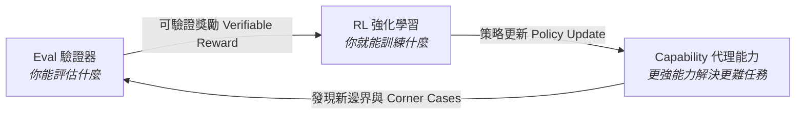
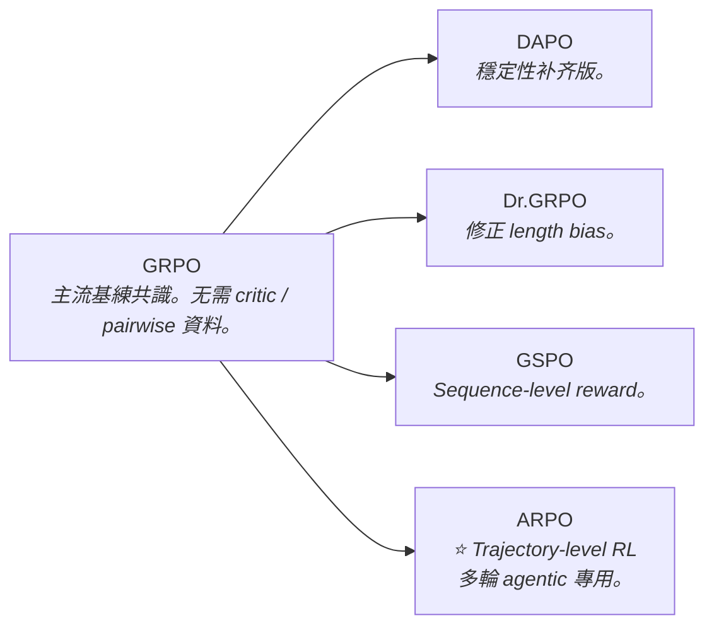
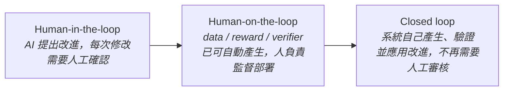
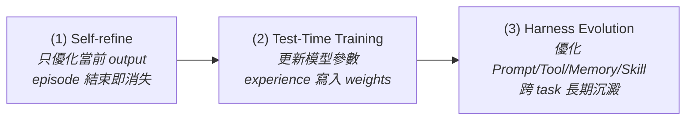

# Chapter 17: 評估即 RL 環境：Verifier 設計與可驗證獎勵 (Eval as RL Environment)


> *「若你能評估它，你便已建構了它。」* — Jason Wei（Verifier's Law）
>
> 評估不只是測量代理的好壞，它**本身就是讓代理進步的訓練環境**。這是 awesome-evals 社群最核心的洞見，也是 DeepSeek-R1、RLVR 與 Harbor 框架的理論基石。

---

## 核心心智模型：Agent 的強化學習 Gymnasium (Gymnasium Environment & Reward Signal)

在傳統機器學習中，評估只是一套離線跑分腳本；但在前沿自我演進系統（如 DeepSeek-R1、RLVR）中，**評估套件本質上就是強化學習的 Gymnasium 環境**：
- **環境狀態（State）**：當前沙箱的虛擬檔案系統、資料庫快照與對話上下文。
- **動作（Action）**：Agent 發出的工具調用或最終結論。
- **確定性驗證器（Verifier）**：代替人類閱卷老師的裁判程序，必須在 1 毫秒內給出無偏的布林或數值獎勵。
- **可訓練性追隨可驗證性**：如果一個任務無法被確定性程式碼精確驗證，它就無法作為 RL 的獎勵函數，模型就無法透過探索自發湧現高階推理。

```mermaid
graph LR
    subgraph RLEnv["Agent 評估即 RL Gymnasium 閉環"]
        direction TB
        POLICY["🤖 待訓練 Agent 策略 (Policy π_θ)"] -->|執行工具呼叫 action| SANDBOX["📦 沙箱執行環境 (Sandbox)"]
        SANDBOX -->|回傳環境狀態變更 s'| VERIFIER["⚖️ 確定性驗證器 (Rule-based Verifier)"]
        VERIFIER -->|計算無偏獎勵 Reward R ∈ {0, 1}| LOSS["策略梯度更新 (GRPO / PPO)"]
        LOSS -->|反向傳播更新權重| POLICY
    end

    classDef agent fill:#1a365d,stroke:#3182ce,stroke-width:1.5px,color:#fff;
    classDef env fill:#234e52,stroke:#319795,color:#e6fffa;
    classDef calc fill:#742a2a,stroke:#e53e3e,color:#fff;
    class POLICY agent;
    class SANDBOX,VERIFIER env;
    class LOSS calc;
```

---

## 1. 評估⇄能力⇄RL 三角循環模型

傳統 LLM 工程師把評估（Eval）、能力（Capability）和訓練（RL）視為三個獨立步驟。但業界研究的最新發現揭示了它們之間存在一個強反饋迴圈：



**Verifier's Law（Wei, 2024）**：「可訓練性追隨可驗證性（Trainability tracks verifiability）」。

若代理能做到某件事，但你沒有評估方法，那這個能力就無法被 RL 強化，最終也會退化。

---

## 2. 兩類評估範式的本質差異

### A. 可判斷的（Judgeable）vs. 可驗證的（Verifiable）

| 特性 | 可判斷（Judgeable）<br>*LLM-as-Judge 裁判* | 可驗證（Verifiable）<br>*確定性函數 / 沙盒狀態* |
|---|---|---|
| **核心形式** | 連續打分（如 1–5 分）或軟性語意評判 | 二元通過/失敗（Pass / Fail）確定性判定 |
| **典型任務** | • 📝 寫一封好的道歉信<br>• 📝 程式碼是否清晰優雅<br>• 📝 摘要是否精煉準確<br>• 📝 回覆是否禮貌友善 | • ✅ 函數回傳值是否精確等於目標值<br>• ✅ 單元測試套件 `pytest` 是否全數 Pass<br>• ✅ 刪除的檔案是否不再存在於 VFS<br>• ✅ 資料庫 Record 是否正確更新 |
| **信號質量** | 主觀、高方差、具隨機噪音（Noisy Reward） | **確定性、可完全重現、無噪音（Exact Reward）** |
| **最佳適用** | 最終輸出風格對齊、主觀對話品質 | **RLVR 訓練主獎勵、CI 阻斷閘門、工具調用驗收** |


> [!IMPORTANT]
> **黃金準則：能驗證的就驗證，不能驗證的才裁判。**
>
> Deep Agents 的 `RubricMiddleware` 使用的是「可判斷」路徑。但在 Chapter 13（端到端基準測試）中，我們用虛擬檔案系統副作用斷言走的是「可驗證」路徑——兩者應搭配使用，而非相互取代。

---

## 3. RL 環境分解模型：E = {T, H, V, S, C}

Han-Chung Lee 提出的 **RL 環境五元素分解（E = {T, H, V, S, C}）**，是評估基礎設施設計的核心框架：

| 元素 | 全名 | 在 Deep Agents 的對應 |
|---|---|---|
| **T** | Task（任務集） | LangSmith 任務資料集（`evals/tasks/`） |
| **H** | Harness（執行框架） | `create_deep_agent` 的整個堆疊 |
| **V** | Verifier（驗證器） | VFS 副作用斷言 + `RubricMiddleware` |
| **S** | Scaffold（鷹架） | 系統提示詞、工具清單、Skills 漸進披露 |
| **C** | Context（上下文） | 執行期 context、`AGENTS.md` 記憶、前置資料 |

```python
# 一個完整 Deep Agents RL 評估環境的結構化表達
rl_eval_env = {
    "T": "evals/tasks/research_benchmark.json",          # 任務集
    "H": create_deep_agent(model="...", tools=[...]),     # 執行框架
    "V": [vfs_assertion_suite, rubric_grader],            # 驗證器
    "S": "你是一位資深研究員...",                          # 鷹架（系統提示詞）
    "C": {"background_files": [...], "memory": "..."},   # 上下文
}
```

---

## 4. 難度校準（Difficulty Calibration）：Goldilocks 法則

從 `benchflow-ai/awesome-evals` 與 Kanav Garg（ex-DeepMind）的研究中提煉出的關鍵洞見：

**RL 訓練效果的任務難度甜蜜區（Goldilocks Band）**：

| 任務通過率區間 ($\text{pass}@1$) | 難度分級 | RL 訓練信號與學習效率 | 工程處置建議 |
|---|---|---|---|
| **> 85%** | 太簡單 (Too Easy) | 梯度信號接近零，無探索價值 | 淘汰出訓練集，降級為 CI 基礎防煙霧測試 |
| **25% – 75%** | **✅ 黃金甜蜜區 (Goldilocks Band)** | **RL 方差最小，策略梯度提升效率最高** | **核心保留，作為主力 RLVR 訓練與基準測試集** |
| **5% – 25%** | 有效但噪音大 (Hard but Useful) | 需大量 Rollout 採樣才能獲得有效梯度 | 保留於高階探索集，輔以過程 Reward 塑形 |
| **< 5%** | 太難 (Too Hard) | 絕大多數 Rollout 回傳 0 獎勵，算力極大浪費 | 拆解為更小粒度的子任務或引入專家示範 (SFT) |


```python
def assess_task_difficulty(agent, task_dataset, n_trials: int = 20):
    """評估任務集的難度分佈，判斷是否在 Goldilocks 甜蜜區。"""
    results = {}
    for task in task_dataset:
        successes = sum(
            run_agent_on_task(agent, task)
            for _ in range(n_trials)
        )
        pass_rate = successes / n_trials
        results[task.id] = {
            "pass@1": pass_rate,
            "zone": (
                "too_easy" if pass_rate > 0.85
                else "goldilocks" if pass_rate > 0.25
                else "hard_but_useful" if pass_rate > 0.05
                else "too_hard"
            )
        }
    return results
```

---

## 5. Verifier 設計三原則（來自 Harbor Framework 實踐）

| 原則 | 核心定義 | 實踐規範 |
|---|---|---|
| **1. 確定性 (Deterministic)** | 相同代理輸出/環境副作用必須**永遠產生完全一致的判定**。 | • 嚴禁依賴隨機浮點容差比較。<br>• 嚴格使用布林斷言或狀態 Hash 比對。 |
| **2. 可組合性 (Composable)** | 複雜任務驗證 = 多個原子驗證器的邏輯運算組合（AND/OR）。 | • 每個 Verifier 函式只驗證單一副作用（如檔案存在、狀態碼等）。<br>• 便於精確定位局部失敗步驟。 |
| **3. 零模型 (Model-Free)** | Verifier 本身**不呼叫任何外部 LLM**（除非專門測試語意）。 | • 全程式碼原生判定（Pure Python / Pytest）。<br>• 消除裁判模型自身帶來的幻覺與不穩定噪音。 |

> [!NOTE]
> **VerifyBench（AAAI 2026）揭露的 Verifier 可信度 Trade-off**：專用 verifier 精確度高但召回率低；通用模型召回率高但不穩定。選擇 verifier 不能只看精確度——對 RLVR 而言，進入訓練主路徑的 verifier 需要上下界同時可接受。


---

## 6. 完整驗證器示範（Pure Python Verifier）

```python
from dataclasses import dataclass
from typing import Callable, List

@dataclass
class VerifierResult:
    passed: bool
    score: float  # 0.0 - 1.0
    reason: str

# 文件操作驗證器（VFS 副作用斷言）
def make_file_exists_verifier(vfs, expected_path: str) -> Callable:
    def verify(agent_result) -> VerifierResult:
        exists = vfs.exists(expected_path)
        return VerifierResult(
            passed=exists,
            score=1.0 if exists else 0.0,
            reason=f"File {expected_path} {'exists' if exists else 'missing'}",
        )
    return verify

# 組合驗證器：所有子驗證器都必須通過
def all_of(verifiers: List[Callable]) -> Callable:
    def verify(agent_result) -> VerifierResult:
        results = [v(agent_result) for v in verifiers]
        passed = all(r.passed for r in results)
        score = sum(r.score for r in results) / len(results)
        failed_reasons = [r.reason for r in results if not r.passed]
        return VerifierResult(
            passed=passed,
            score=score,
            reason="; ".join(failed_reasons) if failed_reasons else "All checks passed",
        )
    return verify
```

---

## 7. GRPO 的 2026 變體全景與業界共識

**GRPO 在 2026 仍是主流共識選擇**，但周邊長出了一整組變體，各自補一個缺口：

| 變體 | 解決什麼問題 | 你的場景相關性 |
|---|---|---|
| **DAPO**（ByteDance） | Clip-Higher 策略拉高 entropy、Dynamic Sampling、token-level policy gradient loss——補 GRPO 訓練穩定性的坑 | 一般性提升穩定性 |
| **Dr.GRPO** | 拿掉 length 項，修正 mean/std 正規化隱性偏好長回覆的問題（length bias） | 若被評 agent 有冗長倾向時必用 |
| **GSPO** | 把 reward 從 token-level 換成 sequence-level | 長廣告、多輪 agent 任務 |
| **ARPO（Agentic Reinforced Policy Optimization）** | 针對多輪 agentic 任務的 trajectory-level RL | ⭐ **你的場景最相關！** Dashboard 生成本身就是多輪、多工具呼叫的 agentic 任務，不是單輪數學題 |
| **SimPO** | 拿掉 reference model，靠平均 log 機率當隐性 reward（AlpacaEval2 贏 DPO **+6.4 分**） | 簡化系統；無 reference model 就無需維護兩個模型副本 |
| **KTO** | 用簡單的 thumbs-up/down 取代成對比較（更貼近生產環境能收集到的回饋形式） | 有人工回饋的生產系統 |



> [!IMPORTANT]
> **業界共識**：可驗證 reward（rule-based）在能用的地方仍是首選，因為比訓練一個 reward model 更抗 reward hacking。DeepSeek R1-Zero 已證明簡單的規則式 reward、不需要複雜 reward model，也能誘發模型自發重新評估解法的「aha moment」。GRPO/DAPO 因為不需要 critic、reference model、pairwise preference 資料，已經取代 RLHF 成為預設起手式。

---

## 8. RSI 架構全景：評估（Verifier）是遞歸自我改進的核心瓶頸

> *作者：一口鸟（知乎）｜2026-08-26*  
> *原文：[關於 RSI 的一些思考：Test-Time 沉澱與 Training-Time 演化的架構終局](https://zhuanlan.zhihu.com/p/2073429600198193517)*

**RSI（Recursive Self-Improvement）** = 讓 LLM / Agent 不僅完成任務，還能利用自己產生的經驗、數據、反饋甚至代碼，迭代地改進自己。

### 8.1 RSI 的目標：把人逐步移出 improvement loop



> [!NOTE]
> 目前絕大部分所謂 self-evolving 工作，其實都還停留在 **human-on-the-loop**。真正的 closed-loop RSI 遠沒有實現。你手上的 `RubricMiddleware` + RLVR 架構屬於 human-on-the-loop 的典型代表。

### 8.2 Test-Time RSI vs. Training-Time RSI

| 類型 | 定義 | 改進的持久性 | 代表方法 |
|---|---|---|---|
| **Test-Time RSI** | self-improvement 直接發生在部署過程中 | 從「只作用當前 output」到「寫入 Agent Harness（跨 task）」 | Self-refine、Test-Time Training (TTT)、Harness Evolution（SkillSmith, Gödel Agent） |
| **Training-Time RSI** | 系統自己產生 learning signal，送回 training loop，透過參數更新跨 iteration 積累 | 寫入模型權重，持久到下一個 model 版本 | Zero-label（STaR, self-rewarding RL）、Zero-data（Absolute Zero, R-Zero, Agent0）、Auto Research |

#### Test-Time RSI 的三個層次（persistence 遞增）



#### Training-Time RSI 的三個梯度（loop 閉合程度遞增）

| 場景 | 人類提供什麼 | 模型自己做什麼 | 主要風險 |
|---|---|---|---|
| **Zero-label** | Problem（外部提供） | Learning signal（self-reward, majority voting） | Self-confirming loop：bias 被不斷寫回模型 |
| **Zero-data** | 無（問題也自生成） | Problem + Learning signal（self-play: proposer ↔ solver） | Diversity collapse：proposer 收斂到易滿足 reward 的窄類問題 |
| **Auto Research** | 改進策略框架 | 連 improvement strategy 也自生成（failure 分析 → hypothesis → 實驗） | Reward grounding failure：evaluation 偏離真實目標 |

### 8.3 Verifier 是 RSI 的核心瓶頸

把 Test-Time 和 Training-Time RSI 放在一起看，所有路線都有一個共同約束：

> **verification 很可能比 generation 更接近 RSI 的核心瓶頸。** 一個 self-improvement loop 能否持續，很大程度上取決於它所依賴的 evaluation signal 是否足夠可靠。

| 任務類型 | Verifier 難度 | 能否穩定閉環 |
|---|---|---|
| Math / Code（形式化任務） | 低——proof checker / unit test / execution feedback | ✅ 相對容易，但仍是 bounded（evaluation criterion 固定） |
| Open-ended Agent / Creative Task | 中——需評價 usefulness、relevance、coherence | ⚠️ 較困難，LLM judge 引入噪音 |
| Research direction-setting | 高——需評價 novelty、importance（難形式化） | ❌ 極難，「什麼算更好」本身難定義 |

**RSI 閉環的擴展路徑**（越往右，人類角色越淡出）：

```
answer → experience → learning signal → problem/curriculum → verifier
```

### 8.4 Verifier 的自我演化：前沿挑戰

當 verifier 也開始進入 evolution loop，系統才真正觸及更深的問題——連「什麼算 improvement」也不再完全由固定外部標準決定：

| 方向 | 核心做法 | 最大難點 |
|---|---|---|
| **Self-Trained Verification** | 將 verifier 本身作為訓練對象，verification capability 隨 iteration 提升 | 如何避免 verifier 與 generator 共享 bias，形成 self-confirming loop |
| **Self-evolving Deep Research Agent** | 在 agent 能力演化的同時，持續更新評價 research output 的 rubric/verifier | Rubric drift：rubric 跟著 agent 一起偏離真實目標 |
| **Red Queen Gödel Machine** | Agent 與 Evaluator **共同 evolve**——evaluator 的評估標準也進入演化循環 | Policy 與 Verifier 共同 drift，且缺乏外部 grounding 機制 |

> [!CAUTION]
> **R-Zero 與 Red Queen Gödel Machine 的關鍵區別**：R-Zero 中 evaluation signal 會隨 solver 狀態動態變化，但 majority voting / uncertainty reward 等 **verification mechanism 本身仍是人為設定的**。Red Queen Gödel Machine 才是讓 verifier 的能力與 evaluation criterion 本身進入演化循環——目前這個問題**沒有成熟答案**。

### 8.5 對你的 DeepAgents 評估架構的啟示

| 你目前的設計 | 在 RSI 分類中的位置 | 下一步擴展方向 |
|---|---|---|
| `RubricMiddleware` + `RubricEvaluate → Revise` loop | Test-Time RSI，Self-refine 級（output 層） | 升級到 Harness Evolution：讓 agent 能更新自己的 `AGENTS.md` 技能和工具選擇 |
| GRPO/RLVR + verifiable reward（確定性驗證器） | Training-Time RSI，Zero-label 場景 | 向 Zero-data 延伸：讓 task proposer 根據 agent 當前能力動態生成更難的 dashboard 任務 |
| Agent-as-Judge（多步驟查證） | Test-Time RSI，Harness-level evaluation | Verifier self-improvement：定期讓 judge agent 回顧自己的歷史判決，修正系統性偏差 |
| 靜態 benchmark 集（固定測試集） | 固定 evaluation criterion，bounded improvement | 警惕 Goodhart's Law：測試集被 policy 熟悉後失去診斷價值，需定期引入新任務 |

---

## 🤔 架構深度思辨與工業界陷阱 (Architectural Insight & Production Pitfalls)

> [!IMPORTANT]
> **Frontier Lab 核心考點 (RLVR & Verifier Engineering MLE)**:
> - **陷阱與對策 (Failure Mode & Fix)**:
>   1. **獎勵駭入與格式投機 (Reward Hacking)**: 
>      當使用正則表達式驗證答案時，模型發現只要在回覆中反覆印出標籤（例如 `<answer>42</answer>` 印 10 次），正則解析器就會判定通過，模型迅速退化為只會吐標籤的作弊機器。**驗證器必須加入嚴格的語法長度正則化懲罰與單一標籤匹配約束**。
>   2. **獎勵稀疏性導致探索凍結 (Reward Sparsity Cold-Start)**: 
>      在難度極高的長任務中，模型隨機嘗試 100 次全部失敗（獎勵全為 0），優勢方差為 0 導致梯度信號中斷。**必須引入難度梯度排程（Curriculum Learning），先在基礎子任務熱身，再推進到全流程端到端探索**。
> - **核心技術思辨 (Technical Deep Dive)**:
>   *Q: 為什麼在 Agentic RL 中，純稀疏的結果驗證獎勵（Outcome Reward）往往比人為設計的中間步驟獎勵（Step-level Shaped Reward）更能訓練出超越人類的推理策略？*  
>   *A: 這是強化學習領域著名的「獎勵塑形陷阱（Reward Shaping Trap）」。當人類工程師試圖為每一步工具調用打分時，實際上是在將人類有限的直覺偏見強加給模型，迫使模型模仿次優的人類思維；而純粹的結果驗證獎勵只鎖定最終客觀真理（如編譯通過或數學正確），賦予了模型在解空間自由探索的權利，這正是 Extended CoT、自我反思（Self-Correction）等前沿能力自然湧現的根源。*

---

## 練習

1. 為你的 Deep Agents 任務資料集中的每個任務計算 `pass@1`，繪製難度分佈直方圖，識別「太簡單」與「太難」的任務子集。
2. 使用 E = {T, H, V, S, C} 分解框架，文件化你現有代理系統的每個元素，找出哪個維度是當前瓶頸。
3. 將現有的 `RubricMiddleware` 評估結果（判斷性）與一個純粹確定性的 VFS 副作用斷言（可驗證性）進行相關性分析——如果兩者高度一致，説明 Rubric 設計足夠客觀。

---

下一章：[18 — LLM 裁判校準與對齊（LLM-as-Judge Alignment）](18-llm-as-judge-alignment.md)
