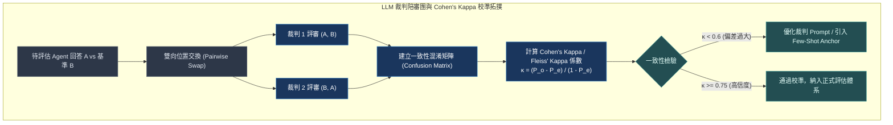
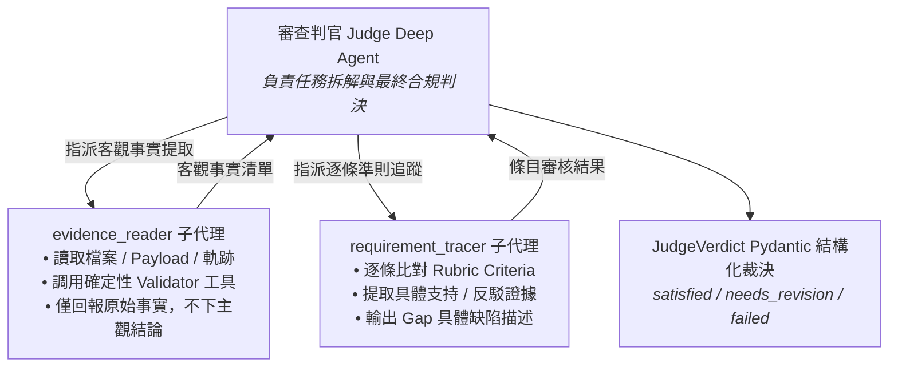
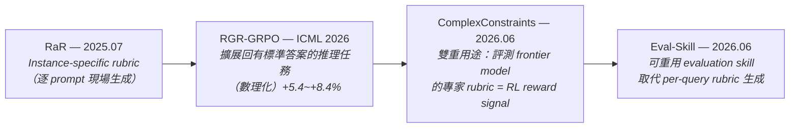

# Chapter 18: Agent-as-Judge、裁判校準與 RLVR 接入 (LLM-as-a-Judge Calibration)


> *「在強化學習與現代評估的世界裡，標準定義了天花板，而確定性回報決定了模型進化的收斂極限。」*

---

LLM 裁判是代理評估系統中最強大也最危險的零件。

強大在於：它能評估需要語意理解的主觀品質，把不可驗證的問題轉化為可量測指標。危險在於：位置偏差、長度偏好、自我偏袒——未校準的裁判比沒有裁判更糟，因為它給了你虛假的精確感。

本章從 Zhuge et al. 2024、`benchflow-ai/awesome-evals`、AJ-Bench 2026 提煉核心實踐，結合 Deep Agents 的 `RubricMiddleware` 實作，深入 **Agent-as-Judge** 的起源、演化、SOTA 量化基準，再接入 **RLVR 訓練**，構建一套從 runtime 驗收到 GRPO 訓練的完整裁判體系。

---

## 核心心智模型：陪審團共識與裁判偏差校準 (Jury Consensus & Position Bias Correction)

在普通法法庭上，死刑或重大訴訟絕不能交由單一法官獨斷，必須由 12 名陪審員共同聽審、交叉質詢並達成一致裁決。

使用 LLM-as-a-Judge 評估 Agent 時也是如此：
- **單一裁判是脆弱的**：GPT-4o 裁判可能因為第一段話寫得長而給高分（長度偏見），或者偏向第一個看見的選項（位置偏見）。
- **位置對稱性比對（Pairwise Swap）**：評估候選解答 A 與 B 時，必須分別評審 `(A, B)` 與 `(B, A)`，只有兩次皆判定 A 勝才算真正獲勝。
- **Cohen's Kappa 統計一致性**：數學化度量多個裁判之間超越隨機巧合的真實共識度（$\kappa > 0.7$ 才具備工業界信度）。



---

## 1. LLM 裁判的三大系統性偏差

| 偏差類型 | 具體表現 | 實戰防禦對策 |
|---|---|---|
| **位置偏差 (Position Bias)** | 一致性偏好第一個（或最後一個）選項 | 互換候選結果順序並取評分平均值（Permutation Test） |
| **長度偏差 (Length Bias)** | 系統性偏好字數更多、更冗長的回覆（即使品質低劣） | 在 Rubric 中明確以嚴格字數上限/簡潔度標準進行扣分 |
| **自我偏袒 (Self-Preference)** | 相同模型家族互評時評分偏高 | 強制使用不同廠商或架構的模型擔任裁判 |


---

## 2. 校準方程：Cohen's Kappa 對齊度

一個「已對齊」的裁判意味著它的判決與領域專家人類標注者高度一致：

$$\kappa = \frac{p_o - p_e}{1 - p_e}$$

| $\kappa$ 值 | 解讀 | 裁判可信程度 |
|---|---|---|
| < 0.20 | 幾乎無一致性 | ❌ 不可用 |
| 0.21 – 0.40 | 輕度一致 | ⚠️ 謹慎使用 |
| 0.41 – 0.60 | 中度一致 | 🔶 可用，需注意邊界 |
| 0.61 – 0.80 | 高度一致 | ✅ 適合作為評估信號 |
| > 0.80 | 幾乎完全一致 | ✅✅ 可替代人工標注 |

**CI 門檻**：`kappa > 0.7` 為生產標準。每次修改 Rubric 都必須在固定校準集上重新驗算，防止標準漂移（Criteria Drift）。

---

## 3. 裁判設計七大最佳實踐

### 3.1 二元判決而非連續評分

```python
# ❌ 連續評分（高方差，難對齊）
rubric = "從 1 到 10 分評分這個回答的品質。"

# ✅ 二元判決（低方差，易對齊，直接 CI 化）
rubric = """
判斷以下代理回覆是否達到驗收標準。只回答 PASS 或 FAIL。

驗收標準（全部必須為真）：
- 報告包含至少 3 個具體可執行建議（非通用描述）
- 每個建議附有支持數據或來源引用
- 總字數不超過 500 字
"""
```

### 3.2 針對具體可觀測行為

```python
# ❌ 模糊標準
rubric = "回答是否有幫助且準確？"

# ✅ 具體可觀測行為（代理的實際動作）
rubric = """
PASS 條件（全部必須為真）：
1. 代理調用了 `search` 工具至少一次
2. 最終回覆包含引用的來源 URL
3. 回覆沒有使用 2022 年前的資料作為主要依據
"""
```

### 3.3 分離「過程驗收」與「結果驗收」

```python
# 過程裁判（Trajectory Judge）：工具序列是否合理
trajectory_rubric = """
評估代理的工具調用序列是否遵循正確研究流程：
1. 先搜尋再分析（不允許直接憑記憶回答）
2. 引用的數據必須來自工具回傳，而非生成
PASS：序列符合；FAIL：存在違規
"""

# 結果裁判（Outcome Judge）：最終輸出是否達標
outcome_rubric = """
評估最終輸出的商業價值——是否可直接提交給客戶？
PASS：可直接使用；FAIL：需要人工修訂
"""
```

### 3.4 自偏袒對策：使用非同族裁判

```python
grader = create_deep_agent(
    # 被評代理用 Claude → 裁判用 Gemini，避免自我偏袒
    model="google_genai:gemini-2.5-pro",
    system_prompt="你是一位嚴格的品質審核員...",
)
```

---

## 4. Agent-as-Judge 的起源與三階段演化

### 4.1 核心定義與起源

**Agent-as-Judge = 用一個具備工具、能觀察軌跡、可多步驟查證的 agent 去評審另一個 agent 的輸出。**

| | **LLM-as-Judge** | **Agent-as-Judge** |
|---|---|---|
| **運作方式** | 一次性看最終輸出 → 給分數/理由 | 平行運作，呼叫工具、讀檔案、跑測試、追蹤軌跡 |
| **輸出格式** | 單一分數或籠統理由 | 逐條需求 pass/fail + 具體證據 |
| **盲點** | 無法檢查中間步驟、無法執行驗證 | 無（可直接執行驗證） |
| **對齊人類評審** | 一致率約 60–70% | 一致率提升至約 **90%** |

**起源論文（Zhuge et al., 2024 / ICML 2025，Meta AI + KAUST，掛名 Jürgen Schmidhuber）**

- 配套 benchmark：**DevAI** — 55 個真實 AI 開發任務，共 **365 條分層需求（requirement graph）**
- 核心做法：把任務拆成需求圖，judge agent 逐條查證（編譯是否通過、使用者需求是否滿足），結果是逐條 pass/fail + 證據，不是單一分數
- 效果：大幅超越 LLM-as-judge，可靠度接近人類專家評審小組

### 4.2 三階段演化

| 階段 | 特徵 | 代表 | 生產成熟度 |
|---|---|---|---|
| **Procedural（程序式）** | 固定 evaluate → revise 流程，grader 照腳本走 | `RubricMiddleware`（單一 grader model + 固定 loop） | ✅ 生產標準 |
| **Reactive（反應式）** | judge 依查到的內容動態決定下一步查什麼、呼叫哪個工具 | Judgment Labs「Agent Judge」— Search / Verification / Adaptation 三能力，reader/worker/forked agent 分工 | ✅ 先進生產 |
| **Self-evolving（自我演化）** | judge 會自己改寫評分規則，應對行為漂移 | 研究前緣，多語言 Agent-as-Judge pipeline 採用：Plan→Locate→Retrieve→Ask→Judge | 🔬 研究前緣 |

> [!NOTE]
> **生產案例 — Gandalf（BankerToolBench）**：傳統 LLM-as-judge 評不了 Excel/PowerPoint 這類複雜交付檔案，改用架在 OpenHands agent harness 上的 agent judge，實際打開、執行、驗證檔案內容。
>
> **適用場景判斷標準**：被評的東西是否「需要打開/執行/追蹤才能驗證」。是，才值得上 agent-as-judge；純文字回覆，LLM-as-judge 通常夠用。

---

## 5. Agent-as-Judge：從單一 LLM 裁判升級為多代理判官

單一 LLM 裁判的精確度有其上限。研究（arXiv:2604.04872）顯示：階層式多代理判官（角色分工、各自方法論約束）能把精確度從 **0.906 提升至 1.0**。



Deep Agents 提供兩條落地路徑：

### 方法 A（最小改動）：保留 RubricMiddleware，升級 Evidence Tool


把「evidence tool」從單一函式換成一個具有子代理的 investigator Deep Agent——對外仍是一個工具，對內是能自主查證的多代理系統：

```python
from deepagents import create_deep_agent
from langchain.tools import tool

investigator = create_deep_agent(
    model=grader_model,
    system_prompt="你負責在候選輸出裡定位並驗證具體證據，不下最終裁決。",
    subagents=[
        {
            "name": "evidence_reader",
            "description": "讀取檔案/dashboard payload/trajectory，回報原始事實",
            "system_prompt": "只回報你實際讀到的內容，不要下判斷。",
            "tools": [read_dashboard_payload, run_dashboard_validator],
        },
        {
            "name": "requirement_tracer",
            "description": "把單條 rubric criterion 對應到證據，判斷通過與否",
            "system_prompt": "針對給定的 criterion，找出支持或反駁它的具體證據。",
        },
    ],
)

@tool
def investigate(candidate: str, criterion: str) -> dict:
    """多步驟查證某一條 rubric criterion。"""
    result = investigator.invoke({
        "messages": [{"role": "user",
                      "content": f"候選內容：{candidate}\n\n查證標準：{criterion}"}]
    })
    return {"finding": result["messages"][-1].content}

rubric_middleware = RubricMiddleware(
    model=grader_model,
    tools=[investigate],          # 取代單一的確定性 tool
    max_iterations=3,
    on_evaluation=record_evaluation,
)
```

> [!TIP]
> **何時用方法 A**：純語意層面的標準（「圖表配置是否真的符合使用者原始需求」這種光看 schema 驗證不出來的），才讓 `investigate` 展開成多代理查證。能用確定性函數驗證的標準，繼續走 rule-based，不要動用 Agent。

### 方法 B（完整版）：獨立 Judge Deep Agent + Pydantic 結構化輸出

```python
from pydantic import BaseModel

class CriterionVerdict(BaseModel):
    name: str
    passed: bool
    evidence: str
    gap: str | None = None

class JudgeVerdict(BaseModel):
    result: str  # satisfied | needs_revision | failed
    criteria: list[CriterionVerdict]

judge_agent = create_deep_agent(
    model=grader_model,
    system_prompt=(
        "你是嚴格的驗收判官。把 rubric 拆成獨立 criterion，"
        "逐條指派給 evidence_reader 查證後才能下結論，"
        "不能只憑候選文字本身判斷。"
        "注意：只評估當前這一輪的候選，不參考上一輪的證據。"
    ),
    subagents=[reader_subagent, tracer_subagent],
    response_format=JudgeVerdict,
)

verdict: JudgeVerdict = judge_agent.invoke({
    "messages": [{"role": "user",
                  "content": f"候選：{candidate}\n\nRubric：{rubric}"}]
})["structured_response"]

accepted = verdict.result == "satisfied"
```

> [!IMPORTANT]
> **方法 B 四大工程要點**：
> 1. `run_deterministic_checks` 不要重寫——直接包你現有 validator middleware，只換入口讓 investigator 呼叫。
> 2. `gap` 欄位決定 revise 迴圈是否有效——要求 requirement_tracer 的 system prompt 引用具體欄位名稱或失敗的測試案例，不接受模糊描述。
> 3. 每一輪評估只看「這一輪」的候選——明確禁止用上一輪的證據評這一輪的答案（常見坑）。
> 4. `failed` 與 `needs_revision` 分開處理——`failed` 表示 rubric 本身評不了（通常是 rubric 寫得有問題），迴圈直接跳出，不繼續燒 iteration。

---

## 6. 接入 RLVR：裁判在訓練迴圈中的角色

### 6.1 成本現實：Agent-as-Judge 不能直接進 GRPO 線上路徑

OpenWebRL 的實戰數據點出成本現實：用 GPT-4.1 作裁判訓練 web agent，**單次訓練跑了 43,200 次 judge API 呼叫，花了約 $545**——這還只是單一 pass 的 LLM judge，不是你剛寫的多子代理版本。

GRPO 標準配置：每個 prompt 抽 **G = 16** 個 completion，每個都要打分，再乘訓練步數——多代理 Agent-as-Judge 直接進線上路徑會讓成本爆炸。

### 6.2 三條可行路徑

| 可行路徑 | 機制設計 | 優缺點與適用場景 | 業界參考 |
|---|---|---|---|
| **路徑 1：離線標註**<br>*(Offline Batch Labeling)* | Agent-as-Judge 先將訓練資料的 Rubric 標籤預先跑一輪並持久化儲存；GRPO 線上訓練直接讀取預標 Reward，不發動即時 LLM 呼叫。 | **優點**：零線上推論延遲與成本。<br>**缺點**：無法支援 On-policy 的動態軌跡獎勵。<br>**適用**：SFT 或靜態偏好對齊。 | RaR Offline 變體 |
| **路徑 2：蒸餾小型 Reward 模型**<br>*(Distillation to Small RM)* | 以強大的 Agent-as-Judge 評判記錄為訓練信號，蒸餾出 8B 等級的小型特定領域 Judge 模型（如 Qwen-8B/Llama-8B）。 | **優點**：兼具高推理速度與低成本，可無縫放入 GRPO 訓練迴圈。<br>**缺點**：需前期數據蒸餾工程。<br>**適用**：大規模強化學習訓練。 | OpenWebRL-Judge-8B (從 12.5K rollout 蒸餾) |
| **路徑 3：確定性主獎勵 + 審計抽檢**<br>*(Rule-based Primary + Judge Audit)* | 主 Reward 完全依賴確定性驗證器（如 DB 狀態、沙盒執行回傳），Agent-as-Judge 僅作為非同步抽樣稽核（Audit Agent）。 | **優點**：主訓練極快且抗博弈，同時具備防禦 Reward Hacking 的能力。<br>**缺點**：需精細設計沙盒驗證環境。<br>**適用**：生產級 RLVR 標準架構。 | DeepSeek-R1 / RLVR 標準實踐 |


### 6.3 GRPO 需要的是純量 Reward，不是 pass/fail 列表

```python
from pydantic import BaseModel
from typing import Literal

class CriterionVerdict(BaseModel):
    name: str
    passed: bool
    weight: float = 1.0   # 可調整各 criterion 的重要性

class JudgeVerdict(BaseModel):
    result: Literal["satisfied", "needs_revision", "failed"]
    criteria: list[CriterionVerdict]

def verdict_to_scalar_reward(verdict: JudgeVerdict) -> float:
    """把 JudgeVerdict 的逐條判決聚合成 GRPO 可消費的純量 reward。"""
    if verdict.result == "failed":
        return 0.0  # Rubric 評不了，不給信號（Fail-Closed）

    total_weight = sum(c.weight for c in verdict.criteria)
    if total_weight == 0:
        return 0.0

    weighted_pass = sum(c.weight for c in verdict.criteria if c.passed)
    return weighted_pass / total_weight   # 0.0 ~ 1.0
```

### 6.4 Policy-Aware Rubric Reward（進階）

靜態等權重聚合的問題：模型早期學不會的細節不該跟已學會的基本要求搶同等的梯度信號。

POW3R / GDPO 等研究提出「依當前 policy 在每條 criterion 上的 rollout variance 動態調整權重」：

```python
def policy_aware_weights(
    criteria_names: list[str],
    rollout_pass_rates: dict[str, float],  # 當前 policy 在各 criterion 上的通過率
) -> dict[str, float]:
    """
    根據當前 policy 在各 criterion 上的學習狀態動態調整權重。
    已飽和的 criterion（pass_rate 接近 1.0）應降低權重；
    有學習空間的 criterion（pass_rate 在 0.3~0.7）應提高權重。
    """
    weights = {}
    for name in criteria_names:
        rate = rollout_pass_rates.get(name, 0.5)
        # 飽和（> 0.9）或不可達（< 0.05）都降低權重；甜蜜區（0.3~0.7）提高權重
        signal_strength = 4 * rate * (1 - rate)   # 在 rate=0.5 時最大為 1.0
        weights[name] = max(signal_strength, 0.05)  # 確保不完全歸零
    # 正規化為和為 1
    total = sum(weights.values())
    return {k: v / total for k, v in weights.items()}
```

---

## 7. Reward Hacking 在訓練迴圈的特有風險

Training-time reward hacking 比 runtime 驗收嚴重得多，因為 **policy 會在成千上萬步裡持續尋找 reward function 的漏洞**：

1. **可驗證 reward 也會被打穿**：即使 `add_numbers` 這種任務，模型可能直接寫死答案通過測試，卻沒真的解決問題。對策：用 AST 解析檢查結構 + 隨機化輸入 + 隱藏測試案例。

2. **KL penalty 是結構性防線**：policy 與 reference policy 偏離越多，reward hacking 越嚴重。GRPO/PPO 保留 KL 項，原因正在於此，而非純為了訓練穩定。

3. **多代理 judge 的分工要寫清楚**：鬆散的多代理判官自己會產生新的漏洞——EvidenceReader 和 RequirementTracer 的 system prompt 需要嚴格約束各自的職責邊界，否則判官自身的行為也會被 policy 反向利用。

---

## 8. SOTA 量化基準與 Rubric-as-Reward 演進脈絡（2026）

### 8.1 Agent-as-Judge 的量化 Benchmark

| Benchmark | 機構 | 規模 | 用途 |
|---|---|---|---|
| **DevAI**（原始論文） | Meta AI + KAUST, ICML 2025 | 55 任務 / 365 條需求 | 首個 Agent-as-Judge 形式評測，逐條需求 pass/fail |
| **AJ-Bench** | USTC + NUS + Meituan, ACL Findings 2026 | 155 任務 / 516 條標注軌跡 / 3 領域 | **專門評測「哪個 backbone 拿來當 judge 最強」**，涵蓋 Claude Opus 4.5、GPT-5、Gemini 3 Pro、Grok 4、Kimi K2、Qwen3-235B |
| **VerifyBench** | AAAI 2026 | — | 不評 judge，評 **verifier 本身的可信度**；揭露專用 verifier 精確度高但召回率低、通用模型召回率高但不穩定的 trade-off |
| **RewardBench 2** | 更新至 2026.04 | 更難、更多樣 | 領先模型換到 RewardBench 2 上，分數平均**掉 20 分以上**；且 RM benchmark 分數進步不保證下游 RLHF 效果同步提升 |

> [!CAUTION]
> **RewardBench 2 警告**：不要只看 leaderboard 排名選擇 reward 方法。務必自己跑一次「你的 reward 方法 × 你的實際 RL pipeline」的相關性驗證。Reward model benchmark 分數與下游訓練效果的相關性，在 2026 研究中已被明確質疑。

### 8.2 Rubric-as-Reward 四代演進脈絡



| 世代 | 核心主張 | 對比基準提升 | 適用場景 |
|---|---|---|---|
| **RaR（2025.07）** | Instance-specific rubric 比固定通用 rubric 有效；通用 rubric 抓不到 prompt 特定的失敗模式 | — | 開放式生成任務 |
| **RGR-GRPO（ICML 2026）** | 密集 rubric reward + offline guidance，解決純 on-policy RLVR 探索空間受限的問題；修正 entropy explosion / semantic drift | 對比純 verifiable reward baseline **+5.4%~+8.4%** | 數學、物理、化學推理 |
| **ComplexConstraints（2026.06）** | 「雙重用途」—— 豐富到能評測 frontier model 的專家 rubric，直接可當 RL reward signal，不用為訓練另外簡化 | — | Frontier model 評測 + RL 共用 |
| **Eval-Skill（2026.06，浙大 + 小紅書）** | 對 RaR 質疑：現場生成增加延遲且容易跑偏。改用 100 筆案例演化出**可重用的 evaluation skill**，注入 judge context，不重訓參數 | Qwen3-8B **+13.44%**、DeepSeek-V4-Flash **+18.51%**（RewardBench 2） | 高頻推斷場景，最新 SOTA 方向 |

> [!IMPORTANT]
> **不要忽略傳統 Reward Model 的對照組**：純目的訓練的 scalar reward model（如 Skywork）在**通用**偏好基準上仍贏過 rubric-based judge（90.3 vs. 87.2）。Rubric 的優勢是**可解釋性**與**任務特定 criteria 對齊**，不是在「哪個分數更準」上全面碾壓。

---

## 9. 裁判校準工作流程（完整流程）

```
Step 1: 收集 50–100 個有爭議的真實案例
        → 選代理在其上表現模糊的例子；正負樣本各半

Step 2: 人工黃金標注
        → 3 位領域專家獨立標注
        → 計算人-人 κ；若 κ < 0.6，先修標準本身

Step 3: 裁判一致率測量
        → 在同一組案例上執行 LLM 裁判
        → 計算裁判-人類 κ，目標 κ > 0.7
        → 未達標則迭代修改 Rubric

Step 4: CI 回歸防護閘
        → 將 50–100 案例存為固定評估集
        → 每次 PR 修改 Rubric 時自動重跑
        → regression rate = 0%（退化即禁止合併）
```

```python
def cohens_kappa(judge_labels: list, human_labels: list) -> float:
    from collections import Counter
    n = len(judge_labels)
    p_o = sum(j == h for j, h in zip(judge_labels, human_labels)) / n
    jf, hf = Counter(judge_labels), Counter(human_labels)
    cats = set(judge_labels) | set(human_labels)
    p_e = sum((jf.get(c, 0) / n) * (hf.get(c, 0) / n) for c in cats)
    return 1.0 if (1 - p_e) == 0 else (p_o - p_e) / (1 - p_e)

# CI 防護閘（pytest）
def test_judge_kappa_regression():
    judge_labels, human_labels = load_calibration_set()
    kappa = cohens_kappa(judge_labels, human_labels)
    assert kappa > 0.7, f"裁判對齊度退化！κ = {kappa:.3f}，請審查 Rubric 更改。"
```

---

## 🤔 架構深度思辨與工業界陷阱 (Architectural Insight & Production Pitfalls)

> [!IMPORTANT]
> **Frontier Lab 核心考點 (LLM-as-a-Judge Calibration MLE)**:
> - **陷阱與對策 (Failure Mode & Fix)**:
>   1. **自戀偏見 (Self-Enhancement Bias)**: 
>      實驗表明，GPT-4 作為裁判時，傾向於給 GPT-4 生成的回答打更高分，而對 Claude 生成的回答給予更嚴苛的評價。**在裁判 Prompt 中必須徹底擦除模型指紋（去識別化），或採用交叉裁判矩陣（Claude 審 GPT、GPT 審 Claude）進行平衡**。
>   2. **長度偏見 (Verbosity Bias)**: 
>      模型裁判容易被排版華麗、洋洋灑灑 2000 字的廢話所吸引，給出高於精簡 100 字核心答案的分數。**在裁判 Rubric 中明確規定長度懲罰項，或強制要求裁判先提取事實原子命題（Atomic Claims）再核算分值**。
> - **核心技術思辨 (Technical Deep Dive)**:
>   *Q: 為什麼在計算裁判一致性時，不能直接使用簡單的重合百分比（Percentage Agreement），而必須計算 Cohen's Kappa？*  
>   *A: 簡單重合百分比忽略了「隨機猜測導致的巧合一致性（Chance Agreement）」。例如在一個合格率高達 90% 的資料集中，即使裁判閉著眼睛全部判 Pass，重合率也能達到 90%，但這完全是虛假的信度。Cohen's Kappa 扣除了隨機期望重合率 $P_e$，只有當裁判的判斷真正依據語意特徵做出時，$\kappa$ 才會大於 0，能精確揭示裁判系統的真實辨識能力。*

---

## 練習

1. 從歷史對話中選取 20 個案例，手動標注 PASS/FAIL，再讓 `RubricMiddleware` 評分，計算 κ 值，驗證裁判是否達到 0.7 門檻。
2. 實作方法 A 的 `investigate` 工具，在語意層面的 criterion 上測試它，對比與單一確定性函數的差異。
3. 用 `verdict_to_scalar_reward` 把 `JudgeVerdict` 聚合成純量，確認輸出在 `[0.0, 1.0]` 範圍內且對稱——`failed` 案例必須回傳 `0.0`（Fail-Closed 原則）。
4. 用 `policy_aware_weights` 計算在 10 條 criterion 上通過率不同時的動態權重分配，繪製 weight vs pass_rate 曲線，觀察信號強度在甜蜜區的峰值行為。
5. 根據 8.2 節的四代演進，為你的任務類型選擇最合適的 rubric reward 策略：若是高頻推斷用 Eval-Skill；若是有標準答案的推理用 RGR-GRPO；若是開放生成用 RaR。

---

下一章：[19 — 評估基礎設施：資料集、CI 流水線與評估驅動開發](19-eval-infrastructure.md)
