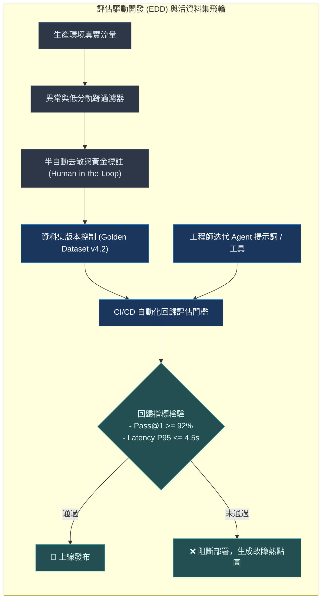
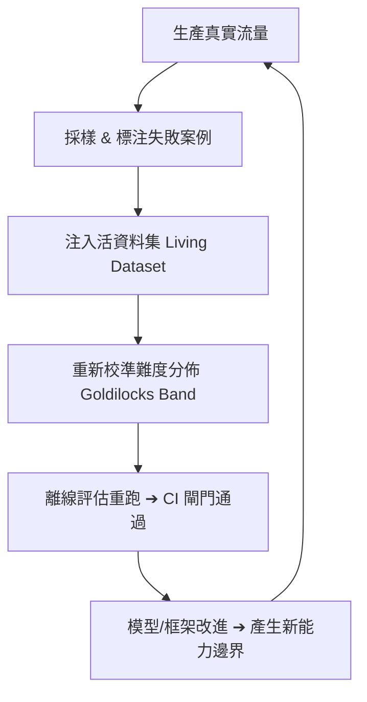

# Chapter 19: 評估基礎設施：資料集、CI 流水線與評估驅動開發 (Eval Infrastructure & EDD)


> *「買另一個評估工具不會拯救你的產品。」* — Eugene Yan
>
> 評估不是「跑完 pass rate 就結束」的一次性事件，而是 **持續整合流水線的核心零件**。
> 本章從 `benchflow-ai/awesome-evals` 第 5 節「Evaluation Infrastructure」提煉產業標準，建立從「黃金資料集管理」到「CI 回歸閘門」的完整評估工程體系。

---

## 核心心智模型：現代晶圓廠良率監控管線 (Wafer Fab Yield Pipeline & Living Datasets)

在台積電等先進半導體晶圓廠中，晶片良率不是靠最後肉眼檢驗，而是遍佈全廠的數千個光學感測器與閉環回饋：每一片晶圓的缺陷都會被立即逆向溯源，改進光刻機參數。

評估基礎設施（Eval Infrastructure）就是 Agent 的良率監控體系：
- **活資料集（Living Dataset）**：靜態測試集在 3 個月內就會過期或被模型背誦；生產環境的真實失敗案例與邊界情況（Edge Cases），必須自動清洗並回流進測試集。
- **評估驅動開發（Eval-Driven Development, EDD）**：在工程師動手寫任何一行 Agent 代碼前，先寫出 10 個端到端評估案例。
- **三柱架構**：黃金資料集（Golden Dataset） × 確定性/裁判評分器（Scorers） × 遙測觀測平台（Observability Platform）。



---

## 1. 評估三柱：資料集 × 評分器 × 觀察平台

Braintrust 對評估基礎設施的核心定義（The Three Pillars of AI Observability）：

| 維度 | 資料集 (Datasets) | 評分器 (Scorers) | 觀察平台 (Observatory) |
|---|---|---|---|
| **核心問題** | 你要測什麼？ | 怎麼評分？ | 去哪裡看結果？ |
| **主要組成** | • 黃金資料集<br>• 生產抽樣集<br>• 邊界案例集<br>• 失敗案例集 | • 確定性驗證<br>• LLM-as-judge<br>• 混合評分器 | • 離線實驗儀表板<br>• 線上生產追蹤<br>• CI 回歸閘門<br>• 告警與通知 |

這三柱缺一不可：

- **只有資料集沒有評分器** → 你有 ground truth 但不知道代理表現得怎樣。
- **只有評分器沒有資料集** → 你有裁判但不知道問什麼問題。
- **兩者都有但沒有觀察平台** → 結果散落在終端機日誌裡，無法追蹤趨勢。

---

## 2. 離線評估 vs. 線上評估

| 特性 | 離線評估（Offline Eval / 批次實驗） | 線上評估（Online Eval / 生產監控） |
|---|---|---|
| **執行環境** | 在固定資料集上確定性地跑 | 對真實生產流量採樣評分 |
| **執行時機** | 每次代碼更改或 PR 時觸發（可重現結果） | 評分異步進行，完全不影響請求延遲 |
| **輸入來源** | CI 閘門、離線測試集 | 真實用戶請求抽樣 |
| **主要目的** | **防止已知問題回歸** | **發現分佈偏移（Distribution Shift）** |
| **典型範例** | 每次 PR 跑完整的 eval suite | 每天隨機抽取 1% 流量進行非同步深度評判 |

> [!IMPORTANT]
> 離線 eval 保護你免受已知問題回歸，線上 eval 讓你發現 **你不知道你不知道的問題**。
> 兩者都必須存在——只有離線 eval 的系統在生產中是盲目的。

---

## 3. 「活資料集」（Living Dataset）模式

靜態的黃金資料集會老化：代理能力提升後，所有樣本都變得太容易，難度校準失效（見 Chapter 17 Goldilocks Band）。

正確做法是維護一個**活資料集**，持續補充新的困難案例：



```python
from dataclasses import dataclass, field
from enum import Enum
from datetime import datetime

class DatasetSplit(str, Enum):
    GOLDEN = "golden"         # 高品質人工標注，長期維護
    REGRESSION = "regression" # 過去失敗的案例，確保不重現
    EDGE_CASE = "edge_case"   # 邊界條件，壓力測試
    PRODUCTION = "production" # 生產採樣，等待標注

@dataclass
class EvalCase:
    case_id: str
    input: str
    expected_outcome: str
    split: DatasetSplit
    difficulty_pass_rate: float | None = None  # 由自動校準填入
    source: str = ""  # 來源（人工標注、生產採樣等）
    created_at: str = field(default_factory=lambda: datetime.now().isoformat())
    tags: list[str] = field(default_factory=list)

# 活資料集管理器
class LivingDataset:
    def __init__(self):
        self._cases: list[EvalCase] = []

    def add_from_production_failure(self, failed_interaction: dict) -> EvalCase:
        """把生產失敗案例加入資料集，等待人工標注。"""
        case = EvalCase(
            case_id=f"prod_{hash(failed_interaction['input']) % 1_000_000}",
            input=failed_interaction["input"],
            expected_outcome="[PENDING HUMAN ANNOTATION]",
            split=DatasetSplit.PRODUCTION,
            source="production_sampling",
        )
        self._cases.append(case)
        return case

    def calibrate_difficulty(self, agent, n_trials: int = 10):
        """自動測量每個案例的通過率，填入 difficulty_pass_rate。"""
        for case in self._cases:
            if case.difficulty_pass_rate is not None:
                continue
            successes = sum(
                run_agent_on_case(agent, case) for _ in range(n_trials)
            )
            case.difficulty_pass_rate = successes / n_trials

    def get_goldilocks_subset(self) -> list[EvalCase]:
        """回傳位於 Goldilocks 甜蜜區（0.25–0.75 通過率）的案例。"""
        return [
            c for c in self._cases
            if c.difficulty_pass_rate is not None
            and 0.25 <= c.difficulty_pass_rate <= 0.75
        ]

    def stats(self) -> dict:
        by_split = {}
        for split in DatasetSplit:
            by_split[split.value] = len([c for c in self._cases if c.split == split])
        calibrated = len([c for c in self._cases if c.difficulty_pass_rate is not None])
        return {"total": len(self._cases), "by_split": by_split, "calibrated": calibrated}
```

---

## 4. 評估驅動開發（Eval-Driven Development, EDD）

EDD 是針對代理系統的 TDD 類比——在寫功能之前，先寫描述預期行為的評估案例：

| 步驟階段 | 傳統直覺開發流程 | 評估驅動開發流程 (EDD) |
|---|---|---|
| **Step 1** | 直接編寫 Prompt / 功能代碼 | 用自然語言精準描述預期行為規範 |
| **Step 2** | 手動在 Web 介面隨機測試 | 將預期行為轉化為可自動執行的 `EvalCase` |
| **Step 3** | 憑感覺修改直到滿意 | 執行 Eval Suite ➔ **確認初始狀態失敗 (Red)** |
| **Step 4** | 提交 PR 請求人工 Review | 編寫/修改 Middleware、Prompt 或 Tool 代碼 |
| **Step 5** | 盲目合併上線 | 執行 Eval Suite ➔ **確認測試通過 (Green)** |
| **Step 6** | 生產爆發回歸事故 | 提交 PR（附帶自動化評測指標與得分報告） |
| **Step 7** | 陷入緊急熱修復救火 | **CI 閘門自動重跑全量 Eval ➔ 100% 通過才允許合併** |


> [!TIP]
> Hamel Husain 的現場教學把 EDD 概括為：「錯誤分析（Error Analysis）始終是最高 ROI 的活動。」
> 每次代理失敗後，第一步是把這個失敗案例加入資料集，而不是立即修改 prompt。

---

## 5. 評估評分器分類學（Scorer Taxonomy）

| 類型 | 範例 | 速度 | 準確性 | 適用場景 |
|---|---|---|---|---|
| **精確比對** | `output == expected` | ⚡⚡⚡ | 高 | 工具參數、結構化輸出 |
| **正則表達式** | 包含特定格式 | ⚡⚡⚡ | 高 | URL 格式、日期、代碼塊 |
| **嵌入相似度** | cosine similarity > 0.9 | ⚡⚡ | 中 | 語意等價的多種表達 |
| **程式碼執行** | 單元測試通過 | ⚡ | 非常高 | 程式碼生成、數學推理 |
| **LLM 裁判** | `RubricMiddleware` | 🐢 | 主觀 | 寫作品質、語意準確性 |
| **混合** | 確定性 + LLM 裁判 | ⚡ + 🐢 | 最高 | 複雜代理任務 |

**選擇準則**：「能驗證的就驗證，不能驗證的才裁判。」優先使用上方（快速確定性）的評分器，LLM 裁判作為最後手段。

---

## 6. CI 流水線集成（GitHub Actions 範本）

```yaml
# .github/workflows/agent-eval.yml
name: Agent Eval Suite

on:
  pull_request:
    paths:
      - "src/**"
      - "prompts/**"
      - "evals/**"

jobs:
  eval:
    runs-on: ubuntu-latest
    steps:
      - uses: actions/checkout@v4

      - name: Set up Python
        uses: actions/setup-python@v5
        with:
          python-version: "3.11"

      - name: Install dependencies
        run: pip install -e ".[evals]"

      - name: Run offline eval suite
        env:
          LANGSMITH_API_KEY: ${{ secrets.LANGSMITH_API_KEY }}
          ANTHROPIC_API_KEY: ${{ secrets.ANTHROPIC_API_KEY }}
        run: |
          python -m pytest evals/ \
            --eval-threshold=0.80 \
            --judge-kappa-min=0.70 \
            -v --tb=short

      - name: Upload eval report
        if: always()
        uses: actions/upload-artifact@v4
        with:
          name: eval-report
          path: eval_results.json
```

```python
# evals/conftest.py — pytest 整合
import pytest

def pytest_addoption(parser):
    parser.addoption("--eval-threshold", type=float, default=0.80)
    parser.addoption("--judge-kappa-min", type=float, default=0.70)

@pytest.fixture
def eval_threshold(request):
    return request.config.getoption("--eval-threshold")
```

```python
# evals/test_research_task.py
import pytest

@pytest.mark.eval
def test_research_task_pass_rate(deep_agent, golden_dataset, eval_threshold):
    """代理在黃金資料集上的通過率必須 ≥ threshold。"""
    results = [
        run_agent_eval(deep_agent, case)
        for case in golden_dataset.get_split("golden")
    ]
    pass_rate = sum(results) / len(results)
    assert pass_rate >= eval_threshold, (
        f"Pass rate {pass_rate:.0%} 低於閾值 {eval_threshold:.0%}。"
        f"請查看失敗案例詳情。"
    )

@pytest.mark.eval
def test_no_regression_on_known_failures(deep_agent, golden_dataset):
    """曾經失敗過的案例不能再次失敗（零容忍回歸）。"""
    regression_cases = golden_dataset.get_split("regression")
    failed = [
        c for c in regression_cases
        if not run_agent_eval(deep_agent, c)
    ]
    assert not failed, f"以下案例回歸：{[c.case_id for c in failed]}"
```

---

## 7. 評估優先級決策框架

| 優先級 | 資料集類型 | 執行時機與觸發條件 | 核心工程目標 | 容忍閾值 |
|---|---|---|---|---|
| **P1（最高/必須）** | **回歸測試集**<br>*(Regression Suite)* | 每次 PR 提交與 CI 構建必跑 | 確保修復過的歷史 Bug 永遠不再重現。 | **100% 通過（零容忍）** |
| **P2（核心/常規）** | **黃金資料集**<br>*(Golden Dataset)* | PR 審批與每日夜間構建 (Nightly) | 代表線上典型生產任務的人工精選代表性樣本。 | **$\ge 80\%$ 通過率** |
| **P3（進階/壓力）** | **邊界案例集**<br>*(Edge Case Suite)* | 週度版本發布前全量回歸 | 刻意構造的對抗性輸入、超長上下文與超額工具負載。 | **不崩潰、優雅降級** |
| **P4（持續/監控）** | **生產動態抽樣**<br>*(Production Sampling)* | 線上 7x24 即時異步採樣評估 | 捕捉線上真實現象與分佈偏移（Distribution Shift）。 | **指標走勢平穩無斷崖** |


---

## 8. 評估結果的正確儲存格式

```python
# eval_results.json — 機器可讀，便於 CI 解析和趨勢追蹤
{
  "run_id": "pr-456-abc123",
  "timestamp": "2026-08-23T01:00:00Z",
  "git_sha": "abc123def456",
  "model": "anthropic:claude-sonnet-4-6",
  "summary": {
    "total_cases": 100,
    "passed": 84,
    "failed": 16,
    "pass_rate": 0.84,
    "judge_kappa": 0.73,
    "ci_gate": "PASS"
  },
  "by_split": {
    "golden": {"total": 60, "passed": 52, "pass_rate": 0.867},
    "regression": {"total": 20, "passed": 20, "pass_rate": 1.000},
    "edge_case": {"total": 20, "passed": 12, "pass_rate": 0.600}
  },
  "failed_cases": [
    {"case_id": "golden_042", "input": "...", "expected": "...", "actual": "..."}
  ]
}
```

---

## 🤔 架構深度思辨與工業界陷阱 (Architectural Insight & Production Pitfalls)

> [!IMPORTANT]
> **Frontier Lab 核心考點 (Evaluation Infrastructure & Platform MLE)**:
> - **陷阱與對策 (Failure Mode & Fix)**:
>   1. **資料集腐化與過時失效 (Dataset Rot)**: 
>      測試集維護在靜態 CSV 檔案中，隨著底層外部 API 格式更替，50% 的測試案例本身出現了錯誤的 Ground-Truth。**實施測試集健康度日常心跳檢測（Benchmark Hygiene Heartbeat），任何外部依賴變動自動觸發黃金答案重校驗**。
>   2. **評估耗時過長拖垮研發節奏**: 
>      全量跑測 5000 道題目需要耗費 4 個小時與 500 美元，導致工程師抗拒執行測試。**實施分級評估矩陣（Tiered Evals）：PR 提交時只跑 50 道高敏感度 Smoke Tests（5 分鐘內反饋），夜間批次跑測全量迴歸套件**。
> - **核心技術思辨 (Technical Deep Dive)**:
>   *Q: 什麼是評估驅動開發（Evaluation-Driven Development, EDD），它與軟體工程傳統的測試驅動開發（TDD）有何本質不同？*  
>   *A: 傳統 TDD 面對的是確定性邏輯（若給定輸入 A，必定產出確定輸出 B）；而 EDD 面對的是高度非確定性的概率模型（LLM）。在 EDD 中，評估不僅僅是布林斷言，還涵蓋了分佈統計、語意相似度、工具呼叫步驟效率、Token 預算與安全紅隊。EDD 提倡在優化 Prompt 或架構前，先建立可量化的指標分佈基準（Baseline），任何工程更動必須證明指標在統計顯著性（p < 0.05）下的整體向上遷移。*

---

## 練習

1. 為你的 Deep Agents 應用創建 `evals/` 目錄結構：`datasets/golden.json`、`datasets/regression.json`，各準備 10 個案例，並寫對應的 pytest 測試。
2. 把最近三次代理失敗的真實案例加入 `regression` 分割，確認 CI 測試能捕捉到這些失敗。
3. 在 `LivingDataset.calibrate_difficulty` 中加入並發執行（`asyncio.gather`），比較序列執行與並發執行在 20 個案例上的時間差異。
4. 在 GitHub Actions 工作流程中設定 `eval-threshold=0.75`，故意讓一個案例失敗，驗證 CI 確實能攔截。

---

下一章：[20 — 執行框架工程：上下文即是代理](20-harness-as-context.md)
