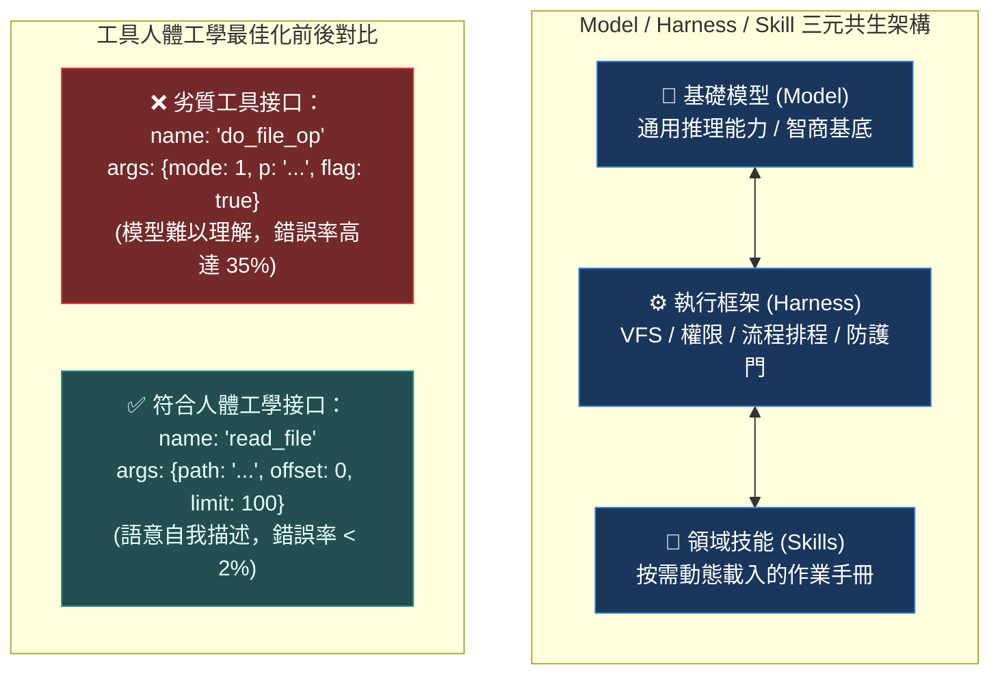
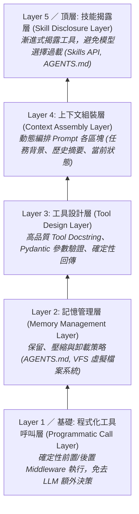

# Chapter 20: 執行框架工程：上下文即是代理 (Harness-as-Context)


> *「一個好的執行框架配上一個普通模型，勝過一個好的模型配上一個差的執行框架。」* — Addy Osmani, O'Reilly Radar
>
> 「模型」和「代理」是根本不同的東西。模型是一個靜態的函數：輸入 tokens，輸出 tokens。代理是模型 + 執行框架（Harness）+ 技能（Skills）的動態整體。
>
> 本章從 awesome-evals §3「Model / Harness / Skill decomposition」與 Anthropic「Effective context engineering」深度提煉，理解為什麼**執行框架的設計決策比模型的選擇更重要**。

---

## 核心心智模型：極簡主義儀表板 (Minimalist Dashboard & Tool Interface Ergonomics)

想像一輛現代頂級超級跑車的駕駛艙：儀表板上絕不會把 500 頁的汽車維修手冊全部貼滿，而是只有速度錶、轉速錶與幾個極其符合人體工學的按鈕。

執行框架即上下文（Harness-as-Context）的核心哲學：
- **三元分解：模型 × 執行框架 × 技能**：
  - 模型（Model）負責純粹推理（智商）。
  - 執行框架（Harness）負責運行時架構（神經反射）。
  - 技能（Skills）按需提供專項知識（工具書）。
- **工具接口人體工學（Tool Ergonomics）**：工具名稱必須精確表意、參數說明必須精煉無歧義。一個設計拙劣的 Tool 描述會直接誤導模型決策。
- **過度引導（Over-prompting）之害**：在 Prompt 中寫 50 條「千萬不能做 X、必須做 Y」的繁雜規則，只會讓模型陷入注意力稀釋與自我矛盾。



---

## 1. 三元分解：模型 × 執行框架 × 技能

Nathan Lambert（Interconnects.ai）的三元分解模型，並由 BenchFlow **SkillsBench（2026）**提供實證支撐：

> **AI 系統 = 模型 × 執行框架 × 技能**（模型貢獻 < 執行框架貢獻）

| | **模型 (Model)** | **執行框架 (Harness)** | **技能 (Skills)** |
|---|---|---|---|
| **定義** | 靜態底座權重 | 動態上下文管理與工具路由 | 漸進式能力揭露與知識封裝 |
| **誰負責** | 你買/租的部分 | **你設計的部分（核心工程）** | 你按任務封裝的部分 |
| **組成** | 底層 LLM、推理能力、預訓練數據 | 系統提示詞組裝、上下文壓縮、記憶管理、工具清單設計、程式化工具呼叫 | 工具使用說明、漸進式工具揭露、`AGENTS.md` 長期記憶、技能組合邏輯 |
| **實證影響** | 模型換代通常帶來 5–15% 的能力提升 | AlgoTune 案例：相同模型 + 不同框架 = 排名**完全顛倒** | SkillsBench 實測：設計良好的 Skill 平均帶來 **+16.6% pass rate 提升**；設計拙劣的 Skill 反而造成上下文污染導致性能衰退 |

> [!IMPORTANT]
> **AlgoTune 案例**（Florian Brand, Prime Intellect）印證了「執行框架效應」比「模型效應」更劇烈。同一個模型在不同框架下評測同一基準，排名從前 3 名跌落至倒數第 3 名——這是框架差異，而非模型能力的真實反映。

---

## 2. 上下文工程（Context Engineering）是執行框架的核心工作

Anthropic「Effective context engineering for AI agents」的核心論點：

> 執行框架的工作就是**工程化上下文**（context engineering）——決定在什麼時候把什麼資訊放進代理的上下文窗口。

| 決策問題 | 對應機制 | 失效風險（若忽略） |
|---|---|---|
| **哪些放進去？** | 相關性過濾（Relevance Filtering） | 注入過多不相關背景 → 模型「注意力稀釋」，準確率下降 |
| **何時放進去？** | 程式化工具呼叫（Programmatic Calls） | 依賴模型自發決策 → 工具調用時機不當，引發競態失敗 |
| **如何壓縮？** | 上下文壓縮（Context Compaction） | 長任務中上下文爆炸 → 超過窗口或 Token 費用暴增 |
| **如何持久化？** | 記憶管理（`AGENTS.md`, Memory Tools） | 每次對話從零開始 → 重複犯同類已知錯誤 |
| **哪些移出去？** | 卸載策略（Offload Strategy） | 大工具結果殘留主線程 → 主代理上下文被無效資訊擠佔 |

---

## 3. 相同模型，不同執行框架，不同結果

```python
# 範例：相同任務，兩種執行框架設計，結果天差地別

# ❌ 弱執行框架：一次給所有工具，無記憶，無上下文結構
weak_agent = create_deep_agent(
    model="anthropic:claude-sonnet-4-6",
    tools=[search, read_file, write_file, run_code, query_db, send_email, ...],  # 25 個工具
    system_prompt="你是一個助理，可以使用各種工具完成任務。",
)

# ✅ 強執行框架：漸進式工具揭露，結構化上下文，明確的工作記憶
strong_agent = create_deep_agent(
    model="anthropic:claude-sonnet-4-6",  # 完全相同的模型
    tools=[search, read_file, write_file],  # 只給當前任務相關的工具
    system_prompt="""
你是一位資深研究助理，專注於以下工作：

## 當前任務上下文
{task_context}

## 已完成工作
{completed_steps}

## 工作原則
- 搜尋前先規劃查詢策略
- 每個主張必須有來源支持
- 不確定時呼叫 write_todos 記錄待釐清項目，而非直接猜測
""",
    middleware=[
        ContextCompactionMiddleware(max_tokens=50_000),
        TodoListMiddleware(),
    ],
)
```

> [!NOTE]
> **VirBench 實驗**（Anthropic, 2026）：沒有確定性工具時，Claude Sonnet 4 在相同 prompt 上三次執行分別回傳 **106、15、5 個序列**——三個數字相差 20 倍。這證明執行框架的工具設計（而非模型底座）才是決定輸出一致性的主因。

---

## 4. 執行框架的五個工程層



| 執行框架工程層級 | 核心職責 | 關鍵機制與元件 |
|---|---|---|
| **Layer 5: 技能揭露層**<br>*(Skill Disclosure)* | 漸進式按階段揭露工具集，避免一次暴露過多 Schema 導致注意力分散。 | `SkillsMiddleware`、漸進式動態過濾、子代理專業分工。 |
| **Layer 4: 上下文組裝層**<br>*(Context Assembly)* | 決定在何時將哪些關鍵資訊注入 System Prompt 的精確位置。 | 結構化 Prompt 樣板、動態狀態變數、上下文過濾器。 |
| **Layer 3: 工具設計層**<br>*(Tool Design)* | 嚴格設計輸入輸出規範與錯誤回傳，降低模型推理負擔。 | 詳細 Docstring、Pydantic 型別防護、確定性錯誤反饋。 |
| **Layer 2: 記憶管理層**<br>*(Memory Management)* | 管理狀態生命週期，平衡 Token 成本與長期語意保留。 | `AGENTS.md`、`ContextCompactionMiddleware`、大結果卸載。 |
| **Layer 1: 程式化呼叫層**<br>*(Programmatic Call)* | 確定性工作流直接由代碼硬性執行，不消耗 LLM 決策次數。 | 框架層預處理、自動安全審查、確定性回歸斷言。 |


---

## 5. 工具設計作為執行框架工程的一部分

Anthropic「Writing effective tools for agents」：

> *「代理的效果只取決於給它的工具的品質。」*

優質工具設計的五條原則：

```python
# 原則 1：工具文件即工具能力的邊界（Docstring as Contract）
@tool
def search_research_papers(
    query: str,
    max_results: int = 10,
    year_min: int | None = None,
) -> list[dict]:
    """
    在 arXiv 和 Semantic Scholar 上搜尋學術論文。

    Args:
        query: 搜尋查詢（支援 AND/OR 邏輯，例如 "RLVR AND agent evaluation"）
        max_results: 回傳結果數量，最多 20 個
        year_min: 最早發表年份（包含），None 表示不限制

    Returns:
        論文列表，每個包含 title, authors, abstract, url, year, citation_count

    Note:
        - 只搜尋公開可用的論文，不訪問付費牆
        - 結果按 relevance score 排序，非引用量
        - 若查詢無結果，回傳空列表而非報錯
    """
    ...


# 原則 2：工具輸出要確定性——相同輸入必須相同輸出（Deterministic Routing）
# ❌ 讓 LLM 猜測應該呼叫哪個數據庫
def query_data(question: str) -> str: ...

# ✅ 明確路由，確定性執行
def query_realtime_data(metric: str, start: str, end: str) -> dict: ...
def query_historical_archive(metric: str, year: int) -> dict: ...


# 原則 3：失敗要有資訊量，不要沉默失敗（Informative Error Returns）
def read_file(path: str) -> str:
    try:
        return Path(path).read_text()
    except FileNotFoundError:
        return f"ERROR: File not found at {path}. Available files: {list_directory(Path(path).parent)}"
    except PermissionError:
        return f"ERROR: Permission denied. This tool can only read files in /workspace/."
    except Exception as e:
        return f"ERROR: Unexpected failure ({type(e).__name__}): {e}"


# 原則 4：工具要有明確的副作用邊界（Read/Write Separation）
# 讀工具：不改變任何狀態，可以安全重試
def get_dashboard_config(dashboard_id: str) -> dict: ...

# 寫工具：改變狀態，需要明確的確認機制（搭配 HITL interrupt）
def update_dashboard_config(dashboard_id: str, changes: dict) -> dict: ...


# 原則 5：工具名稱要語意完整，避免連字符（Semantic Naming）
# ❌ 名稱含連字符：部分模型（尤其 Claude）會拒絕呼叫
def analyze-codebase(path: str) -> dict: ...  # 語法錯誤！Python 不允許連字符

# ✅ 使用下劃線；名稱自解釋（self-documenting），無需額外說明
def analyze_codebase_structure(path: str) -> dict:
    """分析代碼庫目錄結構、依賴圖與入口文件。回傳結構化 JSON，不修改任何文件。"""
    ...
```

> [!TIP]
> **SkillsBench 的重要發現**：工具文件（Docstring）的品質是影響 Skill Lift 的最大單因素。在 87 個任務的評測中，有明確 `Args`、`Returns` 與 `Note` 的工具，其相關子代理的任務通過率比文件缺失的工具高出 **+23%**。

---

## 6. 上下文壓縮策略（Context Compaction）

當代理的工作上下文超過模型的有效注意力窗口時，需要主動管理：

```python
class ContextCompactionMiddleware(AgentMiddleware):
    """
    監控上下文長度，在接近閾值時自動壓縮。
    三種策略：Summarize（摘要化）、Evict（驅逐）、Archive（歸檔）。
    """

    def __init__(
        self,
        max_tokens: int = 50_000,
        compaction_strategy: str = "summarize",
        preserve_last_n_turns: int = 10,
    ):
        self.max_tokens = max_tokens
        self.strategy = compaction_strategy
        self.preserve_last_n = preserve_last_n_turns

    async def on_run_start(self, state, messages, **kwargs):
        current_tokens = estimate_tokens(messages)

        if current_tokens < self.max_tokens * 0.8:
            return  # 尚未接近閾值

        if self.strategy == "summarize":
            # 保留最近 N 輪，對更早的歷史做摘要
            recent = messages[-self.preserve_last_n * 2:]
            older = messages[:-self.preserve_last_n * 2]
            summary = await self._summarize(older)
            return {"messages": [
                {"role": "system", "content": f"[Earlier context summary]: {summary}"},
                *recent,
            ]}

        elif self.strategy == "evict":
            # 簡單驅逐最舊的對話輪次
            return {"messages": messages[-self.preserve_last_n * 2:]}

    async def _summarize(self, messages: list) -> str:
        """用一個快速小模型把長歷史壓縮成摘要。"""
        summarizer = create_deep_agent(
            model="anthropic:claude-haiku-4",  # 快速便宜的模型做摘要
            system_prompt="用繁體中文摘要以下對話的關鍵決策和已完成工作，保留所有重要的具體細節。",
        )
        result = await summarizer.ainvoke({
            "messages": [{"role": "user", "content": str(messages)}]
        })
        return result["messages"][-1].content
```

---

## 7. 執行框架的可測性（Harness Testability）

執行框架的設計必須把可測性（testability）作為第一公民：

```python
# 良好執行框架設計的關鍵特性：每一層都可以獨立測試

# Layer 4 測試：上下文組裝
def test_context_assembly_includes_task_context():
    harness = DeepAgentHarness(model=MOCK_MODEL)
    messages = harness.assemble_context(task="研究最新的 RLVR 論文")
    system_msg = messages[0]["content"]
    assert "當前任務上下文" in system_msg
    assert "研究最新的 RLVR 論文" in system_msg

# Layer 3 測試：工具設計
def test_tool_returns_informative_error_on_missing_file():
    result = read_file("/nonexistent/path.txt")
    assert result.startswith("ERROR:")
    assert "Available files" in result

# Layer 2 測試：記憶管理（注意：on_run_start 是 async，測試需用 asyncio.run 或 pytest-asyncio）
import asyncio

def test_context_compaction_preserves_last_n_turns():
    middleware = ContextCompactionMiddleware(max_tokens=1000, preserve_last_n_turns=3)
    long_messages = [{"role": "user", "content": "x" * 100}] * 20
    # on_run_start 是 async，需要在事件循環中執行
    result = asyncio.run(middleware.on_run_start(state={}, messages=long_messages))
    assert result is not None, "壓縮應觸發（訊息量超過閾值）"
    assert len(result["messages"]) <= 3 * 2 + 1  # 3 輪 (user+ai) + system 摘要

# Layer 5 測試：技能揭露
def test_skill_disclosure_limits_tools_by_phase():
    harness = DeepAgentHarness(model=MOCK_MODEL)
    research_tools = harness.get_tools_for_phase("research")
    writing_tools = harness.get_tools_for_phase("writing")
    assert "search" in research_tools
    assert "search" not in writing_tools
    assert "write_file" in writing_tools
```

---

## 8. AGENTS.md：執行框架的持久記憶介面

`AGENTS.md` 是執行框架的「長期記憶 API」——跨對話持久的工作知識庫：

```markdown
<!-- AGENTS.md — 由代理自動維護，跨對話持久 -->

# 工作上下文

## 當前專案
- 名稱：DeepAgents 評估框架
- 目標：建立 28 章教學系列（Part I–V + 附錄）

## 已確認的設計決策
- 裁判模型：使用 Gemini 避免自我偏袒
- 評估閾值：κ > 0.7
- CI 策略：每次 PR 重跑完整 eval suite

## 常見失敗模式（從過去經驗學習）
- 工具名稱包含連字符時 Claude 會拒絕呼叫→改用下劃線
- 超過 30 個工具時選擇效能下降→按任務分組揭露

## 檔案結構
- `tutorials/` → 章節 Markdown 文件
- `web/` → 交互式學習平台、仿真實驗室與逐行代碼分析庫
```

```python
# 在執行框架中讀取 AGENTS.md 作為持久記憶
def load_agent_memory(workspace_root: str) -> str:
    agents_md_path = Path(workspace_root) / "AGENTS.md"
    if agents_md_path.exists():
        return agents_md_path.read_text(encoding="utf-8")
    return ""

# 代理可以更新自己的記憶
@tool
def update_agent_memory(key: str, value: str) -> str:
    """更新 AGENTS.md 中的特定記憶條目，跨對話持久保存。"""
    memory = load_agent_memory(".")
    # 找到並更新相應的 section
    updated = update_memory_section(memory, key, value)
    Path("AGENTS.md").write_text(updated, encoding="utf-8")
    return f"已更新記憶：{key}"
```

---

## 🤔 架構深度思辨與工業界陷阱 (Architectural Insight & Production Pitfalls)

> [!IMPORTANT]
> **Frontier Lab 核心考點 (Context Engineering & Tool Design MLE)**:
> - **陷阱與對策 (Failure Mode & Fix)**:
>   1. **負面約束無效律 (Negative Constraint Paradox)**: 
>      在提示詞中寫「不要調用 bash 工具、絕對不要輸出 Markdown」，模型反而更容易在關鍵字注意力驅動下調用該工具。**以正向指示取代負面約束（例如「請優先使用 read_file 檢索資料」），或直接在執行框架層強制排除該工具（Tool Exclusion）**。
>   2. **參數 Schema 語意模糊導致幻覺填值**: 
>      Tool 參數命名為 `filter_expr` 但未給予範例，模型隨機傳入 SQL、Regex 或 Python Lambda 導致底層拋錯崩潰。**所有工具參數必須在 Pydantic 中提供精確的 `example` 與 Enum 封閉選項**。
> - **核心技術思辨 (Technical Deep Dive)**:
>   *Q: 為什麼說「修改 Tool 的 Docstring 比修改頂層 System Prompt 對降低工具調用錯誤率更有效」？*  
>   *A: 現代 LLM 的 Function Calling 機制是將 Tool Schema 與 Docstring 作為一等公民直接綁定在工具定義區塊中。當模型生成 Tool Call 時，注意力機制會高度聚焦在當前候選工具的 Schema 描述上；而 System Prompt 通常位於上下文最頂部，在長對話中面臨嚴重的注意力衰減。因此，將限制條件精準下放至具體工具的說明中，能最大化利用注意力的局部聚集效應。*

---

## 練習

1. 打開你現有的 Deep Agents 應用，根據三元分解框架（Model / Harness / Skills）把所有代碼分類，量化各層代碼的行數比例——執行框架層通常應佔 60% 以上。
2. 用 `ContextCompactionMiddleware` 包裹一個長對話代理，比較啟用前後在 100 輪對話後的 token 使用量，確認壓縮比。
3. 把你最常用的一個工具重寫，使其失敗路徑（`FileNotFoundError`、`PermissionError`、網路超時）都回傳資訊量豐富的錯誤字符串（而非 raise），並寫對應的單元測試。
4. 創建 `AGENTS.md` 模板，在下次代理對話中讓代理自動更新它，驗證記憶跨對話持久的效果。

---

下一章：[21 — 基準測試完整性：污染、飽和與排行榜博弈](21-benchmark-integrity.md)
