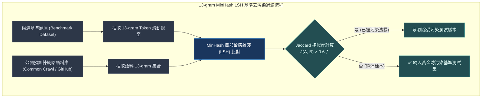
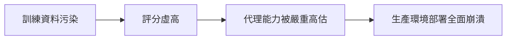

# Chapter 21: 基準測試完整性：污染、飽和與排行榜博弈 (Benchmark Integrity)


> *「基準測試的使命是死亡。一個好的基準測試的生命週期約為一年。」* — Ofir Press
>
> 靜態基準測試是知識在時間上的快照，而不是持久的能力量尺。當代理能力提升後，基準測試本身就成了問題的一部分——理解這些失效模式，能讓你設計出不容易被博弈的評估體系。

---

## 核心心智模型：防弊考場與性價比天平 (Anti-Cheat Testing & Pareto Frontier)

想像一場國家級高普考試：
- **試題去污染（Decontamination）**：如果考卷上的題目早已被補習班題庫公開洩露，考生的 100 分毫無含金量，這叫資料污染。
- **基準飽和（Benchmark Saturation）**：如果全班平均分達到 99 分，這張考卷就失去了區分資優生與普通生的能力。
- **性價比天平（Cost-Accuracy Pareto Frontier）**：若考生花了 100 萬補習費只比花 1000 元的人多考 1 分，在商業競爭中就是絕對的劣勢。

基準測試完整性（Benchmark Integrity）是評估體系的基石：
- **MinHash 13-gram LSH 去污染**：嚴格掃除測試集與預訓練語料的重疊。
- **對抗 Goodhart's Law**：「當一個指標變成目標時，它就不再是一個好指標」。
- **將成本與延遲列為一級評估指標**：絕不脫離成本談準確率。



---

## 1. 基準測試 vs. 評估：根本性的區別

| 特性 | 基準測試（Benchmark）<br>*公共固定資料集* | 評估（Eval）<br>*私有動態評估體系* |
|---|---|---|
| **設計目標** | 跨團隊、跨模型可橫向比較 | 精確捕捉你的具體業務應用質量 |
| **數據私密性** | 數據完全公開（容易被網路爬蟲抓取） | 資料集私有（防止模型預訓練洩露） |
| **對抗博弈** | 極易被污染、超參數博弈或 overfitting | 難以被博弈（貼合自定義工作流） |
| **生命週期** | 存在飽和點（模型達到天花板即失效） | 隨業務邏輯與邊界案例持續迭代 |
| **主要用途** | 粗粒度篩選候選底層模型 | 全生命週期監控代理系統健康度與 CI 防回歸 |
| **潛在風險** | 容易混淆基準高分與真實落地能力 | 需要持續維護與高成本人工校準 |


Han-Chung Lee 的核心論點：

> *「Chat eval 是一個電子表格；Agent eval 是一個系統。」*

---

## 2. 基準測試的三大失效模式

### 2.1 訓練資料污染（Contamination）

問題：模型在訓練期間「見過」基準測試的問題和答案，導致評分虛高，無法代表真實能力。



> [!NOTE]
> **真實案例**：HumanEval 基準在海量開源代碼庫中被預訓練抓取，導致模型在該基準上的「完美通過率」完全無法等同於真實世界代碼架構重構能力。

**防護對策**：
1. **私有評估資料集**：使用來自自身生產環境的未公開真實任務。
2. **折扣係數校準**：對任何公開基準分數打折扣（特別是開源權重模型）。
3. **動態更換題目**：定期輪換評估案例，防範測試集固化。

### 2.2 基準飽和（Saturation & Ceiling Effect）

問題：隨著模型推理能力提升，所有候選模型在該基準上的得分均逼近 100%，基準完全喪失對模型微小差異的區分度。

| 時間階段 | 主流模型平均分數 | 基準區分效力 | 工程建議 |
|---|---|---|---|
| **基準誕生初期 (Year 0)** | ~20% – 40% | ⭐⭐⭐⭐⭐ 極高 | 適合用作大模型篩選與 RL 獎勵塑形 |
| **快速演進期 (Year 1)** | ~60% – 80% | ⭐⭐⭐⭐ 高 | 進入 Goldilocks Band 甜蜜區 |
| **飽和淘汰期 (Year 2+)** | > 90% (天花板效應) | ❌ 喪失區分度 | **果斷廢棄該基準，升級至更長任務** |

> [!TIP]
> **Ofir Press 的 -200% 難度設計法則**：
> 設計新基準時，目標應設定為讓當前最強模型**僅有 ~20% 通過率**；這樣該基準才能在飽和前提供約 1–2 年的有效迭代窗口。

### 2.3 排行榜博弈（Leaderboard Gaming）

當基準測試成為優化目標時，它就不再是一個好的度量標準（**Goodhart's Law**）：

| 博弈手段 | 典型手法 | 實質影響 |
|---|---|---|
| **① 超參數調優** | 針對固定評測集過度微調 Temperature 與 Top-P。 | 生產泛化能力毫無提升。 |
| **② 執行框架差異 (Harness Confound)** | 利用特定提示詞封裝或隱藏重試機制拉高分數。 | 測量的是框架而非模型本身。 |
| **③ 測試集洩露** | 將基準題型改寫後混入微調訓練集（SFT）。 | 產生高分低能的「做題家」模型。 |
| **④ 選擇性報告** | 只披露表現優異的 Benchmark，隱藏落後的測試。 | 誤導架構決策與選型。 |

---

## 3. 代理時代的基準測試特有問題（8 層失效模型）

Florian Brand（Prime Intellect, 2026）「Benches 2026」將評估失效解構為 8 個層級：

| 層級 | 失效維度 | 核心現象與影響 | 所屬範疇 |
|---|---|---|---|
| **Layer 1** | **Prompt** | 提示詞措辭微調使得分波動 $\pm 10\%$。 | 傳統問答基準 |
| **Layer 2** | **Temperature** | 採樣隨機性導致單次測試結果不可復現。 | 傳統問答基準 |
| **Layer 3** | **Grader** | LLM 裁判自身存在長度偏差與位置偏差。 | 傳統問答基準 |
| **Layer 4** | **Harness** | 不同的工具封裝與執行期導致排名完全顛倒。 | 傳統問答基準 |
| **Layer 5** | **Ground Truth** | 基準標注答案本身存在 $10\%–30\%$ 的錯誤率。 | 傳統問答基準 |
| **Layer 6** | **State** | 代理中間狀態（VFS/變數）累積引發連鎖漂移。 | **代理特有長任務** |
| **Layer 7** | **Stochasticity** | 步驟增多導致隨機性指數級放大（需 $\text{pass}^k$ 檢驗）。 | **代理特有長任務** |
| **Layer 8** | **Environment** | Docker 沙盒鏡像版本、網路延遲造成評測噪音。 | **代理特有長任務** |


---

## 4. 自動化基準評分的不可信賴性

**Ground truth 錯誤率**（業界真實數據）：

| 資料集 | 已知標注錯誤率 | 來源 |
|---|---|---|
| ImageNet (1000類) | ~6% | Northcutt et al., 2021 |
| MNIST | ~0.3% | Label errors analysis |
| NLP 常用資料集 | 10–15% | 多篇 ACL 論文 |
| 代碼生成基準 | 因平台而異，估計 5–20% | 內部評估 |

```python
# 可行的對策：評估你的評估（Evaluating the Evaluator）
def audit_ground_truth(dataset: list[EvalCase], n_sample: int = 50) -> dict:
    """
    對資料集本身進行抽樣審計——找出 ground truth 的錯誤。
    這是「Who validates the validators?」（EvalGen, UIST 2024）的實踐。
    """
    sample = random.sample(dataset, min(n_sample, len(dataset)))
    issues = []
    for case in sample:
        # 讓 3 個不同的裁判各自評分，看是否一致
        verdicts = [judge.evaluate(case) for judge in get_multiple_judges()]
        if len(set(verdicts)) > 1:
            issues.append({
                "case_id": case.case_id,
                "expected": case.expected_outcome,
                "judge_verdicts": verdicts,
                "consensus": None,  # 有分歧，需要人工重審
            })

    return {
        "audited": len(sample),
        "ambiguous": len(issues),
        "ambiguity_rate": len(issues) / len(sample),
        "issues": issues,
    }
```

---

## 5. 對抗污染的評估設計原則

| 設計準則 | Ofir Press 黃金標準 (學術基準) | Deep Agents 工程落地版本 (私有系統評估) |
|---|---|---|
| **1. Natural (自然性)** | 問題源自人類日常真實複雜工作，而非合成的玩具數據。 | 案例 100% 取自你的生產環境日誌（Production Trace），而非公共測試集子集。 |
| **2. Auto-evaluatable (自動可驗證)** | 答案具備唯一且可程式化檢驗的客觀標準。 | 優先使用 **VFS 狀態斷言與環境副作用驗證**（確定性 Verifier > 軟性 LLM 裁判）。 |
| **3. Challenging (足夠挑戰性)** | 最強模型僅能達到 ~20% 通過率，延緩飽和。 | 保持測試集在 **25%–75% 通過率（Goldilocks Band）**，持續動態淘汰過易樣本。 |


---

## 6. 代理評估的 Holistic Leaderboard（HAL）方法

Princeton SAgE 團隊的 **Holistic Agent Leaderboard（HAL）** 提出了一個解決方案：

用**相同的固定執行框架**跑同一個代理，在**多個基準**上測試，確保排名是模型能力而非執行框架差異。

```python
# HAL 方法的核心思想：固定執行框架，變化基準
class HolisticEvalRunner:
    """
    在多個任務類型上使用相同執行框架評估代理，
    避免執行框架差異污染跨基準比較。
    """

    BENCHMARK_SUITE = [
        "research_synthesis",  # 長任務研究整合
        "code_generation",     # 代碼生成與測試
        "data_analysis",       # 數據分析推理
        "multi_step_planning", # 多步驟計劃執行
        "adversarial_input",   # 對抗性輸入魯棒性
    ]

    def __init__(self, agent, harness_config: dict):
        # 關鍵：所有基準使用完全相同的執行框架配置
        self.agent = agent
        self.harness_config = harness_config  # 固定，不因基準而變

    def run_holistic_eval(self, n_trials: int = 5) -> dict:
        """
        跨多個基準評估，成本作為一級指標（cost-aware evaluation）。
        """
        results = {}
        for benchmark in self.BENCHMARK_SUITE:
            cases = load_benchmark(benchmark)
            passed = []
            costs = []
            for case in cases:
                for trial in range(n_trials):
                    result = run_agent_with_cost_tracking(
                        self.agent, case, self.harness_config
                    )
                    passed.append(result["passed"])
                    costs.append(result["cost_usd"])

            # pass^k（所有試驗都通過），而非 pass@k
            pass_all_k = sum(
                all(passed[i:i+n_trials])
                for i in range(0, len(passed), n_trials)
            ) / len(cases)

            results[benchmark] = {
                "pass@1": sum(passed) / len(passed),
                f"pass^{n_trials}": pass_all_k,
                "avg_cost_usd": sum(costs) / len(costs),
                "cost_normalized_score": pass_all_k / (sum(costs) / len(costs)),
            }

        return results
```

**成本作為一級指標**（Kapoor et al. 「AI Agents That Matter」）：

> 如果代理 A 的通過率是 80%，代理 B 是 82%，但代理 B 的每次任務成本是代理 A 的 5 倍——從應用工程師的視角看，代理 A 更好。排行榜必須報告成本，而非只報告分數。

---

## 7. 你應該如何使用公開基準

| ✅ 推薦做法 (DO) | ❌ 禁止反模式 (DON'T) |
|---|---|
| • 用公開基準做候選模型「入場篩選」（Sanity Check），排除明顯退化的底座模型。 | • 把公開基準分數直接當作自定義業務代理的真實能力指標。 |
| • 借鑑公開基準的「任務類型與難題結構」，設計自己的私有邊界案例集。 | • 針對公開基準過度微調 Prompt / Temperature，自欺欺人宣布「代理能力提升」。 |
| • 關注任務結構與失敗分佈，而非單純攀比排行榜小數點後的勝率。 | • 選擇性披露高分基準、隱藏落後數據，或宣稱「在 GAIA 上達 80% 即等同於生產可用 80%」。 |


---

## 8. 新一代抗污染基準設計（值得追蹤的方向）

| 基準設計策略 | 實例 | 抗污染原理 |
|---|---|---|
| **動態生成題目** | τ²-Bench（Sierra Research） | 每次評估都生成新的任務實例 |
| **真實環境執行** | Terminal-Bench（Harbor） | 在 Docker 環境中執行，可編程驗證 |
| **人類時間基準** | METR Long-Horizon Tasks | 以完成任務所需人類時間為量尺，模型難以直接優化 |
| **成本效益前沿** | HAL（Princeton） | 在標準化成本下比較能力 |
| **多代理評估** | τ²-Bench 的雙控制設計 | 用模擬用戶 + 可驗證 DB 狀態組合驗收 |

---

## 🤔 架構深度思辨與工業界陷阱 (Architectural Insight & Production Pitfalls)

> [!IMPORTANT]
> **Frontier Lab 核心考點 (Benchmark Integrity & Evaluation Rigor MLE)**:
> - **陷阱與對策 (Failure Mode & Fix)**:
>   1. **基準過擬合與虛假繁榮 (Benchmark Overfitting)**: 
>      模型在 SWE-Bench 或 GSM8K 上刷到了 90% 的分數，但在真實生產客戶問題上解決率只有 20%。**生產團隊必須維護內部私有動態測試集（Canary Dataset），每季輪換且永不公開**。
>   2. **格式作弊刷分 (Format Gaming)**: 
>      某些模型透過特殊的 Prompt 提示詞觸發評分腳本漏洞。**評估腳本必須具備對抗性穩健性測試（Adversarial Robustness Testing），打亂提示詞順序與同義替換後分數波動不應超過 3%**。
> - **核心技術思辨 (Technical Deep Dive)**:
>   *Q: 為什麼在評估前沿 Agent 系統時，傳統 NLP 廣泛使用的 BLEU 或 ROUGE 指標已被業界徹底廢棄？*  
>   *A: BLEU 與 ROUGE 本質上是 n-gram 字面重合度統計，完全缺乏對邏輯推理與任務狀態的感知能力。例如在程式碼修復中，將 `if x > 0` 誤寫為 `if x < 0` 只改變了一個字元（ROUGE 接近 1.0），但程式碼邏輯完全顛倒；而在代理調度中，不同 Agent 採用的探索路徑和調用語法千變萬化，字面重合度為 0 卻可能完美達成目標。因此，現代評估全面轉向確定性沙箱副作用驗證與多維度語意校準的 LLM-as-a-Judge。*

---

## 練習

1. 從你的代理歷史日誌中找出最近 50 個真實失敗案例，分析它們在**你的私有評估集**中是否有對應覆蓋——如果超過 20% 的生產失敗沒有被離線評估捕捉，說明你的評估集需要擴充。
2. 對你的黃金資料集進行「ground truth 審計」（`audit_ground_truth`），找出有分歧的案例，重新用三位評審標注，計算你的資料集標注質量。
3. 用 `HolisticEvalRunner` 的思路，把你的評估套件拆成至少 3 種任務類型（按代理能力維度），在每種類型上分別跑 `pass^3` 而非 `pass@1`，比較兩個指標揭示的代理能力差異。
4. 翻查你最近一次使用的公開基準（如 GAIA、HumanEval），計算模型在上面的分數和在你自己任務上的表現的相關係數——如果相關性低，說明你不應該依賴該基準做決策。

---

下一章：[22 — 可觀測性：五個評估面與 OTel 代理追蹤](22-observability-five-surfaces.md)
