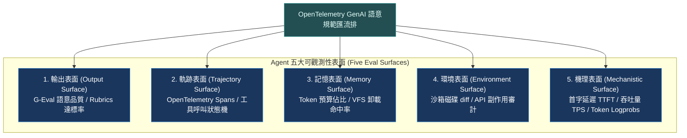
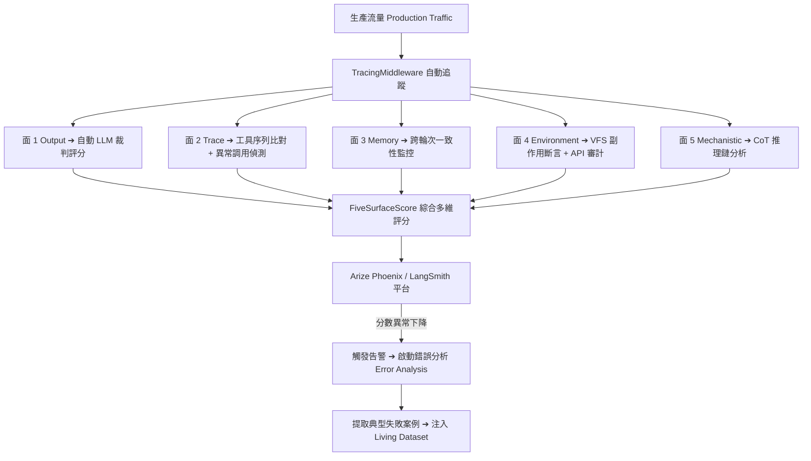

# Chapter 22: 可觀測性：五個評估面與 OTel 代理追蹤 (Five Observability Surfaces)


> *「Chat eval 是一個電子表格；Agent eval 是一個系統。」* — Han-Chung Lee
>
> 你只能評估你看得見的東西。代理系統在執行期會產生五種截然不同的可觀測面——每種都揭示不同的失效模式。只看最終輸出，你會錯過 80% 的問題。

---

## 核心心智模型：醫療級全景斷層掃描 (Full CT Scan & OpenTelemetry Spans)

當醫生診斷重大疾病時，單憑量體溫無法得知內臟病變，必須進行多層螺旋電腦斷層掃描（CT Scan）：從骨骼、血管到軟組織，層層剖析。

Agent 可觀測性絕不能只看「使用者輸入」與「最終輸出」，必須構建 **五大評估面（Five Eval Surfaces）** 的全景斷層掃描：
1. **輸出層 (Output Surface)**：最終文字答案的語意品質與格式合規。
2. **軌跡層 (Trajectory Surface)**：工具調用序列、決策順序與步驟效率。
3. **記憶層 (Memory Surface)**：上下文視窗演變、摘要觸發與長期記憶檢索精準度。
4. **環境層 (Environment Surface)**：VFS 檔案變更、外部 API 請求與副作用乾淨度。
5. **機理層 (Mechanistic Surface)**：模型內部 Token 概率、注意力分佈與延遲瓶頸。



---

## 1. 五個評估面（Five Eval Surfaces）

Han-Chung Lee「Hidden Technical Debt: Agent Evaluation Infrastructure」提出的五面模型：

| 評估面 | 觀察對象 | 評估方式 | 可見問題 | 盲點 |
|---|---|---|---|---|
| **面 1: Output** | 代理的最終文字輸出 | 確定性驗證、LLM 裁判、嵌入相似度 | 最終答案是否正確 | 過程是否合理、中間步驟是否正確 |
| **面 2: Trace** | 工具調用序列（軌跡） | 軌跡比對、順序驗證、工具選擇評分 | 代理走錯路徑、調用多餘工具 | 每個工具調用的內部邏輯 |
| **面 3: Memory** | 對話中累積的狀態和記憶 | 跨輪次一致性檢查、記憶注入測試 | 「遺忘症」、錯誤記憶持久化 | 記憶與行為的因果關係 |
| **面 4: Environment** | 代理對外部世界的副作用 | VFS 斷言、API 回呼驗證、DB 狀態檢查 | 檔案被錯誤修改、API 被多次呼叫 | 副作用的長期影響 |
| **面 5: Mechanistic** | 代理推理過程的內部機制 | CoT 分析、注意力模式 | 幻覺的推理根源、邏輯跳躍 | 大部分仍是黑盒 |


> [!IMPORTANT]
> **空工具回傳幻覺（Empty-tool-result Hallucination）**
>
> Lee 特別指出的一個典型五面分析案例：工具回傳了空結果（面 4），但代理在最終輸出（面 1）中虛構了一個正面的答案。如果只評估面 1，你永遠不會發現這個問題——你需要同時觀察面 4（工具回傳是否為空）和面 1（輸出是否承認了這一點）。

---

## 2. 控制平面 vs. 資料平面

| 維度 | 控制平面 (Control Plane)<br>*決定代理「應該做什麼」* | 資料平面 (Data Plane)<br>*記錄代理「實際做了什麼」* |
|---|---|---|
| **核心職責** | 策略正確性（Policy Correctness） | 執行品質與可觀測性（Execution Quality） |
| **主要範疇** | • 系統提示詞（System Prompt）組裝<br>• 工具選擇與路由邏輯<br>• 子代理委派策略（Delegation Strategy）<br>• HITL 中斷條件判定與權限控制 | • 工具呼叫參數與返回值日誌<br>• 中間思考步驟與推理鏈（CoT）<br>• VFS 檔案變更與環境副作用記錄<br>• Token 消耗、p95 延遲與帳單成本 |
| **評估焦點** | 規則與決策邏輯是否嚴密無漏洞 | 運行期真實行為是否符合預期與 SLA |


---

## 3. OTel GenAI 語意規範：代理追蹤的業界標準

OpenTelemetry GenAI Semantic Conventions（CNCF 2026）定義了代理追蹤的標準 span 結構：

```python
# 標準 OTel GenAI spans 的結構
# 對應 opentelemetry.io/docs/specs/semconv/gen-ai/gen-ai-agent-spans/

SPAN_TYPES = {
    # 代理生命週期
    "gen_ai.agent.create":  "代理實例建立",
    "gen_ai.agent.invoke":  "代理被呼叫執行任務",
    # 工具執行
    "gen_ai.tool.execute":  "單次工具呼叫執行",
    # LLM 呼叫
    "gen_ai.llm.call":      "單次 LLM API 呼叫",
}

# 每個 span 的標準屬性
SPAN_ATTRIBUTES = {
    # gen_ai.agent.invoke
    "gen_ai.agent.name":            str,   # 代理名稱
    "gen_ai.agent.description":     str,   # 代理描述
    "gen_ai.input.messages":        list,  # 輸入訊息
    "gen_ai.output.messages":       list,  # 輸出訊息

    # gen_ai.tool.execute
    "gen_ai.tool.name":             str,   # 工具名稱
    "gen_ai.tool.call.id":          str,   # 工具呼叫 ID（配對請求/回應）
    "gen_ai.tool.args":             dict,  # 工具參數
    "gen_ai.tool.result":           str,   # 工具回傳結果
    "error.type":                   str,   # 若工具失敗，錯誤類型

    # gen_ai.llm.call（追加）
    "gen_ai.usage.input_tokens":    int,   # 輸入 token 數
    "gen_ai.usage.output_tokens":   int,   # 輸出 token 數
    "gen_ai.response.finish_reason": str,  # stop / tool_calls / length
}
```

---

## 4. Deep Agents 追蹤 Middleware：把五面數據結構化

```python
import time
from dataclasses import dataclass, field
from typing import Any

@dataclass
class AgentSpan:
    """單次代理執行的完整追蹤記錄，覆蓋五個評估面。"""
    span_id: str
    agent_name: str
    start_time: float
    end_time: float = 0.0

    # 面 1: Output
    final_output: str = ""

    # 面 2: Trace（工具調用序列）
    tool_calls: list = field(default_factory=list)  # [{"name": ..., "args": ..., "result": ...}]

    # 面 3: Memory（跨輪次狀態）
    memory_snapshot_before: dict = field(default_factory=dict)
    memory_snapshot_after: dict = field(default_factory=dict)

    # 面 4: Environment（副作用）
    vfs_mutations: list = field(default_factory=list)  # 檔案系統變動記錄
    api_calls_made: list = field(default_factory=list)

    # 面 5: Mechanistic（推理步驟，部分可見）
    chain_of_thought_steps: list = field(default_factory=list)

    # 成本與延遲（一級指標）
    total_input_tokens: int = 0
    total_output_tokens: int = 0
    total_cost_usd: float = 0.0

    @property
    def latency_ms(self) -> float:
        return (self.end_time - self.start_time) * 1000

    @property
    def tool_call_count(self) -> int:
        return len(self.tool_calls)

    @property
    def empty_tool_results(self) -> list:
        """識別空工具回傳——幻覺的常見根源。"""
        return [
            tc for tc in self.tool_calls
            if not tc.get("result") or tc["result"].strip() in ("", "null", "None", "{}")
        ]


class TracingMiddleware:
    """
    Deep Agents 追蹤中介軟體：在代理執行期間收集五個評估面的數據。
    輸出 OTel-compatible 結構，可直接送入 Arize Phoenix / Langfuse。
    """

    def __init__(self, span_sink=None):
        self._current_span: AgentSpan | None = None
        self._sink = span_sink or self._default_sink

    async def on_run_start(self, state, messages, **kwargs):
        import uuid
        self._current_span = AgentSpan(
            span_id=str(uuid.uuid4()),
            agent_name=kwargs.get("agent_name", "unknown"),
            start_time=time.time(),
            memory_snapshot_before=dict(state or {}),
        )

    async def on_tool_call(self, tool_name: str, tool_args: dict, tool_result: Any, **kwargs):
        if self._current_span:
            self._current_span.tool_calls.append({
                "name": tool_name,
                "args": tool_args,
                "result": str(tool_result),
                "timestamp": time.time(),
            })

    async def on_run_end(self, state, messages, **kwargs):
        if not self._current_span:
            return
        span = self._current_span
        span.end_time = time.time()
        span.final_output = messages[-1].content if messages else ""
        span.memory_snapshot_after = dict(state or {})

        # 自動警告：空工具回傳 + 非空輸出（可能幻覺）
        empty_results = span.empty_tool_results
        if empty_results and span.final_output:
            print(
                f"⚠️ [TracingMiddleware] 偵測到 {len(empty_results)} 個空工具回傳，"
                f"但代理產生了輸出——請手動驗證是否存在幻覺。"
            )

        await self._sink(span)
        self._current_span = None

    async def _default_sink(self, span: AgentSpan):
        """預設：輸出到 stdout，生產中應替換為 Langfuse / Arize Phoenix。"""
        print(f"[Trace] {span.span_id[:8]} | "
              f"tools={span.tool_call_count} | "
              f"latency={span.latency_ms:.0f}ms | "
              f"cost=${span.total_cost_usd:.4f}")
```

---

## 5. 五面評估器：結構化評分代理執行

```python
from dataclasses import dataclass

@dataclass
class FiveSurfaceScore:
    output_score: float       # 面 1: 0.0–1.0
    trace_score: float        # 面 2: 0.0–1.0
    memory_score: float       # 面 3: 0.0–1.0
    environment_score: float  # 面 4: 0.0–1.0
    # 面 5 (Mechanistic) 通常無法自動評分，留給人工

    @property
    def composite_score(self) -> float:
        """加權複合分數（可調整各面權重）。"""
        weights = {
            "output": 0.35,
            "trace": 0.25,
            "memory": 0.20,
            "environment": 0.20,
        }
        return (
            self.output_score * weights["output"]
            + self.trace_score * weights["trace"]
            + self.memory_score * weights["memory"]
            + self.environment_score * weights["environment"]
        )


def evaluate_span(span: AgentSpan, expected: dict) -> FiveSurfaceScore:
    """對單次代理執行跨五個面打分。"""

    # 面 1: Output — 確定性或 LLM 裁判
    expected_keywords = expected.get("output_keywords", [])
    output_score = (
        sum(kw.lower() in span.final_output.lower() for kw in expected_keywords)
        / len(expected_keywords)
        if expected_keywords else 1.0
    )

    # 面 2: Trace — 工具調用序列是否包含所有必需工具
    required_tools = set(expected.get("required_tools", []))
    actual_tools = {tc["name"] for tc in span.tool_calls}
    trace_score = len(required_tools & actual_tools) / len(required_tools) if required_tools else 1.0

    # 面 3: Memory — 跨輪次狀態一致性
    expected_memory_keys = expected.get("expected_memory_keys", [])
    memory_score = (
        sum(k in span.memory_snapshot_after for k in expected_memory_keys)
        / len(expected_memory_keys)
        if expected_memory_keys else 1.0
    )

    # 面 4: Environment — VFS 副作用斷言
    expected_mutations = set(expected.get("expected_file_mutations", []))
    actual_mutations = {m.get("path") for m in span.vfs_mutations}
    environment_score = (
        len(expected_mutations & actual_mutations) / len(expected_mutations)
        if expected_mutations else 1.0
    )

    return FiveSurfaceScore(
        output_score=output_score,
        trace_score=trace_score,
        memory_score=memory_score,
        environment_score=environment_score,
    )
```

---

## 6. 代理追蹤的 OTel → Arize Phoenix 整合範本

```python
# 把 TracingMiddleware 的 span 送入 Arize Phoenix（OTel 標準）
from opentelemetry.sdk.trace import TracerProvider
from opentelemetry.exporter.otlp.proto.http.trace_exporter import OTLPSpanExporter
from opentelemetry.sdk.trace.export import BatchSpanProcessor

def setup_otel_tracing(phoenix_endpoint: str = "http://localhost:6006"):
    """設定 OTel 追蹤，把 agent spans 送入 Arize Phoenix。"""
    provider = TracerProvider()
    exporter = OTLPSpanExporter(endpoint=f"{phoenix_endpoint}/v1/traces")
    provider.add_span_processor(BatchSpanProcessor(exporter))
    return provider

def span_to_otel(span: AgentSpan, tracer):
    """把 AgentSpan 轉換為 OTel span，包含 GenAI 語意屬性。"""
    with tracer.start_as_current_span(f"gen_ai.agent.invoke") as otel_span:
        # 標準 GenAI 屬性
        otel_span.set_attribute("gen_ai.agent.name", span.agent_name)
        otel_span.set_attribute("gen_ai.output.messages", str(span.final_output))
        otel_span.set_attribute("gen_ai.usage.input_tokens", span.total_input_tokens)
        otel_span.set_attribute("gen_ai.usage.output_tokens", span.total_output_tokens)

        # 工具調用子 spans
        for tc in span.tool_calls:
            with tracer.start_as_current_span("gen_ai.tool.execute") as tool_span:
                tool_span.set_attribute("gen_ai.tool.name", tc["name"])
                tool_span.set_attribute("gen_ai.tool.args", str(tc["args"]))
                tool_span.set_attribute("gen_ai.tool.result", tc["result"])
                # 標記空工具回傳
                if not tc["result"] or tc["result"].strip() in ("", "null", "None"):
                    tool_span.set_attribute("deep_agents.empty_tool_result", True)
```

---

## 7. 追蹤數據驅動的評估工作流程




---

## 🤔 架構深度思辨與工業界陷阱 (Architectural Insight & Production Pitfalls)

> [!IMPORTANT]
> **Frontier Lab 核心考點 (Distributed Tracing & Agent Observability MLE)**:
> - **陷阱與對策 (Failure Mode & Fix)**:
>   1. **追蹤遙測開銷導致延遲暴增 (Tracing Latency Overhead)**: 
>      在每一次 Tool Call 或 Token 生成時同步向外部 OTel Collector 發送 HTTP POST，使整個 Agent 交互延遲增加 300% 以上。**必須使用非同步記憶體緩衝佇列（Async Batching Span Processor），以背景 Worker 批量推送遙測資料**。
>   2. **敏感隱私資料外洩進追蹤日誌 (PII Leakage in Traces)**: 
>      使用者的身分證號、信用卡號或 API Key 隨 Prompt 與 Tool 輸出被未經脫敏直接寫入 Datadog / Langfuse。**在 OTel Span 注入中介軟體中設置正則脫敏過濾器（Regex Sanitizer），自動遮蔽任何高敏資訊**。
> - **核心技術思辨 (Technical Deep Dive)**:
>   *Q: 為什麼 OpenTelemetry 提出的「GenAI 語意規範（Semantic Conventions）」比各家自製的 Logging JSON 更適合跨團隊協作？*  
>   *A: 傳統 JSON 日誌格式因團隊而異（有人寫 `tool_name`，有人寫 `function`，有人將延遲記錄為 `latency_ms` 或 `duration`），導致跨系統的鏈路追蹤無法自動解析。OTel GenAI 規範標準化了 `gen_ai.system`、`gen_ai.request.model`、`gen_ai.usage.prompt_tokens` 等關鍵屬性，使得 Datadog、Jaeger、Langfuse 等開源與商業平台能開箱即用繪製出統一的火焰圖、Token 消耗矩陣與調用拓撲，極大降低維運成本。*

---

## 練習

1. 在你的代理上部署 `TracingMiddleware`，執行 10 次任務，分析哪個面的平均分最低——這就是你最應該優先改善的方向。
2. 特意設計一個讓工具回傳空結果的任務，觀察代理在面 1（Output）和面 4（Environment）的表現差異，驗證空工具回傳幻覺的存在。
3. 用 `evaluate_span` 對同一個任務的 5 次執行計算 `FiveSurfaceScore`，計算五個面的方差——方差最大的面是你的代理系統最不穩定的環節。
4. 把 `span_to_otel` 整合到你的本地 Arize Phoenix 實例（`pip install arize-phoenix`），用 Phoenix UI 視覺化工具調用樹，找出延遲最高的工具呼叫。

---

下一章：[23 — 錯誤分析：最高 ROI 的代理改善活動](23-error-analysis.md)
