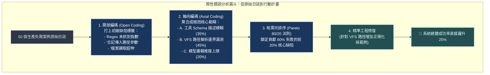

# Chapter 23: 錯誤分析：最高 ROI 的代理改善活動 (Error Analysis & RCA)


> *「錯誤分析（Error Analysis）是始終一致的最高 ROI 活動。」* — Hamel Husain
>
> 大多數工程師在代理失敗時的第一反應是修改 prompt 或換模型。
> 真正有效的改善流程從**系統性地觀察和分類失敗**開始——在你理解失敗的根本原因之前，任何修改都是猜測。

---

## 核心心智模型：空難調查委員會與黑盒子解碼 (Air Crash Investigation & Axial Coding)

當一起空難發生時，調查委員會絕不會憑空猜測「可能是天候不佳」，而是花費數月進行嚴謹的質性研究：
- **開放編碼（Open Coding）**：把飛行記錄儀的每一秒通話、儀表數據切片，標註出數百個具體的「微小異常現象」。
- **軸向編碼（Axial Coding）**：將這數百個微小標籤聚合成核心因果鏈條（如：結冰感應器故障 → 自動推力解鎖 → 飛行員注意力轉移）。
- **根因分析（RCA）與行動樹**：得出最根本的工程缺陷，並針對性修改手冊或零件。

在 Agent 工程中，**錯誤分析（Error Analysis）是投入產出比（ROI）最高的一項活動**：與其盲目調試 Prompt，不如深度剖析 50 個真實失敗案例，利用軸向編碼定位真正的系統瓶頸！



---

## 1. 為什麼「直覺修改」是低效的

```mermaid
graph TD
    subgraph bad ["❌ 典型低效盲目直覺迴圈"]
        F1["代理執行失敗"] --> P1["直覺猜測：可能是 Prompt 問題"]
        P1 --> E1["隨意微調 Prompt"]
        E1 --> T1["手動隨機跑 2-3 個案例"]
        T1 --> D1["體感尚可 ➔ 盲目部署"]
        D1 --> R1["兩週後生產環境再次爆發回歸！"]
    end

    subgraph good ["✅ 高效評估驅動開發 EDD 閉環"]
        F2["代理執行失敗"] --> C2["系統性收集 50+ 失敗案例"]
        C2 --> O2["開放編碼 Open Coding 記錄事實"]
        O2 --> A2["軸心編碼 Axial Coding 聚類歸因"]
        A2 --> PA2["帕累托分析鎖定前 80% 核心根因"]
        PA2 --> V2["針對性擴充 EvalCase & Verifier"]
        V2 --> M2["重構架構 / Middleware / Tool"]
        M2 --> CI2["CI 回歸測試通過 ➔ 注入 Regression 活資料集"]
    end
```




---

## 2. 開放編碼（Open Coding）：從原始失敗到失敗標籤

開放編碼源自質性研究方法，被 Hamel Husain 和 Shreya Shankar 引入 AI 評估實踐：

```python
from dataclasses import dataclass, field
from typing import Optional
from enum import Enum

class FailureCategory(str, Enum):
    """代理失敗的高層次分類（開放編碼後的軸心類別）。"""
    TOOL_SELECTION = "tool_selection"         # 選錯工具或多餘工具呼叫
    TOOL_ARGUMENT = "tool_argument"           # 工具參數錯誤或不完整
    CONTEXT_LOSS = "context_loss"             # 跨輪次丟失關鍵上下文
    HALLUCINATION = "hallucination"           # 憑空捏造事實或引用
    PREMATURE_STOP = "premature_stop"         # 提前結束任務（任務未完成）
    INSTRUCTION_IGNORE = "instruction_ignore" # 忽略系統提示詞中的限制
    LOOP_DETECTION = "loop_detection"         # 重複相同動作（Chapter 15 MAST）
    SECURITY_VIOLATION = "security_violation" # 觸發安全邊界（Chapter 16）
    REASONING_ERROR = "reasoning_error"       # 邏輯推理錯誤
    FORMAT_ERROR = "format_error"             # 輸出格式不符合要求
    UNKNOWN = "unknown"                       # 需要進一步分析

@dataclass
class AnnotatedFailure:
    """單個失敗案例的完整標注記錄。"""
    case_id: str
    input: str
    actual_output: str
    expected_outcome: str

    # 開放編碼結果
    raw_notes: str = ""  # 初次閱讀的直覺觀察（不加過濾）

    # 軸心編碼結果
    primary_category: Optional[FailureCategory] = None
    secondary_category: Optional[FailureCategory] = None

    # 根本原因分析
    root_cause: str = ""       # 為什麼會這樣失敗？（技術根因）
    contributing_factor: str = "" # 是什麼讓這個問題更嚴重？

    # 可行的修復方向
    suggested_fix: str = ""    # Middleware / Tool / Prompt 層面的具體建議
    eval_case_needed: bool = True  # 這個失敗是否需要成為 EvalCase？
```

---

## 3. 軸心編碼（Axial Coding）：把失敗標籤聚合成行動計劃

```python
from collections import Counter

def axial_coding_report(failures: list[AnnotatedFailure]) -> dict:
    """
    聚合開放編碼結果，識別高頻失敗類別，輸出帕累托分析。
    這就是把「50 個失敗案例」轉化為「行動優先級」的核心步驟。
    """
    category_counts = Counter(
        f.primary_category for f in failures
        if f.primary_category is not None
    )
    total = len(failures)

    # 帕累托分析：哪些類別佔了 80% 的失敗？
    sorted_categories = category_counts.most_common()
    cumulative = 0
    pareto_threshold = []
    for category, count in sorted_categories:
        cumulative += count
        pareto_threshold.append({
            "category": category,
            "count": count,
            "percentage": count / total * 100,
            "cumulative_percentage": cumulative / total * 100,
            "in_pareto_80": cumulative / total <= 0.80,
        })

    # 根本原因聚類
    root_causes = [f.root_cause for f in failures if f.root_cause]

    # 建議修復行動
    suggested_fixes = [f.suggested_fix for f in failures if f.suggested_fix]

    return {
        "total_failures_analyzed": total,
        "category_distribution": pareto_threshold,
        "pareto_80_categories": [
            p["category"] for p in pareto_threshold if p["in_pareto_80"]
        ],
        "sample_root_causes": root_causes[:5],
        "sample_suggested_fixes": suggested_fixes[:5],
        "eval_cases_needed": sum(1 for f in failures if f.eval_case_needed),
    }
```

---

## 4. 四步錯誤分析流程（Hamel's Process）

| 步驟 | 名稱 | 關鍵目標與原則 | 實踐範例 |
|---|---|---|---|
| **Step 1** | **收集 (Collect)** | • 收集 50–100 個失敗案例<br>• 來源：生產日誌、CI 失敗、人工測試、邊界輸入<br>• **原則**：不要過濾篩選！包括所有異常案例 | 將所有測試失敗的 LangSmith trace JSON 匯入分析列表 |
| **Step 2** | **標注 (Annotate)**<br>*開放編碼* | • 為每個案例記錄 2–3 句客觀事實（`raw_notes`）<br>• **原則**：先記錄事實，不急著歸類、不主觀評判 | 「代理沒有呼叫搜尋就直接作答」<br>「工具參數格式為 ISO，代理傳遞了中文」 |
| **Step 3** | **聚類 (Cluster)**<br>*軸心編碼* | • 將事實筆記分組，提取通用故障模式<br>• **原則**：讓類別從真實數據中浮現，切忌生搬硬套 | 「未調用工具」➔ `TOOL_SELECTION`<br>「參數溢出」➔ `TOOL_ARGUMENT` |
| **Step 4** | **行動 (Act)**<br>*帕累托分析* | • 統計失敗類別佔比，鎖定前 80% 問題的 2–3 個根因<br>• 針對性重構中介軟體或鷹架 | `TOOL_SELECTION` (35%) ➔ 補充 ReAct 指引<br>`TOOL_ARGUMENT` (25%) ➔ 加參數驗證 |

---

## 5. 失敗模式的三層根本原因分析框架

| 分析層級 | 診斷核心問題 | 典型故障現象與修復路徑 |
|---|---|---|
| **層 1：執行框架失效點**<br>*(Which Harness Layer?)* | 到底是哪一個具體層級崩潰？ | • **Skill Disclosure**：工具暴露過多/過少 ➔ 引入漸進式揭露<br>• **Context Assembly**：上下文噪音過多 ➔ 上下文壓縮<br>• **Tool Design**：Schema 定義模糊 ➔ 重新設計 Docstring<br>• **Memory**：狀態污染 ➔ 清理跨輪次 Storage<br>• **Programmatic**：確定性預處理錯誤 ➔ 修復規則函數 |
| **層 2：模型邊界 vs 框架缺陷**<br>*(Model vs Harness?)* | 換個框架能解決嗎？ | • **框架缺陷**：相同 Prompt 在其他 Harness 下能跑通 ➔ **修改執行框架架構**<br>• **模型邊界**：所有框架下均失敗 ➔ **評估微調（Fine-tuning）或更換大模型** |
| **層 3：穩定性 vs 絕對能力**<br>*(Reliability vs Capability?)* | 是偶發隨機還是能力不足？ | • **穩定性問題**：$\text{pass}@1 = 50\%,\ \text{pass}^5 = 5\%$ ➔ **增加確定性驗證、自我反思迴圈**<br>• **能力問題**：$\text{pass}^5 = 0\%$ ➔ **任務超出當前模型推理上限** |

---

## 6. 案例分析：Cursor Bugbot 的錯誤分析驅動改善

Cursor「Building a better Bugbot」（2026）是錯誤分析驅動改善的最佳產業案例：

| 維度 | 初期基準 | 40 次實驗後最終狀態 | 關鍵洞見 |
|---|---|---|---|
| **Bug 解決率** | **52%** (BugBench 黃金資料集) | **> 70%** (全面上線) | **架構躍遷（非代理 ➔ 完整多代理）帶來的 ROI (+18%) 遠超一切超參數調優 (1-3%) 的總和。** |
| **改進分佈** | 單次非代理 LLM 評估 | 具備完整探索工具、驗證迴圈的 Agent 系統 | 若錯誤分析顯示某類失效佔比超過 40%，且需架構調整才能根治，應果斷重構架構而非無休止調參。 |


---

## 7. 實戰：自動化錯誤分析報告

```python
class AutoErrorAnalyzer:
    """
    自動從代理追蹤數據中提取失敗模式，生成錯誤分析報告。
    Scale AI「Insights Generator」論文（arXiv:2605.21347）的輕量版實作：
    人工專家使用 IG 報告後，架構性能提升 30.4pp（幾乎是未修改基準的兩倍）。
    """

    def __init__(self, judge_agent):
        self.judge = judge_agent

    def analyze_batch(self, spans: list, expected: list) -> dict:
        """分析一批代理執行追蹤，提取失敗模式。"""
        failed_spans = [
            (span, exp) for span, exp in zip(spans, expected)
            if not self._is_success(span, exp)
        ]

        if not failed_spans:
            return {"status": "no_failures", "total": len(spans)}

        # 對每個失敗案例提取 raw notes（可以用 LLM 自動化，也可以手動）
        annotated = []
        for span, exp in failed_spans:
            notes = self._extract_failure_notes(span, exp)
            annotated.append(AnnotatedFailure(
                case_id=span.span_id,
                input=str(exp.get("input", "")),
                actual_output=span.final_output,
                expected_outcome=str(exp.get("expected", "")),
                raw_notes=notes,
            ))

        # 批量分類（使用 LLM 裁判）
        for failure in annotated:
            category = self._classify_failure(failure)
            failure.primary_category = category

        # 生成軸心編碼報告
        report = axial_coding_report(annotated)
        report["sample_failures"] = [
            {"case_id": f.case_id, "notes": f.raw_notes, "category": f.primary_category}
            for f in annotated[:5]
        ]
        return report

    def _is_success(self, span, expected: dict) -> bool:
        required_tools = set(expected.get("required_tools", []))
        actual_tools = {tc["name"] for tc in span.tool_calls}
        has_tools = required_tools.issubset(actual_tools)
        has_keywords = all(
            kw.lower() in span.final_output.lower()
            for kw in expected.get("output_keywords", [])
        )
        return has_tools and has_keywords

    def _extract_failure_notes(self, span, expected: dict) -> str:
        """生成描述性失敗 notes——可手動，也可以讓 LLM 幫你寫初稿。"""
        issues = []
        required = set(expected.get("required_tools", []))
        called = {tc["name"] for tc in span.tool_calls}
        missing = required - called
        extra = called - required

        if missing:
            issues.append(f"缺少必要工具呼叫：{missing}")
        if extra:
            issues.append(f"多餘工具呼叫：{extra}")
        if span.empty_tool_results:
            issues.append(f"空工具回傳（潛在幻覺）：{[t['name'] for t in span.empty_tool_results]}")
        if not span.final_output:
            issues.append("代理無輸出（提前結束）")

        return "；".join(issues) if issues else "輸出與預期不符（需人工審查）"

    def _classify_failure(self, failure: AnnotatedFailure) -> FailureCategory:
        """用 LLM 裁判把 raw_notes 分類到失敗類別。"""
        # 簡化版：基於關鍵詞的確定性分類（生產中用 LLM 裁判更準確）
        notes = failure.raw_notes.lower()
        if "工具" in notes and "缺少" in notes:
            return FailureCategory.TOOL_SELECTION
        if "工具" in notes and "參數" in notes:
            return FailureCategory.TOOL_ARGUMENT
        if "幻覺" in notes or "空工具回傳" in notes:
            return FailureCategory.HALLUCINATION
        if "提前結束" in notes or "無輸出" in notes:
            return FailureCategory.PREMATURE_STOP
        return FailureCategory.UNKNOWN
```

---

## 8. 錯誤分析的反模式（要避免的坑）

| ❌ 常見反模式 (Anti-Pattern) | 潛在危害與盲點 | ✅ 正確工程對策 |
|---|---|---|
| **反模式 1：只分析最近失敗的 2–3 個案例** | 樣本容量過小，極易被長尾隨機噪音誤導，陷入過度擬合（Overfitting）。 | 至少系統性收集 **50–100 個案例** 才能準確辨識統計學顯著模式。 |
| **反模式 2：在分析事實之前預設解決方案** | 帶著預設立場（如「一定是提示詞寫不好」），忽視真正的架構缺陷。 | 嚴格執行**先開放編碼（客觀描述事實）➔ 再軸心編碼（聚類）➔ 最後制定架構方案**。 |
| **反模式 3：只分析失敗，從不分析成功** | 無法理解為什麼某些邊界情況代理能夠偶然通過，丟失對比基線。 | 對比成功案例與失敗案例的 Trace 差異，找出致勝的關鍵特徵。 |
| **反模式 4：錯誤分析後不沉澱 EvalCase** | 問題修復後沒有任何防禦工事，未來的 Prompt/模型變更必然導致回歸。 | 每個被確認的典型失敗案例必須**立即編寫確定性 Verifier 並存入 Regression 集**。 |
| **反模式 5：把「換更貴的模型」當作萬能解藥** | 掩蓋執行框架缺陷；成本翻倍後，原本的架構問題（如上下文丟失）依然存在。 | **先窮盡執行框架層（Tool/Middleware/VFS/Skills）的優化空間**，再評估更換模型。 |


---

## 🤔 架構深度思辨與工業界陷阱 (Architectural Insight & Production Pitfalls)

> [!IMPORTANT]
> **Frontier Lab 核心考點 (Root Cause Analysis & Agent Improvement MLE)**:
> - **陷阱與對策 (Failure Mode & Fix)**:
>   1. **打地鼠式修改 (Whack-a-Mole Debugging)**: 
>      工程師看到一個案例失敗，就立即在 System Prompt 裡加一句特定補丁，結果修復了案例 A 卻搞砸了原本正常的案例 B 和 C。**嚴禁針對單一案例打補丁！必須累積至少 30 個失敗樣本完成軸向編碼後，以系統性架構變更（如增加 Middleware 或優化 Tool 介面）進行整體迭代**。
>   2. **海森堡錯誤 (Heisenbugs in LLM)**: 
>      因為溫度 $	au > 0$，重跑同一個失敗案例時錯誤消失，工程師誤以為問題已解決。**在錯誤分析階段，必須將溫度歸零（$	au = 0$）以獲得確定性基線，或針對同一案例採樣 $N=10$ 次評估失效率分佈**。
> - **核心技術思辨 (Technical Deep Dive)**:
>   *Q: 為什麼在 Agent 系統改進中，80% 的失敗根本原因通常不在「模型不夠聰明」，而在「執行框架環境工程粗糙」？*  
>   *A: 現代前沿模型（Claude 3.7、GPT-4o）的邏輯理解能力已遠超多數常規任務需求。深度錯誤分析揭示，絕大多數任務失敗源於：1. Tool 返回的報錯訊息過於晦澀（例如僅拋出 `KeyError: 0`），未提供任何可執行的修正建議；2. VFS 缺少檔案分頁讀取功能導致模型被截斷文本誤導；3. 缺乏中間狀態檢查點導致輕微挫折直接終止。這些純粹是軟體工程與執行框架的職責，改善框架環境能以極低成本釋放模型原本被抑制的推理潛能。*

---

## 練習

1. 從你的代理歷史日誌中選取最近 30 個失敗案例，為每個寫 2-3 句話的 `raw_notes`（只描述，不評判），然後用 `FailureCategory` 分類，繪製頻率直方圖。
2. 找出佔失敗總數前 80% 的類別，用根本原因框架（哪個執行框架層 / 模型 vs 框架 / 穩定性 vs 能力）分析每個類別的根本原因。
3. 用 `AutoErrorAnalyzer.analyze_batch` 處理你的失敗追蹤數據，對比自動分析結果和你手動的 `raw_notes`——找出自動分類準確率最低的失敗類別，理解為什麼機器在這個類別上表現差。
4. 選取帕累托分析中最高頻的失敗類別，設計對應的 `EvalCase` 並加入 regression set，在修復後確認 CI 通過。

---

下一章：[24 — 多輪次與長任務評估](24-multi-turn-evaluation.md)
