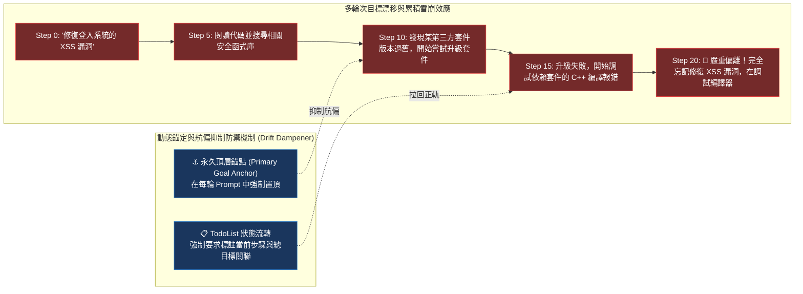
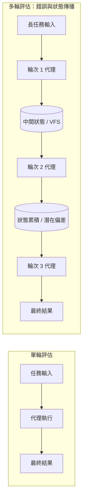
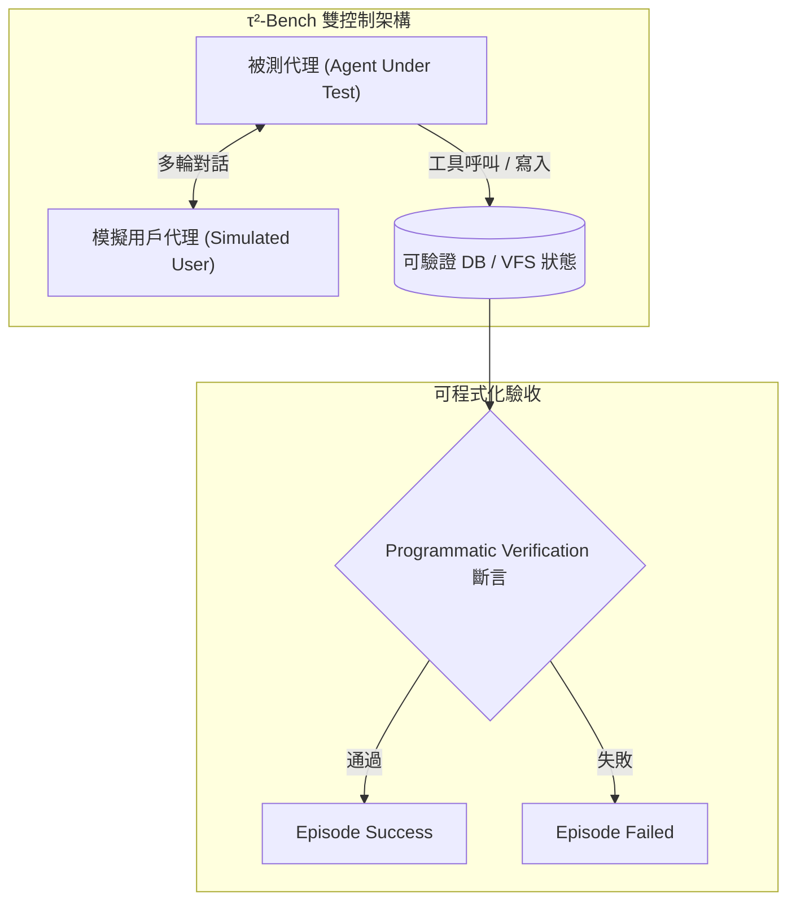

# Chapter 24: 多輪次與長任務評估 (Multi-Turn Evaluation & Long Horizon)


> *「不可觀測的系統無法被優化，未經衡量的成本終將拖垮商業化；在全鏈路遙測的世界裡，每一次 Token 消耗都是透明的脈搏。」*

---

> *「成功率 vs 人類時間」是長任務評估的核心量尺。* — METR「Measuring AI Ability to Complete Long Tasks」
>
> 傳統 LLM 評估假設：每個任務是獨立的單次問答。代理評估的根本挑戰是：**長任務的隨機性會累積，單輪成功率無法預測多輪穩定性**。本章從 METR 的長任務基準設計、τ²-Bench 的雙控制架構、和 Deep Agents 多輪實踐中提煉核心評估方法。

---

## 核心心智模型：遠洋航行的羅盤與航偏校正 (Ocean Navigation & Drift Dampening)

一艘從舊金山出發前往東京的輪船，航行距離超過 5,000 海浬。如果船長在起航時羅盤偏差了僅僅 0.5 度，若中途不做任何校正，輪船最終將偏離目標數百公里，駛入完全未知的大洋深處。

長任務與多輪次對話（Multi-Turn Long Horizon）面臨完全相同的挑戰：
- **目標漂移（Goal Drift）**：在執行第 1 步時目標清晰，但到了第 20 步，模型在大量中間工具產物與瑣碎細節的干擾下，遺忘了最原始的頂層任務。
- **METR 長任務量尺**：從 5 分鐘任務（單次搜尋）到 2 小時長程任務（獨立重構中型專案），成功率隨時間視野呈指數級衰減。
- **動態錨定與航偏抑制（Drift Dampening）**：每隔幾輪自動將頂層目標與已完成 Checkpoint 重新投影至視窗頂部，如同燈塔持續指引航向。



---

## 1. 為什麼多輪次評估根本不同



> [!WARNING]
> **多輪錯誤累積效應**：若單輪失敗率為 $p = 0.10$（90% 成功率），在 10 輪任務中至少出現一次失敗的機率高達：
> $$P(\text{失敗}) = 1 - (1 - 0.1)^{10} \approx 65.1\%$$
> **結論**：單純的 $\text{pass}@1$ 指標在長任務中完全不具備可靠性預測力。

---

## 2. 成功率 vs. 人類時間：METR 長任務量尺

METR「Measuring AI Ability to Complete Long Tasks」（2025）提出了一個革命性的量尺：**不問「代理能做什麼任務」，而是問「代理能在多長的人類任務上達到 50% 成功率？」**

| 人類完成此任務所需時間 | 代理通過率 (Pass Rate) | 演進趨勢備註 |
|---|---|---|
| **5 分鐘** | **90%** | 代理顯著超越人類執行速度 |
| **15 分鐘** | **70%** | 穩定可靠自動化區間 |
| **1 小時** | **50%** | **2025 年主流旗艦模型的能力邊界（50% 閾值）** |
| **4 小時** | **20%** | 狀態漂移與死循環風險激增 |
| **1 天** | **5%** | 需極強的架構重試與記憶修復 |
| **1 週** | **1%** | 當前最前沿自主研發挑戰極限 |

> [!TIP]
> **代理時間視野（Agent Time Horizon）**：2023 年代理 50% 成功率對應約 5 分鐘人類任務；2025 年已躍升至 1 小時。
> 相同的模型在不同執行框架（Scaffold）下，測量出的時間視野差距高達 **3–5 倍**。


---

## 3. 長任務評估的三個核心指標

### 3.1 pass^k（所有試驗都成功）vs. pass@k（至少一次成功）

```python
from typing import Callable

def compute_long_task_metrics(
    agent,
    task,
    k: int = 5,
    n_independent_sessions: int = 20,
) -> dict:
    """
    計算長任務的可靠性指標。

    pass@k  = P(至少 1 次試驗成功) = 代理的「最大能力」
    pass^k  = P(所有 k 次試驗都成功) = 代理的「可靠能力」
    """
    session_results = []
    for session_i in range(n_independent_sessions):
        # 每個 session 完全隔離：新的對話、新的 VFS、新的記憶
        trial_results = []
        for trial_j in range(k):
            result = run_isolated_agent_trial(agent, task)
            trial_results.append(result["passed"])

        session_results.append({
            "pass_at_1": trial_results[0],
            "pass_at_k": any(trial_results),              # 至少一次成功
            "pass_pow_k": all(trial_results),             # 所有試驗都成功
            "pass_rate_in_session": sum(trial_results) / k,
        })

    n = len(session_results)
    return {
        "k": k,
        "n_sessions": n,
        "pass@1": sum(r["pass_at_1"] for r in session_results) / n,
        f"pass@{k}": sum(r["pass_at_k"] for r in session_results) / n,
        f"pass^{k}": sum(r["pass_pow_k"] for r in session_results) / n,
        "avg_session_pass_rate": sum(r["pass_rate_in_session"] for r in session_results) / n,
        # 可靠性差距：pass@k 和 pass^k 的差越大，代理越不穩定
        "reliability_gap": (
            sum(r["pass_at_k"] for r in session_results) / n
            - sum(r["pass_pow_k"] for r in session_results) / n
        ),
    }
```

### 3.2 對話回合效率（Turn Efficiency）

```python
def turn_efficiency(span, expected_min_turns: int) -> float:
    """
    衡量代理完成任務的「路徑效率」。
    最優路徑需要 expected_min_turns 輪，代理使用了多少？

    效率 = 最優輪次 / 實際輪次
    效率 = 1.0 → 完美最短路徑
    效率 = 0.5 → 使用了兩倍的轉次（繞路或重試）
    效率 < 0.3 → 代理在「打轉」（可能是 MAST 循環問題）
    """
    actual_turns = len([tc for tc in span.tool_calls if tc.get("is_reasoning_turn")])
    if actual_turns == 0:
        return 0.0
    return min(expected_min_turns / actual_turns, 1.0)
```

### 3.3 錯誤傳播率（Error Propagation Rate）

```python
def error_propagation_rate(turn_scores: list[float]) -> float:
    """
    衡量早期輪次的錯誤是否傳播並影響後續輪次。
    
    輸入：每輪的評分列表，例如 [0.9, 0.8, 0.3, 0.2, 0.1]
    高傳播率（> 0.3）表示錯誤在累積，代理沒有自我修正能力。
    """
    if len(turn_scores) < 2:
        return 0.0

    # 計算相鄰輪次的平均分數下降
    drops = [
        max(0, turn_scores[i] - turn_scores[i + 1])
        for i in range(len(turn_scores) - 1)
    ]
    return sum(drops) / len(drops)
```

---

## 4. 多輪次評估的隔離原則

> [!IMPORTANT]
> **每個評估試驗必須完全隔離，不得共享任何狀態**：
>
> - **✅ 正確做法**：
>   - `Trial 1`: `new_vfs()` + `new_memory()` + `new_conversation_id()`
>   - `Trial 2`: `new_vfs()` + `new_memory()` + `new_conversation_id()`
>   - `Trial 3`: `new_vfs()` + `new_memory()` + `new_conversation_id()`
>
> - **❌ 錯誤做法**：
>   - `Trial 1`: `shared_vfs` + `clear_memory()` + `new_conversation_id()`
>   - `Trial 2`: `shared_vfs` + `clear_memory()` + `new_conversation_id()`
>
> - **問題分析**：VFS 的殘留狀態（被 Trial 1 修改的檔案）會影響 Trial 2 的評分，導致 $\text{pass}^k$ 虛高。
>
> **關鍵結論**：「隔離」是產生可信 $\text{pass}^k$ 的必要條件，沒有隔離的 $\text{pass}^k$ 數字完全沒有意義。

```python
from contextlib import contextmanager

@contextmanager
def isolated_agent_session(agent_factory, task_input: dict):
    """確保每次試驗在完全隔離的環境中執行。"""
    import uuid

    # 建立隔離的 VFS
    session_id = str(uuid.uuid4())
    vfs = VirtualFileSystem(root=f"/tmp/eval_sessions/{session_id}")

    # 建立獨立的代理實例（確保記憶不共享）
    agent = agent_factory(
        session_id=session_id,
        vfs=vfs,
        memory={},  # 空記憶，不繼承任何上輪狀態
    )

    try:
        yield agent, vfs, session_id
    finally:
        # 清理隔離環境
        vfs.cleanup()
```

---

## 5. τ²-Bench 的雙控制架構：真實多輪次評估

Sierra Research 的 **τ²-Bench（tau²-Bench）** 是多輪次代理評估的最佳實踐：



> **關鍵設計原則**：
> 1. **模擬用戶代理** $\neq$ 人工用戶：遵循特定政策與偏好腳本，提供逼真的多輪互動。
> 2. **最終驗收是 DB/環境狀態**，而非 LLM 對最終文字回覆的評判（全自動確定性驗證）。
> 3. **強制真實對話**：代理必須在自然多輪互動中探詢並滿足使用者隱含限制。


```python
class TauSquaredEvalScenario:
    """τ²-Bench 風格的雙控制評估場景。"""

    def __init__(
        self,
        agent_under_test,
        simulated_user_policy: str,
        verifiable_state_check: Callable,
        max_turns: int = 10,
    ):
        self.agent = agent_under_test
        self.user_policy = simulated_user_policy
        self.state_check = verifiable_state_check
        self.max_turns = max_turns

    def run_episode(self) -> dict:
        """執行一個完整的多輪評估對話。"""
        # 建立模擬用戶代理
        user_agent = create_deep_agent(
            model="anthropic:claude-haiku-4",  # 廉價模型模擬用戶
            system_prompt=self.user_policy,
        )

        conversation = []
        turn_scores = []

        for turn_i in range(self.max_turns):
            # 用戶說話
            user_msg = user_agent.invoke({"messages": conversation})
            user_content = user_msg["messages"][-1].content
            conversation.append({"role": "user", "content": user_content})

            # 判斷對話是否自然結束
            if self._is_conversation_complete(user_content):
                break

            # 代理回應
            agent_response = self.agent.invoke({"messages": conversation})
            agent_content = agent_response["messages"][-1].content
            conversation.append({"role": "assistant", "content": agent_content})

            # 逐輪評分（中間狀態）
            mid_turn_score = self.state_check(agent_response.get("state", {}))
            turn_scores.append(mid_turn_score)

        # 最終驗收：可程式化 DB 狀態檢查
        final_state = self.agent.get_current_state()
        final_passed = self.state_check(final_state)

        return {
            "passed": final_passed,
            "turns_used": len(turn_scores),
            "turn_scores": turn_scores,
            "error_propagation_rate": error_propagation_rate(turn_scores),
            "conversation": conversation,
        }

    def _is_conversation_complete(self, user_message: str) -> bool:
        return any(
            phrase in user_message.lower()
            for phrase in ["謝謝", "好了", "完成了", "bye", "結束"]
        )
```

---

## 6. 多輪次評估的成本管理

長任務評估本身很貴——每次試驗可能包含 50+ 個 LLM 呼叫：

```python
class CostBudgetedEvaluator:
    """
    成本感知的長任務評估器：在預算內最大化評估覆蓋率。
    Kapoor et al.「AI Agents That Matter」的核心論點：
    成本是一級指標，不能被忽略。
    """

    def __init__(self, budget_usd: float = 10.0):
        self.budget_usd = budget_usd
        self.spent_usd = 0.0

    def evaluate_with_budget(
        self,
        agent_factory,
        task_suite: list,
        k: int = 3,
    ) -> dict:
        results = []
        prioritized_tasks = self._prioritize_by_coverage(task_suite)

        for task in prioritized_tasks:
            if self.spent_usd >= self.budget_usd:
                break

            estimated_cost = self._estimate_task_cost(task, k)
            if self.spent_usd + estimated_cost > self.budget_usd:
                # 預算不足：降低 k 而非跳過任務
                reduced_k = max(1, int((self.budget_usd - self.spent_usd) / estimated_cost * k))
                k_to_use = reduced_k
            else:
                k_to_use = k

            task_result = compute_long_task_metrics(
                agent=agent_factory(),
                task=task,
                k=k_to_use,
            )
            task_result["cost_usd"] = estimated_cost * (k_to_use / k)
            self.spent_usd += task_result["cost_usd"]
            results.append(task_result)

        return {
            "tasks_evaluated": len(results),
            "total_cost_usd": self.spent_usd,
            "budget_usd": self.budget_usd,
            "budget_utilization": self.spent_usd / self.budget_usd,
            "results": results,
        }

    def _prioritize_by_coverage(self, tasks: list) -> list:
        """優先評估覆蓋不同失敗類別的任務（最大化診斷覆蓋率）。"""
        # 按任務類型分組，確保每種類型都有代表
        from collections import defaultdict
        by_type = defaultdict(list)
        for task in tasks:
            by_type[task.get("type", "unknown")].append(task)
        # 輪流從每種類型取任務
        prioritized = []
        while any(by_type.values()):
            for task_type in list(by_type.keys()):
                if by_type[task_type]:
                    prioritized.append(by_type[task_type].pop(0))
        return prioritized

    def _estimate_task_cost(self, task: dict, k: int) -> float:
        """估算任務的評估成本（基於預期輪次數和 token 量）。"""
        expected_turns = task.get("expected_turns", 5)
        tokens_per_turn = 2000  # 估算
        cost_per_1k_tokens = 0.003  # claude-sonnet 約價
        return expected_turns * k * tokens_per_turn * cost_per_1k_tokens / 1000
```

---

## 7. 長任務評估的 Session-level vs. Turn-level 指標

| 維度 | Turn-level 指標（每輪評分） | Session-level 指標（整個長任務評分） |
|---|---|---|
| **核心指標** | • 工具選擇準確率<br>• 參數格式正確率<br>• 中間狀態/變更正確性 | • $\text{pass}^k$（連續所有試驗均成功率）<br>• 任務完成時間與 Token 消耗<br>• 成本效率（成功次數 / 美元）<br>• 錯誤傳播率（Error Propagation Rate）<br>• 對話輪次效率（Turn Efficiency） |
| **適用場景** | • 診斷具體在哪個步驟或工具出錯<br>• 訓練 Step-level RLVR 的即時 Reward 塑形 | • 代理系統綜合落地能力評估<br>• PR 與 CI/CD 部署阻斷閘門<br>• 業務 SLA 可靠度報告 |


---

## 🤔 架構深度思辨與工業界陷阱 (Architectural Insight & Production Pitfalls)

> [!IMPORTANT]
> **Frontier Lab 核心考點 (METR Evaluation & Long-Horizon Agents MLE)**:
> - **陷阱與對策 (Failure Mode & Fix)**:
>   1. **長任務兔子洞效應 (Rabbit Hole Trapping)**: 
>      Agent 在嘗試安裝一個輔助套件時遇到報錯，隨後耗費 30 個步驟試圖解決該無關報錯，耗盡 Token 預算。**在 TodoList 中介軟體中設置單一子任務最大嘗試步數（Max Steps per Subtask = 5），超標強制回滾並標記該路徑不可行**。
>   2. **多輪評估環境洩漏 (State Leakage Across Turns)**: 
>      在測試多輪對話時，測試框架未清空會話快照，使第二輪評估無意中繼承了第一輪殘留的變數。**嚴格實施會話級 Session Quarantine，每一輪交互在獨立乾淨的狀態鏡像中展開**。
> - **核心技術思辨 (Technical Deep Dive)**:
>   *Q: 為什麼在評估人類水平長程任務時，METR 組織強烈主張以「人類耗時（Human Time Horizon）」作為難度度量，而不是以 Token 數或步驟數？*  
>   *A: 步驟數與 Token 數高度依賴具體執行框架的實作細節（例如分片大小或提示詞排版），缺乏跨架構可比性；而「人類專家完成該任務所需的時間」（例如 15 分鐘、1 小時、8 小時）反映了任務本身的內在複雜度與認知負荷。若一個 Agent 能穩定解決人類需要工作 2 小時的長程代碼重構任務，意味著其具備了高階規劃、長期狀態持久化與多階段自我糾錯能力，這是度量 AGI 自主性進展的黃金客觀標尺。*

---

## 練習

1. 對你最複雜的代理任務，分別計算 `pass@1` 和 `pass^5`（重複 5 次），比較兩個數字——如果 `pass^5 < 0.5 * pass@1`，說明代理的穩定性問題比能力問題更嚴重。
2. 用 `isolated_agent_session` 上下文管理器包裹你的評估試驗，確認不同試驗之間完全沒有 VFS 殘留狀態，驗證隔離機制正常工作。
3. 實作一個 `turn_efficiency` 計算器，在你的 10 輪測試任務上運行，繪製「輪次 vs 分數」曲線，識別哪個輪次是分數下降的主要轉折點。
4. 用 `CostBudgetedEvaluator` 在 $5 的預算內評估 20 個任務，觀察預算分配策略如何影響任務覆蓋率和診斷覆蓋率。

---

下一章：[25 — RAG 評估：檢索增強代理的三角驗收框架](25-rag-evaluation.md)
