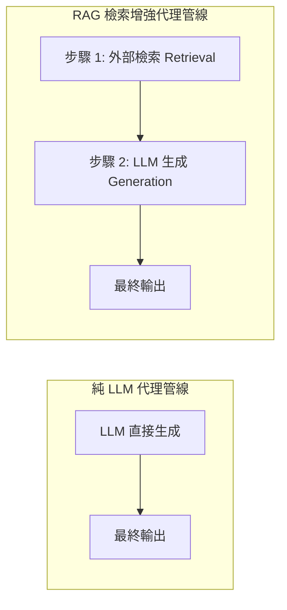
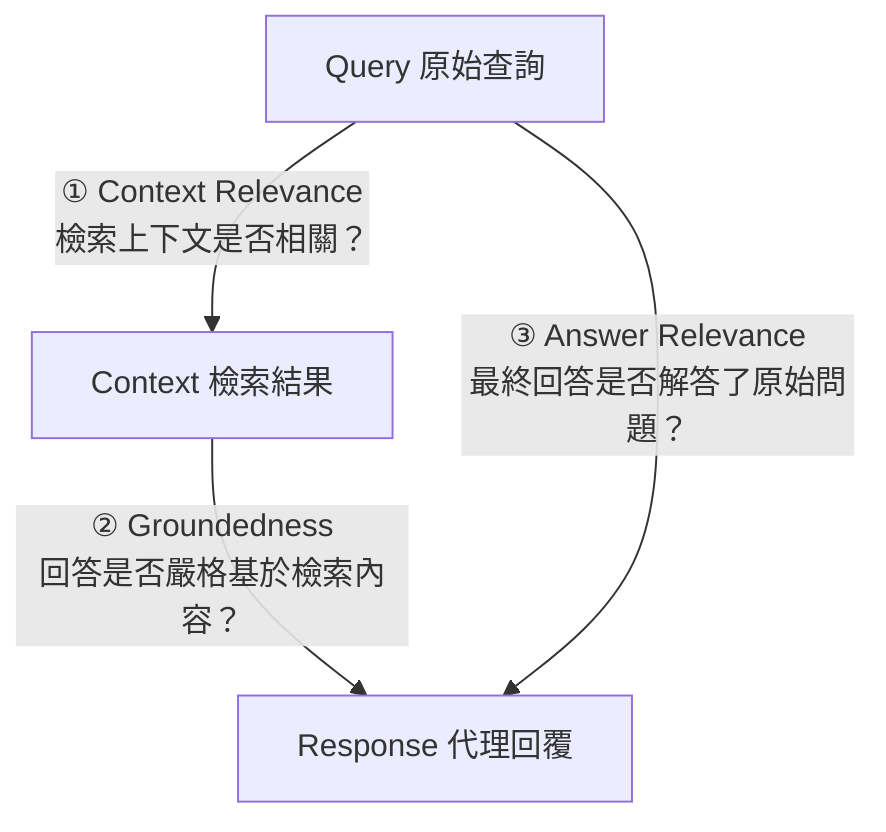

# Chapter 25: RAG 評估：檢索增強代理的三角驗收框架 (RAG Triad Evaluation)


> *「評估 RAG 系統的核心問題不是『最終答案是否正確』，而是『代理說的每一個主張，它真的知道嗎？』」* — RAGChecker, Amazon Science
>
> RAG（Retrieval-Augmented Generation）代理在 Deep Agents 中普遍存在：任何使用 `search` 或 `read_file` 工具後再生成回覆的代理，都是某種形式的 RAG 代理。RAG 引入了單純 LLM 評估看不見的新失效模式，需要專門的評估框架。

---

## 核心心智模型：法庭證據鏈審查 (Courtroom Chain of Custody & Claim-Level Verification)

在刑事法庭上，檢察官提出指控不能只給一句結論，必須建立完整的**證據鏈（Chain of Custody）**：
1. 證物來源是否與現場相關？（相關性檢驗）
2. 證物是否未經偽造、真實可靠？（真實性檢驗）
3. 指控推論是否嚴格基於所呈堂的證物做出？（紮實度檢驗）

**RAG 評估三角（RAG Triad）** 是檢索增強代理（RAG Agent）的三權分立審查憲章：
- **脈絡相關性（Context Relevance）**：檢索出的文件是否精準切中問題，還是包含了 80% 的噪音？
- **回答紮實度（Groundedness / Faithfulness）**：回答中的每一個句子，是否都能在檢索到的文本中找到明確的事實支撐？（嚴防憑空捏造的幻覺）
- **答案相關性（Answer Relevance）**：回答是否真正解決了使用者最初的提問？

```mermaid
graph TD
    subgraph RAGTriad["RAG 評估三角 (RAG Triad) 三權分立審查模型"]
        Q["使用者問題 (Query)"] 
        C["檢索脈絡 (Retrieved Context)"]
        A["最終回答 (Generated Answer)"]

        Q <-->|1. 脈絡相關性 (Context Relevance)<br/>檢索器召回準確率| C
        C <-->|2. 紮實度 (Groundedness)<br/>無幻覺忠實度 (Faithfulness)| A
        Q <-->|3. 答案相關性 (Answer Relevance)<br/>精準答題、無跑題| A
    end

    classDef query fill:#2d3748,stroke:#4a5568,color:#e2e8f0;
    classDef context fill:#1a365d,stroke:#3182ce,color:#fff;
    classDef answer fill:#234e52,stroke:#319795,color:#e6fffa;
    class Q query;
    class C context;
    class A answer;
```

---

## 1. 為什麼 RAG 評估需要獨立框架



| 失效根源 | 具體故障表現 | 診斷責任方 | 典型對策 |
|---|---|---|---|
| **① 檢索失效**<br>*(Retrieval Failure)* | 檢索回傳的 Chunks 完全不包含解答問題所需的知識，或包含大量過期無關噪音。 | **檢索器 (Retriever)** | 改進 Embedding 模型、重排器 (Reranker) 或混合檢索策略。 |
| **② 生成忠實性失效**<br>*(Faithfulness Failure)* | 檢索回傳了正確上下文，但 LLM 忽視了上下文中的關鍵限制或推論出相反結論。 | **生成器 (Generator)** | 調整 System Prompt、強制 CoT 引用指引或掛載 Rubric 審查。 |
| **③ 幻覺生成**<br>*(Hallucination)* | LLM 混淆了檢索內容與預訓練記憶，臆造了未被任何資料支持的事實或數字。 | **生成器 (Generator)** | 採用宣告級別核查（Claim-Level Verification）進行自動截斷。 |


---

## 2. RAG 三角（RAG Triad）：三個核心評估指標

TruLens 提出的 RAG 評估三角，現已成為業界標準：




| 指標 | 英文 | 問題 | 失效表現 |
|---|---|---|---|
| **上下文相關性** | Context Relevance | 檢索結果和查詢相關嗎？ | 把 2020 年的論文用來回答 2026 年的問題 |
| **有根據性** | Groundedness | 代理的回覆是否基於檢索結果？ | 代理混入了訓練集記憶，憑空添加細節 |
| **答案相關性** | Answer Relevance | 最終回覆真的回答了用戶的問題嗎？ | 回覆詳盡但答非所問 |

---

## 3. 宣告式評估（Claim-level Evaluation）：RAGChecker 方法

Amazon Science 的 RAGChecker 提出了比三角指標更精細的**宣告級別（Claim-level）**評估，把生成的回覆拆解成獨立的事實主張，逐一追溯來源：

```python
from dataclasses import dataclass

@dataclass
class Claim:
    """從代理回覆中提取的單一事實主張。"""
    text: str               # 主張內容
    source_chunk: str = "" # 支持此主張的檢索片段（若有）
    is_supported: bool = False  # 是否有檢索依據
    is_hallucinated: bool = False  # 是否是幻覺（無任何來源支持）


def extract_claims(agent_response: str, llm_extractor) -> list[Claim]:
    """
    從代理回覆中提取所有可核查的事實主張。
    例如：「LangChain 在 2024 年發布了 Deep Agents 0.6.0」
    會被提取為一個 Claim，然後逐一在檢索結果中尋找支持。
    """
    prompt = f"""
請從以下代理回覆中提取所有可獨立核查的事實主張（每個主張一句話）。
排除主觀意見和一般常識，只提取具體的可驗證事實。

代理回覆：
{agent_response}

以 JSON 列表回傳，格式：[{{"claim": "..."}}]
"""
    result = llm_extractor.invoke({"messages": [{"role": "user", "content": prompt}]})
    claims_raw = parse_json(result["messages"][-1].content)
    return [Claim(text=c["claim"]) for c in claims_raw]


def verify_claims_against_context(
    claims: list[Claim],
    retrieved_chunks: list[str],
) -> list[Claim]:
    """
    逐一核查每個主張是否有檢索結果的支持。
    未被任何 chunk 支持的主張 → 潛在幻覺。
    """
    for claim in claims:
        for chunk in retrieved_chunks:
            if claim_is_supported_by_chunk(claim.text, chunk):
                claim.source_chunk = chunk
                claim.is_supported = True
                break
        if not claim.is_supported:
            claim.is_hallucinated = True
    return claims


def rag_claim_level_score(claims: list[Claim]) -> dict:
    """計算宣告級別的 RAG 評估指標。"""
    total = len(claims)
    if total == 0:
        return {"hallucination_rate": 0.0, "groundedness": 1.0, "total_claims": 0}
    hallucinated = sum(1 for c in claims if c.is_hallucinated)
    supported = sum(1 for c in claims if c.is_supported)
    return {
        "total_claims": total,
        "supported_claims": supported,
        "hallucinated_claims": hallucinated,
        "hallucination_rate": hallucinated / total,
        "groundedness": supported / total,
    }
```

---

## 4. 檢索器 vs. 生成器錯誤的分離診斷

RAGChecker 的核心貢獻是把「RAG 失敗」精確定位到是**檢索器的問題**還是**生成器的問題**：

```python
@dataclass
class RAGDiagnosis:
    """診斷 RAG 失敗的根本位置：檢索器還是生成器？"""
    query: str
    retrieved_chunks: list[str]
    agent_response: str
    claims: list[Claim]

    @property
    def retriever_precision(self) -> float:
        """檢索精確率：回傳的 chunks 中有多少是真正相關的？"""
        relevant = sum(1 for chunk in self.retrieved_chunks if self._is_relevant(chunk))
        return relevant / len(self.retrieved_chunks) if self.retrieved_chunks else 0.0

    @property
    def retriever_recall(self) -> float:
        """檢索召回率：所有需要的 chunks 是否都被找到了？"""
        needed = self._count_needed_chunks()
        found = sum(1 for chunk in self.retrieved_chunks if self._is_relevant(chunk))
        return found / needed if needed > 0 else 1.0

    @property
    def generator_faithfulness(self) -> float:
        """生成器忠實度：代理的回覆是否嚴格基於已有的 chunks？"""
        supported = sum(1 for c in self.claims if c.is_supported)
        return supported / len(self.claims) if self.claims else 1.0

    @property
    def failure_location(self) -> str:
        """定位失敗的主要根源。"""
        retriever_ok = self.retriever_precision > 0.7 and self.retriever_recall > 0.6
        generator_ok = self.generator_faithfulness > 0.8

        if not retriever_ok and generator_ok:
            return "RETRIEVER: 檢索器未找到相關資料，但生成器行為正確"
        elif retriever_ok and not generator_ok:
            return "GENERATOR: 檢索器找到了正確資料，但生成器沒有忠實使用"
        elif not retriever_ok and not generator_ok:
            return "BOTH: 檢索和生成都有問題"
        else:
            return "OK: 系統表現正常"

    def _is_relevant(self, chunk: str) -> bool:
        return self.query.lower()[:20] in chunk.lower()

    def _count_needed_chunks(self) -> int:
        return max(1, len(self.claims) // 3)
```

---

## 5. Deep Agents RAG 評估 Middleware

```python
class RAGEvaluationMiddleware:
    """
    在 Deep Agents 的 RAG 執行期間自動收集評估數據。
    攔截 search / read_file 工具的回傳，記錄檢索結果，
    在代理輸出後自動計算 RAG 三角指標。
    """

    def __init__(self, auto_evaluate: bool = True):
        self._retrieved_chunks: list[str] = []
        self._query: str = ""
        self.auto_evaluate = auto_evaluate
        self._last_diagnosis: RAGDiagnosis | None = None

    async def on_run_start(self, state, messages, **kwargs):
        """捕捉原始查詢（最後一條用戶訊息）。"""
        self._retrieved_chunks = []
        user_messages = [m for m in messages if m.get("role") == "user"]
        self._query = user_messages[-1]["content"] if user_messages else ""

    async def on_tool_call(self, tool_name: str, tool_args: dict, tool_result, **kwargs):
        """攔截 search / read_file 工具的回傳，累積檢索結果。"""
        if tool_name in ("search", "read_file", "query_db", "fetch_url"):
            chunk = str(tool_result)
            if chunk and chunk not in ("", "null", "None"):
                self._retrieved_chunks.append(chunk)

    async def on_run_end(self, state, messages, **kwargs):
        """代理完成後自動計算 RAG 評估指標。"""
        if not self.auto_evaluate or not self._retrieved_chunks:
            return

        final_output = messages[-1].content if messages else ""
        claims = [Claim(text=sent) for sent in final_output.split("。") if len(sent) > 10]
        verify_claims_against_context(claims, self._retrieved_chunks)

        self._last_diagnosis = RAGDiagnosis(
            query=self._query,
            retrieved_chunks=self._retrieved_chunks,
            agent_response=final_output,
            claims=claims,
        )

        score = rag_claim_level_score(claims)
        if score["hallucination_rate"] > 0.2:
            print(
                f"⚠️ [RAGEval] 幻覺率偏高：{score['hallucination_rate']:.0%} "
                f"（{score['hallucinated_claims']}/{score['total_claims']} 個主張無來源支持）"
            )
            print(f"   根本位置：{self._last_diagnosis.failure_location}")

    def get_last_diagnosis(self) -> RAGDiagnosis | None:
        return self._last_diagnosis
```

---

## 6. ARES 方法：置信區間而非點估計

Stanford ARES 框架提出用**預測功效推斷（Prediction-Powered Inference, PPI）**計算 RAG 評估指標的統計置信區間，而非裸點估計：

```python
import math

def rag_score_with_confidence_interval(
    scores: list[float],
    confidence: float = 0.95,
) -> dict:
    """
    計算 RAG 評估指標的置信區間（ARES 方法）。
    裸點估計（mean = 0.73）遠不如置信區間（[0.65, 0.81]）有信息量。
    """
    n = len(scores)
    if n == 0:
        return {"mean": 0.0, "ci_lower": 0.0, "ci_upper": 0.0}

    mean = sum(scores) / n
    variance = sum((s - mean) ** 2 for s in scores) / (n - 1) if n > 1 else 0.0
    std_err = math.sqrt(variance / n)

    # 95% 置信區間的 z-score ≈ 1.96
    z = 1.96 if confidence == 0.95 else 1.645
    margin = z * std_err

    return {
        "mean": round(mean, 3),
        "ci_lower": round(max(0, mean - margin), 3),
        "ci_upper": round(min(1, mean + margin), 3),
        "n_samples": n,
        "std_err": round(std_err, 4),
    }


# 範例：50 個 RAG 評估的 groundedness 分布
import random
random.seed(42)
groundedness_scores = [random.uniform(0.6, 0.95) for _ in range(50)]
ci = rag_score_with_confidence_interval(groundedness_scores)
# 輸出：{"mean": 0.773, "ci_lower": 0.742, "ci_upper": 0.804, "n_samples": 50}
```

---

## 7. RAG 評估的 CI 閘門配置

```yaml
# evals/rag_eval_config.yaml — RAG 評估 CI 閘門設定
rag_thresholds:
  context_relevance_min: 0.70      # 檢索相關性最低閾值
  groundedness_min: 0.80           # 有根據性最低閾值（更嚴格）
  answer_relevance_min: 0.75       # 答案相關性最低閾值
  hallucination_rate_max: 0.15     # 幻覺率最高容忍值（15%）
  
  # 分離診斷閾值
  retriever_precision_min: 0.65    # 若低於此值 → 修改 retrieval 策略
  generator_faithfulness_min: 0.80  # 若低於此值 → 修改 prompt / context formatting
```

```python
# evals/test_rag_quality.py
import pytest

@pytest.mark.eval
def test_rag_groundedness(rag_agent, rag_golden_dataset, rag_eval_config):
    """有根據性 CI 閘門：代理的主張必須有檢索依據。"""
    scores = []
    for case in rag_golden_dataset:
        diagnosis = run_rag_eval(rag_agent, case)
        scores.append(diagnosis.generator_faithfulness)

    ci = rag_score_with_confidence_interval(scores)
    min_threshold = rag_eval_config["groundedness_min"]

    assert ci["ci_lower"] >= min_threshold, (
        f"Groundedness CI lower bound {ci['ci_lower']:.3f} "
        f"低於閾值 {min_threshold}。"
        f"表示即使在最樂觀的統計估計下，代理仍然低於驗收標準。"
    )

@pytest.mark.eval
def test_rag_failure_location_distribution(rag_agent, rag_golden_dataset):
    """確保失敗主要在可接受的分佈內（沒有系統性的生成器幻覺問題）。"""
    diagnoses = [run_rag_eval(rag_agent, c) for c in rag_golden_dataset]
    generator_failures = sum(1 for d in diagnoses if "GENERATOR" in d.failure_location)
    generator_failure_rate = generator_failures / len(diagnoses)

    # 生成器幻覺是最嚴重的問題，超過 10% 就是系統性問題
    assert generator_failure_rate < 0.10, (
        f"Generator faithfulness 系統性失效：{generator_failure_rate:.0%} 的案例。"
        f"請檢查 context formatting 或 grounding 指令。"
    )
```

---

## 🤔 架構深度思辨與工業界陷阱 (Architectural Insight & Production Pitfalls)

> [!IMPORTANT]
> **Frontier Lab 核心考點 (RAG Architecture & Faithfulness Evaluation MLE)**:
> - **陷阱與對策 (Failure Mode & Fix)**:
>   1. **檢索雜訊引發雪崩幻覺 (Noise-Induced Hallucination)**: 
>      Retriever 檢索出 5 篇文檔，其中 1 篇包含過期錯誤資訊，Generator 傾向於採信該錯誤文檔。**在生成前引入重排序與相關性過濾器（Reranker + Relevance Thresholding），相關度低於 0.75 的 Chunk 強制丟棄**。
>   2. **粗粒度文本相似度的欺騙性**: 
>      使用餘弦相似度評估回答與 Context，但模型只是複述了專有名詞，核心結論與 Context 完全相反。**必須將文本拆解為原子命題（Atomic Claims），對每個命題進行 NLI（自然語言推理：蘊含 Entailment / 矛盾 Contradiction）比對**。
> - **核心技術思辨 (Technical Deep Dive)**:
>   *Q: 為什麼在 RAG 評估中，必須將檢索器（Retriever）與生成器（Generator）的評估徹底解耦？*  
>   *A: 若將 RAG 視為端到端黑盒子評估，當最終答案錯誤時，工程團隊無法定位故障根因：究竟是檢索器根本沒找回相關文檔（Recall 缺陷），還是檢索器找齊了文檔但生成模型產生了幻覺（Generation 缺陷）。解耦評估能精準計算 Context Relevance 與 Groundedness，明確指導是該調優 Embedding / 向量庫索引，還是該改進 Generation Prompt 與溫度參數。*

---

## 練習

1. 選取你代理最近 20 個 `search` 工具呼叫，用 `RAGEvaluationMiddleware` 記錄 `retrieved_chunks`，計算 `retriever_precision`——看看有多少比例的檢索結果是真正被代理使用的。
2. 對同一組問題，用 `extract_claims` 提取代理回覆中的事實主張，用 `verify_claims_against_context` 逐一核查，計算整體幻覺率。
3. 比較高幻覺率案例和低幻覺率案例的 `retrieved_chunks`——你會發現幻覺主要發生在哪個場景（空 chunks？不相關 chunks？chunk 太長？）。
4. 把 `test_rag_groundedness` 加入你的 CI 流水線，設定 `groundedness_min = 0.75`，觀察初始運行的 CI lower bound 是否達標。

---

下一章：[26 — 生產監控與分佈偏移偵測](26-production-monitoring.md)
