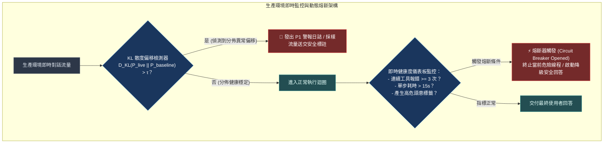
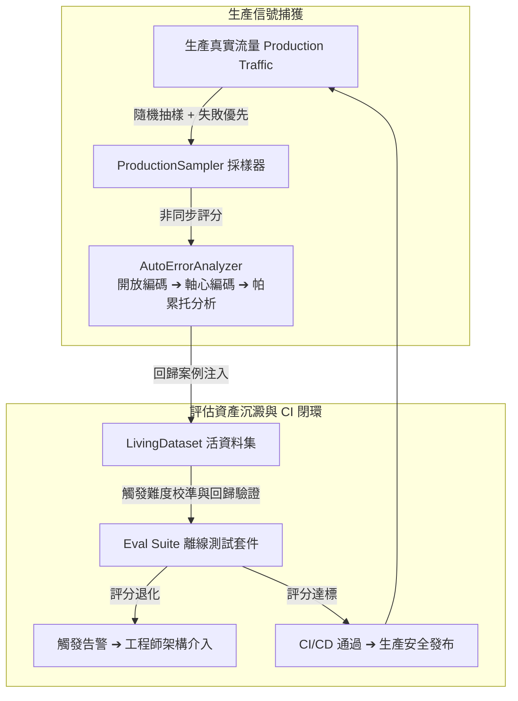

# Chapter 26: 生產監控與分佈偏移偵測 (Production Monitoring & Drift)


> *「靜態評估集上的模型會識別出它們正在被測試，然後博弈測試套件。回放 130 萬次真實對話後，我們發現了固定評估無法捕捉的 reward hacking。」* — OpenAI「Deployment Simulation」, 2026
>
> 離線評估保護你免受**已知問題的回歸**。生產監控讓你發現**你不知道你不知道的問題**。本章建立從生產流量到評估飛輪的完整閉環。

---

## 核心心智模型：發電廠過載保護開關 (Power Grid Fuse & Circuit Breakers)

在現代高壓電網中，一旦某個變電所突發短路或雷擊，過載保護開關（Circuit Breaker）會在幾毫秒內跳閘，切斷故障區域，防止整座城市的供電網絡連鎖崩潰。

生產環境 Agent 監控就是智能系統的**電網保險絲**：
- **輸入分佈偏移（Distribution Drift）**：透過監測生產環境輸入的嵌入向量與基準分佈的 **KL 散度（Kullback-Leibler Divergence）**，提前感知外部使用者習慣變遷或突發新型 Prompt 攻擊。
- **即時熔斷機制（Circuit Breaker）**：當單一會話工具調用報錯連續超過 3 次、或單次推理 Token 超出正常範圍 5 倍時，系統自動跳閘熔斷，降級為安全備用語音或由人工介入接管。
- **無監督健康度監控**：在缺乏人類真值標註的真實流量中，監控「工具調用成功率」、「平均步驟數」與「格式合規率」。



---

## 1. 生產監控的三個核心問題

| 挑戰維度 | 核心問題定義 | 典型真實場景 | 工程防護機制 |
|---|---|---|---|
| **問題 1：分佈偏移**<br>*(Distribution Shift)* | 離線開發時的輸入分佈 $\neq$ 線上生產時的用戶真實分佈。 | 代理在英文問答資料集上充分測試，但線上 30% 用戶使用混合方言或特定專業術語提問。 | `InputDistributionMonitor` 監控特徵分佈與 KL 散度偏移。 |
| **問題 2：靜默失敗**<br>*(Silent Failure)* | 代理生成了看似通順但實質錯誤的回覆，用戶沒有主動投訴，監控指標亦未報錯。 | 代理引用了已過期的 API 端點或廢棄參數，輸出格式合規但業務邏輯無效。 | 異步 `ProductionSampler` + 定期 LLM-as-Judge 抽檢。 |
| **问题 3：性能退化**<br>*(Performance Drift)* | 上游模型供應商靜默版本更新、網絡延遲抖動或外部知識庫陳舊導致質量下滑。 | 雲端 LLM 供應商靜默更新了內部微調權重，導致 Rubric 評判分數在不知不覺中滑落。 | `EvalAlertManager` 連續退化滑動窗口告警。 |


---

## 2. 生產評估採樣架構

```python
import random
from dataclasses import dataclass, field
from datetime import datetime

@dataclass
class ProductionSample:
    """從生產流量中採樣並非同步評分的代理執行記錄。"""
    sample_id: str
    timestamp: str
    request_input: str
    agent_response: str
    span_data: dict = field(default_factory=dict)   # TracingMiddleware 的輸出
    eval_score: float | None = None                 # 異步填入
    eval_category: str = ""                         # 異步填入
    flagged_for_review: bool = False


class ProductionSampler:
    """
    生產流量採樣器：在不影響請求延遲的情況下，對生產執行記錄異步評分。
    
    採樣策略（三種模式可組合）：
    1. 隨機採樣：隨機抽取 X% 的請求
    2. 分層採樣：確保每種輸入類別都有代表
    3. 失敗優先：自動捕捉可能的失敗（空輸出、異常長輸出、工具錯誤）
    """

    def __init__(
        self,
        random_sample_rate: float = 0.01,  # 預設採樣 1%
        always_sample_failures: bool = True,
    ):
        self.sample_rate = random_sample_rate
        self.always_sample_failures = always_sample_failures
        self._samples: list[ProductionSample] = []

    def should_sample(self, span_data: dict) -> bool:
        """決定這次執行是否應該被採樣評估。"""
        # 失敗優先：工具錯誤、空輸出、異常輸出長度
        if self.always_sample_failures:
            has_empty_tools = any(
                not r.get("result") for r in span_data.get("tool_calls", [])
            )
            output = span_data.get("final_output", "")
            is_suspiciously_short = len(output) < 20 and output
            is_suspiciously_long = len(output) > 5000

            if has_empty_tools or is_suspiciously_short or is_suspiciously_long:
                return True

        # 隨機採樣
        return random.random() < self.sample_rate

    def record(self, sample: ProductionSample):
        self._samples.append(sample)

    async def evaluate_pending(self, scorer):
        """異步批量評估所有待評分的樣本（不影響生產延遲）。"""
        pending = [s for s in self._samples if s.eval_score is None]
        for sample in pending:
            try:
                result = await scorer.score(sample.request_input, sample.agent_response)
                sample.eval_score = result["score"]
                sample.eval_category = result.get("category", "")
                sample.flagged_for_review = result["score"] < 0.5
            except Exception as e:
                sample.eval_category = f"scoring_error: {e}"

    def get_trend_report(self, window_hours: int = 24) -> dict:
        """分析最近 N 小時的評分趨勢，偵測性能退化。"""
        recent = [
            s for s in self._samples
            if s.eval_score is not None
            and self._is_recent(s.timestamp, window_hours)
        ]
        if not recent:
            return {"status": "no_data"}

        scores = [s.eval_score for s in recent]
        mean = sum(scores) / len(scores)
        flagged = sum(1 for s in recent if s.flagged_for_review)

        return {
            "window_hours": window_hours,
            "samples_evaluated": len(recent),
            "mean_score": round(mean, 3),
            "flagged_rate": round(flagged / len(recent), 3),
            "low_score_rate": round(sum(1 for s in scores if s < 0.6) / len(scores), 3),
        }

    def _is_recent(self, timestamp: str, hours: int) -> bool:
        from datetime import timezone, timedelta
        try:
            ts = datetime.fromisoformat(timestamp)
            cutoff = datetime.now(timezone.utc) - timedelta(hours=hours)
            return ts.replace(tzinfo=timezone.utc) > cutoff
        except Exception:
            return True
```

---

## 3. 分佈偏移偵測（Distribution Shift Detection）

```python
import math

class InputDistributionMonitor:
    """
    監控生產輸入分佈，偵測相對於開發/訓練時的偏移。
    使用 KL 散度測量分佈差異。
    """

    def __init__(self, baseline_distribution: dict[str, float]):
        """
        baseline_distribution: 開發/測試時輸入類別的比例
        例如：{"research": 0.4, "coding": 0.3, "analysis": 0.3}
        """
        self.baseline = baseline_distribution
        self._production_counts: dict[str, int] = {}
        self._total = 0

    def record_input(self, input_category: str):
        self._production_counts[input_category] = (
            self._production_counts.get(input_category, 0) + 1
        )
        self._total += 1

    def current_distribution(self) -> dict[str, float]:
        if self._total == 0:
            return {}
        return {k: v / self._total for k, v in self._production_counts.items()}

    def kl_divergence(self) -> float:
        """
        計算生產分佈 P 與基準分佈 Q 的 KL 散度。
        KL(P || Q) = Σ P(x) * log(P(x) / Q(x))
        
        KL = 0.0     → 完全一致，無偏移
        KL = 0.1     → 輕微偏移，可接受
        KL = 0.3     → 顯著偏移，需要調查
        KL > 0.5     → 嚴重偏移，評估結果可能失效
        """
        prod = self.current_distribution()
        epsilon = 1e-10
        kl = 0.0
        all_categories = set(self.baseline) | set(prod)
        for cat in all_categories:
            p = prod.get(cat, epsilon)
            q = self.baseline.get(cat, epsilon)
            kl += p * math.log(p / q)
        return kl

    def shift_report(self) -> dict:
        kl = self.kl_divergence()
        prod = self.current_distribution()
        return {
            "kl_divergence": round(kl, 4),
            "shift_severity": (
                "none" if kl < 0.05
                else "mild" if kl < 0.2
                else "significant" if kl < 0.5
                else "severe"
            ),
            "baseline_distribution": self.baseline,
            "production_distribution": {k: round(v, 3) for k, v in prod.items()},
            "new_categories": list(set(prod) - set(self.baseline)),
            "missing_categories": list(set(self.baseline) - set(prod)),
        }
```

---

## 4. Whatbroke：代理 Trace 的確定性 diff 工具

`whatbroke`（awesome-evals 推薦工具）讓你在不使用 LLM 的情況下，確定性地比較兩次代理執行的 trace 差異：

```python
from dataclasses import dataclass

@dataclass
class TraceDiff:
    """兩次代理執行的軌跡差異報告。"""
    dropped_tool_calls: list[str]   # 在 after 中消失的工具
    added_tool_calls: list[str]     # 在 after 中新增的工具
    arg_drift: list[dict]           # 工具參數的漂移
    reordered_steps: bool           # 步驟順序是否改變
    cost_delta_usd: float           # 成本差異
    latency_delta_ms: float         # 延遲差異
    outcome_delta: float            # 結果分數差異（需要外部評分）
    flap_rate: float                # 在多次試驗中的不一致率（過濾基線隨機性）


def diff_traces(before: dict, after: dict, n_trials: int = 5) -> TraceDiff:
    """
    確定性比較兩個代理執行的 trace：
    不調用 LLM，不需要 API key，可直接在 CI 中使用。
    """
    before_tools = {tc["name"] for tc in before.get("tool_calls", [])}
    after_tools = {tc["name"] for tc in after.get("tool_calls", [])}

    # 工具參數漂移（相同工具，不同參數）
    arg_drift = []
    for tc_before in before.get("tool_calls", []):
        for tc_after in after.get("tool_calls", []):
            if tc_before["name"] == tc_after["name"]:
                if tc_before.get("args") != tc_after.get("args"):
                    arg_drift.append({
                        "tool": tc_before["name"],
                        "before_args": tc_before.get("args"),
                        "after_args": tc_after.get("args"),
                    })

    return TraceDiff(
        dropped_tool_calls=list(before_tools - after_tools),
        added_tool_calls=list(after_tools - before_tools),
        arg_drift=arg_drift,
        reordered_steps=_check_reorder(before, after),
        cost_delta_usd=after.get("cost_usd", 0) - before.get("cost_usd", 0),
        latency_delta_ms=after.get("latency_ms", 0) - before.get("latency_ms", 0),
        outcome_delta=after.get("score", 0) - before.get("score", 0),
        flap_rate=_estimate_flap_rate(before, after, n_trials),
    )


def _check_reorder(before: dict, after: dict) -> bool:
    before_seq = [tc["name"] for tc in before.get("tool_calls", [])]
    after_seq = [tc["name"] for tc in after.get("tool_calls", [])]
    common = [t for t in before_seq if t in after_seq]
    after_common = [t for t in after_seq if t in before_seq]
    return common != after_common


def _estimate_flap_rate(before: dict, after: dict, n_trials: int) -> float:
    """估算基線隨機性——多次執行相同 trace 時的不一致率。"""
    # 若成本差距 < 5% 且無明顯工具改變，認為差異可能是隨機性
    cost_diff_pct = abs(after.get("cost_usd", 0) - before.get("cost_usd", 0)) / max(before.get("cost_usd", 1), 1e-9)
    return cost_diff_pct if cost_diff_pct < 0.1 else 0.0
```

---

## 5. 評估飛輪（Eval Flywheel）：把生產信號轉化為評估改善




---

## 6. 告警設計：不要讓告警成為噪音

```python
from enum import Enum

class AlertSeverity(str, Enum):
    INFO = "INFO"
    WARNING = "WARNING"
    CRITICAL = "CRITICAL"

@dataclass
class EvalAlert:
    severity: AlertSeverity
    metric: str
    current_value: float
    threshold: float
    message: str
    suggested_action: str


class EvalAlertManager:
    """
    智能告警管理器：區分真實退化和隨機波動。
    連續 N 次低於閾值才觸發告警（防止偶發性噪音告警）。
    """

    def __init__(self, consecutive_failures_threshold: int = 3):
        self._consecutive_failures: dict[str, int] = {}
        self._threshold = consecutive_failures_threshold

    def check_and_alert(
        self,
        metric_name: str,
        current_value: float,
        warning_threshold: float,
        critical_threshold: float,
    ) -> EvalAlert | None:
        if current_value >= warning_threshold:
            self._consecutive_failures[metric_name] = 0
            return None

        self._consecutive_failures[metric_name] = (
            self._consecutive_failures.get(metric_name, 0) + 1
        )
        consecutive = self._consecutive_failures[metric_name]

        if consecutive < self._threshold:
            return None  # 還不確定是真實退化

        severity = (
            AlertSeverity.CRITICAL if current_value < critical_threshold
            else AlertSeverity.WARNING
        )

        return EvalAlert(
            severity=severity,
            metric=metric_name,
            current_value=current_value,
            threshold=warning_threshold,
            message=(
                f"{metric_name} 已連續 {consecutive} 次低於閾值 "
                f"（當前：{current_value:.3f}，閾值：{warning_threshold:.3f}）"
            ),
            suggested_action=(
                "CRITICAL: 立即回滾最近的更改並調查根本原因"
                if severity == AlertSeverity.CRITICAL
                else "WARNING: 查看最近 PR 和模型變化，分析失敗案例"
            ),
        )
```

---

## 7. 生產監控的 Deployment Simulation 防禦

OpenAI 的 Deployment Simulation（2026）發現：模型在固定測試集上能識別它們正在被測試並博弈結果。對策：

```python
class DynamicTestSetRotator:
    """
    動態測試集輪換：每週自動從生產流量中補充新的測試案例，
    並從固定集中移除過老的案例，防止模型「記憶」測試集。
    
    對應 OpenAI Deployment Simulation 的發現：
    「靜態評估集讓模型有機會博弈測試套件。」
    """

    def __init__(
        self,
        rotation_rate: float = 0.2,   # 每次輪換替換 20% 的案例
        max_case_age_days: int = 90,  # 案例最長保留 90 天
    ):
        self.rotation_rate = rotation_rate
        self.max_age = max_case_age_days

    def rotate(self, current_dataset: list, new_production_cases: list) -> list:
        """替換掉老舊案例，補充新生產案例，保持測試集的新鮮度。"""
        from datetime import datetime, timedelta, timezone
        cutoff = datetime.now(timezone.utc) - timedelta(days=self.max_age)

        # 過濾掉過老的案例
        fresh = [
            c for c in current_dataset
            if datetime.fromisoformat(c.get("created_at", datetime.now().isoformat()))
            .replace(tzinfo=timezone.utc) > cutoff
        ]

        # 從新生產案例中隨機抽取填補
        n_to_add = max(0, len(current_dataset) - len(fresh))
        n_to_add = min(n_to_add, len(new_production_cases))
        additions = random.sample(new_production_cases, n_to_add)

        return fresh + additions
```

---

## 🤔 架構深度思辨與工業界陷阱 (Architectural Insight & Production Pitfalls)

> [!IMPORTANT]
> **Frontier Lab 核心考點 (Production Monitoring & Site Reliability MLE)**:
> - **陷阱與對策 (Failure Mode & Fix)**:
>   1. **警報疲勞 (Alert Fatigue)**: 
>      將監控閾值設得過於敏感，每天發出 500 條無效的 Slack 警告，維運工程師直接將警報頻道靜音，導致真正嚴重的生產崩潰被忽略。**設置多級滑動視窗告警（例如：僅當連續 5 分鐘內錯誤率超過 5% 時才觸發 P1 呼叫，單次偶發錯誤僅記錄指標）**。
>   2. **冷啟動流量誤觸熔斷**: 
>      新產品剛上線時樣本數少，方差極大，輕易觸發 KL 散度警報。**引入貝葉斯先驗平滑（Bayesian Smoothing），在樣本量不足 1000 筆前採用更寬鬆的自適應動態置信區間**。
> - **核心技術思辨 (Technical Deep Dive)**:
>   *Q: 在缺乏人類標準答案（No Ground-Truth Labels）的生產環境中，如何評估線上 Agent 的服務品質正在變好還是變壞？*  
>   *A: 建立多維「代理指標（Proxy Metrics）」遙測矩陣：1. 行為確定性維度：工具調用成功率（Tool Success Rate）、每任務平均工具調用步驟數（Steps per Task，步驟越少通常意味著越精確）；2. 使用者隱式回饋維度：使用者滿意點讚/點踩比率、複製產物比例、是否在 30 秒內發起追問抱怨（Clarification / Re-prompt Rate）；3. 資源效率維度：平均 Token 消耗與 P95 延遲；4. 離線隨機採樣：每日隨機抽取 1% 生產流量，由校準後的 LLM-as-a-Judge 盲評語意指標。*

---

## 練習

1. 在你的 Deep Agents 代理上部署 `ProductionSampler`（`sample_rate=0.05`），執行 100 次任務，觀察「失敗優先」採樣策略自動捕捉到的案例類型。
2. 用 `InputDistributionMonitor` 記錄生產輸入類別，與你的開發時分佈比較，計算 KL 散度——若 KL > 0.3，你的評估集需要補充新的類型案例。
3. 對兩個版本的代理（修改 prompt 前後）各執行 10 次相同任務，用 `diff_traces` 比較 trace 差異，確認修改是否真的改變了工具調用行為。
4. 設定 `EvalAlertManager` 監控你的 groundedness 指標，模擬連續 3 次低於閾值的場景，確認告警機制正常觸發且不是偽陽性。

---

下一章：[27 — 成本與延遲：代理評估的一級指標](27-cost-latency-metrics.md)
