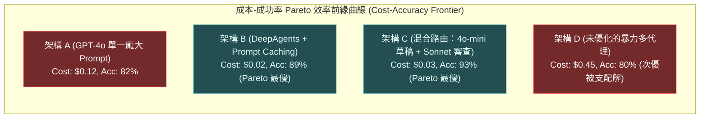
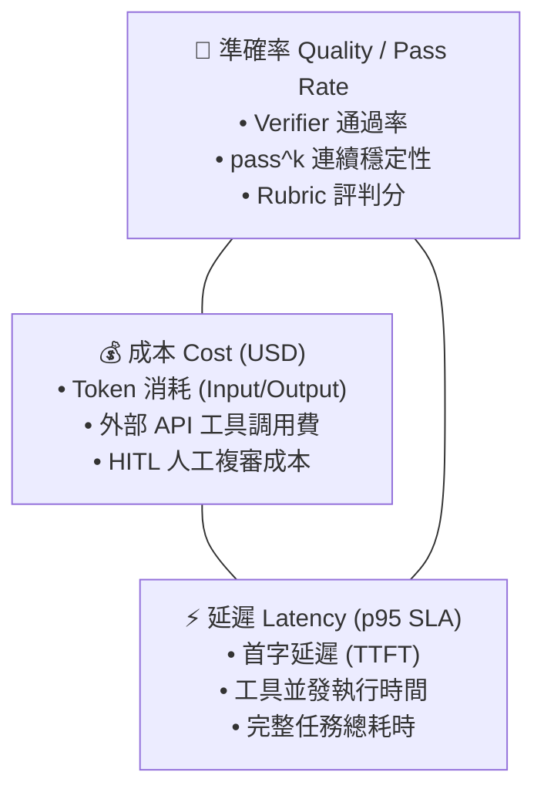

# Chapter 27: 成本與延遲：代理評估的一級指標 (Cost & Latency Economics)


> *「如果代理 A 的通過率是 80%，代理 B 是 82%，但代理 B 的每次任務成本是代理 A 的 5 倍——從應用工程師的視角看，代理 A 更好。」* — Kapoor, Stroebl et al.「AI Agents That Matter」, 2024
>
> 大多數評估排行榜只報告**準確率**。但在真實部署中，成本和延遲與準確率一樣重要——一個準確但昂貴到無法負擔、或慢到無法使用的代理，在生產中是失敗的。

---

## 核心心智模型：F1 賽車的輕量化與空氣動力學 (F1 Aerodynamics & Pareto Frontier)

在 F1 賽車設計中，工程師不能為了追求最高馬力而無限制增加引擎重量；每一克重量的增加都會在過彎時轉化為嚴重的離心力負擔。最優秀的賽車永遠是**引擎輸出、下壓力與車身重量的最優平衡體**。

Agent 工程中的成本與延遲也是如此：
- **Token 經濟學不是細枝末節**：如果一個 Agent 解決問題需要花費 2 美元且耗時 45 秒，即使準確率高達 95%，也毫無大規模商業化落地可能。
- **Pareto 最優前緣（Pareto Frontier）**：在「成本 / 延遲」與「成功率」的二維坐標系中，任何位於前緣內部的架構都是次優的（被支配解）。
- **延遲解構：TTFT（首字延遲）vs. TPS（每秒輸出 Token）**：首字延遲考驗 Prompt 處理速度與快取命中率；TPS 考驗自回歸解碼頻寬。



---

## 1. 為什麼成本和延遲是一級指標

| 維度 | 排行榜思維（Leaderboard Mentality） | 應用工程師思維（Production Engineering） |
|---|---|---|
| **核心目標** | 最高準確率 $\text{pass}@1$ = 最好 | **最高性價比 Pareto Frontier** = 最好 |
| **容易忽視的代價** | • 忽視每次任務產生的巨大 API 呼叫次數<br>• 忽視超長延遲對用戶體驗的破壞<br>• 忽視十萬級請求帶來的巨額月度賬單 | • 嚴密監控每次成功任務的真實邊際成本（USD）<br>• 嚴格約束 p95/p99 延遲 SLA<br>• 權衡邊際準確率提升與成本倍增的 ROI |


---

## 2. 成本-成功率 Pareto 前沿分析

```python
from dataclasses import dataclass

@dataclass
class AgentVariant:
    """代理的一個配置變體（模型 + 執行框架 + 參數組合）。"""
    name: str
    model: str
    pass_rate: float       # 任務成功率（0.0–1.0）
    cost_per_task_usd: float  # 每個成功任務的平均成本
    p50_latency_ms: float     # 中位延遲（ms）
    p95_latency_ms: float     # 第 95 百分位延遲（ms）


def pareto_frontier(variants: list[AgentVariant]) -> list[AgentVariant]:
    """
    計算成本-成功率 Pareto 前沿：
    找出「沒有其他變體在成本和成功率上同時更優」的變體集合。
    
    Pareto 最優 = 降低成本必然犧牲成功率，提高成功率必然增加成本。
    """
    pareto = []
    for candidate in variants:
        dominated = False
        for other in variants:
            if (other.pass_rate >= candidate.pass_rate
                    and other.cost_per_task_usd <= candidate.cost_per_task_usd
                    and other != candidate):
                dominated = True
                break
        if not dominated:
            pareto.append(candidate)
    return sorted(pareto, key=lambda v: v.pass_rate)


def cost_efficiency_score(variant: AgentVariant) -> float:
    """
    成本效益評分：每美元獲得的成功任務數。
    更高 = 更高效。
    """
    if variant.cost_per_task_usd <= 0:
        return float("inf")
    return variant.pass_rate / variant.cost_per_task_usd


# 範例：比較四個代理配置
variants = [
    AgentVariant("claude-opus-4-full",   "claude-opus-4",    0.92, 0.42, 8200, 15000),
    AgentVariant("claude-sonnet-4-std",  "claude-sonnet-4",  0.86, 0.12, 3100, 6500),
    AgentVariant("claude-sonnet-4-lean", "claude-sonnet-4",  0.81, 0.07, 2200, 4800),
    AgentVariant("claude-haiku-4-fast",  "claude-haiku-4",   0.62, 0.02, 800,  1800),
]

pareto = pareto_frontier(variants)
print("Pareto 最優配置：")
for v in pareto:
    print(f"  {v.name}: pass_rate={v.pass_rate:.0%}, "
          f"cost=${v.cost_per_task_usd:.3f}, "
          f"efficiency={cost_efficiency_score(v):.1f} tasks/$")
```

---

## 3. 成本核算模型（Cost Attribution）

```python
from dataclasses import dataclass, field

@dataclass
class CostBreakdown:
    """代理執行的詳細成本分解。"""
    # LLM API 成本
    llm_input_tokens: int = 0
    llm_output_tokens: int = 0
    llm_cost_usd: float = 0.0

    # 工具呼叫成本（外部 API）
    search_api_calls: int = 0
    search_cost_usd: float = 0.0

    # 基礎設施成本
    compute_seconds: float = 0.0
    compute_cost_usd: float = 0.0

    # 人工審核成本（HITL）
    human_review_minutes: float = 0.0
    human_review_cost_usd: float = 0.0

    @property
    def total_cost_usd(self) -> float:
        return (
            self.llm_cost_usd
            + self.search_cost_usd
            + self.compute_cost_usd
            + self.human_review_cost_usd
        )

    @property
    def cost_per_component(self) -> dict:
        total = max(self.total_cost_usd, 1e-9)
        return {
            "llm": self.llm_cost_usd / total,
            "search": self.search_cost_usd / total,
            "compute": self.compute_cost_usd / total,
            "human_review": self.human_review_cost_usd / total,
        }


# 常見模型的 token 定價（USD/1M tokens，2026 估算）
MODEL_PRICING = {
    "anthropic:claude-opus-4":     {"input": 15.0,  "output": 75.0},
    "anthropic:claude-sonnet-4-6": {"input": 3.0,   "output": 15.0},
    "anthropic:claude-haiku-4":    {"input": 0.25,  "output": 1.25},
    "openai:gpt-5":                {"input": 10.0,  "output": 30.0},
    "openai:gpt-5.5":              {"input": 5.0,   "output": 20.0},
    "google_genai:gemini-2.5-pro": {"input": 2.5,   "output": 10.0},
}

def estimate_llm_cost(
    model: str,
    input_tokens: int,
    output_tokens: int,
) -> float:
    """估算單次 LLM 呼叫的成本（USD）。"""
    pricing = MODEL_PRICING.get(model, {"input": 3.0, "output": 15.0})
    return (
        input_tokens / 1_000_000 * pricing["input"]
        + output_tokens / 1_000_000 * pricing["output"]
    )
```

---

## 4. 延遲預算設計（Latency Budget）

```python
@dataclass
class LatencyBudget:
    """
    代理執行的延遲預算設計。
    把總延遲分配給各個組件，確保整體 p95 不超過 SLA。
    """
    total_p95_ms: float  # 整體 SLA（例如 8000ms = 8 秒）

    # 各組件的延遲預算
    context_assembly_ms: float = 100    # 上下文組裝
    llm_first_token_ms: float = 800     # LLM TTFT（首 token 時間）
    per_tool_call_ms: float = 500       # 每次工具呼叫
    llm_completion_ms: float = 2000     # LLM 生成完整回覆
    max_tool_calls: int = 6             # 最多工具呼叫次數

    @property
    def tool_budget_total_ms(self) -> float:
        return self.per_tool_call_ms * self.max_tool_calls

    @property
    def theoretical_max_ms(self) -> float:
        return (
            self.context_assembly_ms
            + self.llm_first_token_ms
            + self.tool_budget_total_ms
            + self.llm_completion_ms
        )

    def is_within_budget(self) -> bool:
        return self.theoretical_max_ms <= self.total_p95_ms

    def optimization_suggestions(self) -> list[str]:
        if self.is_within_budget():
            return ["✅ 延遲預算在 SLA 範圍內"]
        suggestions = []
        if self.tool_budget_total_ms > self.total_p95_ms * 0.5:
            suggestions.append(f"減少最大工具呼叫次數（當前 {self.max_tool_calls}）或並發工具調用")
        if self.llm_completion_ms > 2500:
            suggestions.append("使用串流（Streaming）改善用戶感知延遲（TTFT 比完成更重要）")
        if self.context_assembly_ms > 200:
            suggestions.append("優化上下文壓縮，減少送入 LLM 的 token 數")
        return suggestions
```

---

## 5. 成本-延遲-準確率三角最佳化（The Trade-off Triangle）

在真實生產架構中，沒有任何單一配置能在三個維度同時達到極限，工程師必須在約束條件下尋求 **Pareto 前沿平衡**：



```python

def find_optimal_configuration(
    variants: list[AgentVariant],
    constraints: dict,
) -> AgentVariant | None:
    """
    在給定約束條件下，找到最優的代理配置。
    
    constraints 例子：
    {
        "min_pass_rate": 0.80,           # 最低成功率要求
        "max_cost_per_task_usd": 0.15,   # 每任務最高成本
        "max_p95_latency_ms": 8000,      # 最高 p95 延遲
    }
    """
    # 過濾出符合所有約束的變體
    feasible = [
        v for v in variants
        if (v.pass_rate >= constraints.get("min_pass_rate", 0)
            and v.cost_per_task_usd <= constraints.get("max_cost_per_task_usd", float("inf"))
            and v.p95_latency_ms <= constraints.get("max_p95_latency_ms", float("inf")))
    ]

    if not feasible:
        return None

    # 在可行集合中，找到最高成本效益的配置
    return max(feasible, key=cost_efficiency_score)


# 月度成本預測
def monthly_cost_forecast(
    variant: AgentVariant,
    daily_task_volume: int,
    days: int = 30,
) -> dict:
    """預測代理在給定流量下的月度總成本。"""
    total_tasks = daily_task_volume * days
    total_cost = variant.cost_per_task_usd * total_tasks

    return {
        "variant": variant.name,
        "daily_volume": daily_task_volume,
        "period_days": days,
        "total_tasks": total_tasks,
        "cost_per_task_usd": variant.cost_per_task_usd,
        "total_cost_usd": round(total_cost, 2),
        "annual_projection_usd": round(total_cost * (365 / days), 2),
        "cost_at_scale": {
            "10x_volume_monthly": round(total_cost * 10, 2),
            "100x_volume_monthly": round(total_cost * 100, 2),
        }
    }
```

---

| 準確率區間 | 邊際成本增量（每任務） | 投資回報率 (ROI) 評估 | 建議工程決策 |
|---|---|---|---|
| **70% ➔ 80%** | +$0.04 | ⭐⭐⭐⭐⭐ 極高 | 必做：完善提示詞工程與基礎工具清單 |
| **80% ➔ 85%** | +$0.05 | ⭐⭐⭐⭐ 高 | 推薦：增加簡單的自我反思或格式中介軟體 |
| **85% ➔ 90%** | +$0.10 | ⭐⭐⭐ 中等 | 視業務對錯誤容忍度而定（如高價值金融場景） |
| **90% ➔ 95%** | +$0.20 | ⭐⭐ 低 | 通常不具性價比（成本翻倍，收斂緩慢） |
| **95% ➔ 99%** | +$0.40+ | ⭐ 極低 | 邊際效益急劇遞減（陷入長尾 Corner Cases 泥潭） |

> [!TIP]
> **決策黃金法則**：
> 僅當「額外提升準確率所節省的人工審核/客服糾錯成本」**大於**「呼叫更大模型與多輪自我驗證所增加的雲端 Token 成本」時，才繼續推高準確率；否則應鎖定當前質量，轉向**上下文壓縮與延遲優化**。


---

## 7. 完整評估儀表板：五個核心指標

```python
@dataclass
class AgentHealthDashboard:
    """代理系統的綜合健康度儀表板——五個核心維度。"""

    # 1. 準確率（Quality）
    pass_rate: float           # 任務成功率
    pass_pow_k: float          # pass^k 可靠性（k=5）
    judge_kappa: float         # 裁判-人類對齊度

    # 2. 成本（Cost）
    cost_per_task_usd: float   # 每任務平均成本
    monthly_forecast_usd: float # 月度費用預測

    # 3. 延遲（Latency）
    p50_latency_ms: float      # 中位延遲
    p95_latency_ms: float      # 95 百分位延遲

    # 4. 安全性（Safety）
    injection_block_rate: float  # 注入攻擊攔截率
    hallucination_rate: float    # 幻覺率（RAG 評估）

    # 5. 趨勢（Trend）
    score_7d_delta: float       # 過去 7 天的分數變化
    cost_7d_delta: float        # 過去 7 天的成本變化

    def summary(self) -> str:
        health_indicators = []

        if self.pass_rate >= 0.85:
            health_indicators.append("✅ 準確率良好")
        elif self.pass_rate >= 0.75:
            health_indicators.append("🔶 準確率尚可")
        else:
            health_indicators.append("❌ 準確率不足")

        if self.p95_latency_ms <= 8000:
            health_indicators.append("✅ 延遲達標")
        else:
            health_indicators.append("❌ 延遲超出 SLA")

        if self.hallucination_rate <= 0.15:
            health_indicators.append("✅ 幻覺率正常")
        else:
            health_indicators.append("⚠️ 幻覺率偏高")

        if self.score_7d_delta >= -0.02:
            health_indicators.append("✅ 分數趨勢穩定")
        else:
            health_indicators.append("❌ 分數下滑趨勢")

        return " | ".join(health_indicators)
```

---

## 8. 成本優化的實用工具箱

| 優化策略 | 成本降低 | 準確率影響 | 實作難度 |
|---|---|---|---|
| **模型選擇降級**（opus → sonnet） | ~70% | -3% ~ -8% | ⭐ 低 |
| **上下文壓縮**（減少 token） | ~30% | ~0% | ⭐⭐ 中 |
| **工具呼叫數量上限**（max_tool_calls=5） | ~20% | -2% ~ -5% | ⭐ 低 |
| **提示詞快取**（Anthropic Prompt Caching） | ~20% | ~0% | ⭐⭐ 中 |
| **結果快取**（相似查詢） | ~15% | ~0% | ⭐⭐⭐ 高 |
| **並發工具呼叫**（減少串行等待） | 延遲↓40% | ~0% | ⭐⭐ 中 |
| **批次評分**（批量 LLM 裁判呼叫） | ~40% | ~0% | ⭐⭐ 中 |

---

## 🤔 架構深度思辨與工業界陷阱 (Architectural Insight & Production Pitfalls)

> [!IMPORTANT]
> **Frontier Lab 核心考點 (GenAI Cost Economics & Latency Optimization MLE)**:
> - **陷阱與對策 (Failure Mode & Fix)**:
>   1. **長對話歷史引發的立方級成本爆炸**: 
>      在多輪長任務中，未加清理的對話歷史使每一輪請求的輸入 Token 呈等差數列遞增，10 輪對話消耗的累計 Token 是第 1 輪的 10 倍以上。**必須強制落實 Prompt Caching，並在上下文超過閾值時啟用結構化摘要壓縮與 VFS 卸載**。
>   2. **盲目追求大模型導致 TTFT 崩潰**: 
>      對簡單的意圖分類調用 70B 模型，TTFT 高達 3 秒。**實施大小模型投機路由（Speculative Routing）：以 8B 小模型處理格式驗證與粗篩（TTFT < 300ms），僅在核心決策時調用旗艦模型**。
> - **核心技術思辨 (Technical Deep Dive)**:
>   *Q: 為什麼說「Prompt Caching（提示詞快取）」是現代 Agent 商業化應用的勝負手？其背後的定價機制如何改變架構設計？*  
>   *A: 主流模型供應商（Anthropic / OpenAI / DeepSeek）對快取命中的輸入 Token 提供高達 75% 至 90% 的折扣，且快取命中時的 TTFT 延遲通常能縮短 80%。這從根本上推翻了過去「盡量精簡 System Prompt」的舊思維——在具備快取的架構中，將 5000 行包含完整規格的 `AGENTS.md`、詳細 Tool Schema 與 Few-Shot 範例常駐在 System Prompt 前端，只要前綴保持位元組級凍結，後續每次調用的邊際成本趨近於零，同時換來了極致的指示依從性與極低的延遲。*

---

## 練習

1. 用 `pareto_frontier` 分析你的代理在三種配置（不同模型或不同工具集）下的成本-準確率組合，確認你目前的配置是否在 Pareto 前沿上。
2. 用 `CostBreakdown` 分解最近 10 次代理執行的成本，識別成本佔比最高的組件——通常是 LLM token，而非工具呼叫。
3. 設計 `LatencyBudget`（總 SLA = 8 秒），計算在 `max_tool_calls = 8` 時是否超出預算，然後找到不超出 SLA 的最大 `max_tool_calls`。
4. 用 `monthly_cost_forecast` 預測你的代理在當前流量（假設每天 1000 次請求）下的月度成本，再預測 10 倍流量時的成本，判斷是否需要在規模化前先做成本優化。

---

本章是深度代理評估系列的最後一篇專題章節。請查閱 [附錄 — 22 個核心執行框架原始碼模組庫](28-runnable-examples.md) 獲取所有章節的核心模組導引。
