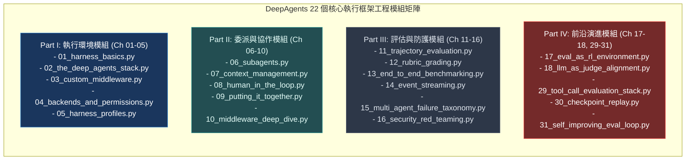

# Chapter 28: 可執行案例庫與工程實戰 (Runnable Harness Implementation Catalog)

> *「工程師的成長始於閱讀優秀的工業級代碼；模組化、可測試性與高內聚低耦合，是生產級 Agent Harness 的基石。」*

---

## 核心心智模型：高階工程師工具箱 (Senior Engineer Toolkit & Architecture Modules)

在傳統腳本編程中，人們習慣寫幾百行「從頭執行到尾」的 Python 腳本，所有連線、金鑰與 Prompt 全雜糅在一起；一旦環境變化，整套系統立即崩潰且無法進行單元測試。

可執行案例庫（Runnable Harness Catalog）將整個 Agent 體系拆解為 **22 個高內聚、可獨立測試的微架構模組**：
- **環境模組**：VFS 虛擬檔案系統、POSIX 權限過濾、CompositeBackend 多端路由。
- **上下文模組**：漸進式 Skills 加載器、記憶體卸載中介軟體、對話歷史摘要器。
- **委派模組**：TodoList 任務流轉狀態機、上下文隔離子代理調度器。
- **評估模組**：確定性軌跡比對器、執行期 Rubrics 驗收門、MAST 死鎖檢測器。
- **前沿控制模組**：四層工具評估棧、時空時光機重放、Reflexion 自改進演化閉環。

---

## 28.1 核心執行框架模組（Part I–II）

| 模組檔案名稱 | 所屬章節 | 核心職責與工藝亮點 |
|---|---|---|
| `01_harness_basics.py` | [Ch 01](01-harness-engineering-basics.md) | `create_deep_agent` 進入點組裝、預設 VFS 7 大工具掛載 |
| `02_the_deep_agents_stack.py` | [Ch 02](02-the-deep-agents-stack.md) | 12 層中介軟體順序堆疊、名稱匹配原位覆寫、快取凍結 |
| `03_custom_middleware.py` | [Ch 03](03-custom-middleware.md) | `@wrap_tool_call` 輕量裝飾器與 `AgentMiddleware` 生命週期 |
| `04_backends_and_permissions.py` | [Ch 04](04-backends-and-permissions.md) | `CompositeBackend` 多端路由掛載、Path-level ACL 讀寫阻斷 |
| `05_harness_profiles.py` | [Ch 05](05-harness-profiles.md) | 跨供應商硬體抽象層、模型工具排除與思考標籤適配 |
| `06_subagents.py` | [Ch 06](06-subagents-and-delegation.md) | `task` 工具調度、宣告式專職子代理與上下文資訊防火牆 |
| `07_context_management.py` | [Ch 07](07-context-management.md) | 漸進式技能目錄、>20k tokens 大輸出自動卸載至 VFS |
| `08_human_in_the_loop.py` | [Ch 08](08-human-in-the-loop.md) | `interrupt_on` 高危動作暫停、LangGraph 狀態快照與恢復 |
| `09_putting_it_together.py` | [Ch 09](09-putting-it-together.md) | 端到端完整研究代理：VFS + Skills + 子代理 + HITL 拓撲 |
| `10_middleware_deep_dive.py` | [Ch 10](10-middleware-deep-dive.md) | `jump_to` 流程重定向、`Command` 狀態變異與非同步事件管線 |

---

## 28.2 評估與防護模組（Part III）

| 模組檔案名稱 | 所屬章節 | 核心職責與工藝亮點 |
|---|---|---|
| `11_trajectory_evaluation.py` | [Ch 11](11-trajectory-evaluation.md) | 確定性狀態機比對、序列包含關係斷言與步驟效率評定 |
| `12_rubric_grading.py` | [Ch 12](12-rubric-grading.md) | 執行期 `RubricMiddleware`、五維判定狀態與一票否決制 |
| `13_end_to_end_benchmarking.py` | [Ch 13](13-end-to-end-benchmarking.md) | 拋棄式沙箱環境副作用斷言、Pytest 自動化 CI 阻斷流水線 |
| `14_event_streaming.py` | [Ch 14](14-event-streaming.md) | SSE 串流轉發、Typed Projections 視圖投影與 OTel Spans |
| `15_multi_agent_failure_taxonomy.py` | [Ch 15](15-multi-agent-failure-taxonomy.md) | MAST 14 類失效模式、Ping-Pong 死鎖檢測與 pass@k 統計 |
| `16_security_red_teaming.py` | [Ch 16](16-security-red-teaming.md) | 間接提示詞注入對抗、雙層 LLM 隔離審查與 ASR 驗收 |

---

## 28.3 前沿評估與自改進模組（Part IV–VI）

| 模組檔案名稱 | 所屬章節 | 核心職責與工藝亮點 |
|---|---|---|
| `17_eval_as_rl_environment.py` | [Ch 17](17-eval-as-rl-environment.md) | 確定性 Verifier 構建、Goldilocks 難度梯度與獎勵信號 |
| `18_llm_as_judge_alignment.py` | [Ch 18](18-llm-as-judge-alignment.md) | Pairwise Swap 雙向交換、Cohen's Kappa 裁判信度校準 |
| `29_tool_call_evaluation_stack.py` | [Ch 29](29-tool-call-evaluation-stack.md) | 選擇層、抽取層、消化層與恢復層四層工具穿透驗收 |
| `30_checkpoint_replay.py` | [Ch 30](30-checkpoint-replay.md) | 檢查點時空旅行重放、確定性狀態重現與副作用 Mock |
| `31_self_improving_eval_loop.py` | [Ch 31](31-self-improving-eval-loop.md) | Generate-Critique-Revise 反思閉環、DSPy MIPROv2 自動編譯 |

---

## 🤔 架構深度思辨與工業界陷阱 (Architectural Insight & Production Pitfalls)

> [!IMPORTANT]
> **Frontier Lab 核心考點 (Software Architecture & Modularity in AI Agents)**:
> - **陷阱與對策 (Failure Mode & Fix)**:
>   1. **上帝物件反模式 (God Object Anti-Pattern)**: 
>      初學者常把所有功能全塞進單一的 `AgentRunner` 類別中，既管網路連線、又做 Prompt 拼接、還兼任狀態儲存，幾天後代碼臃腫至數千行無法維護。**嚴格依據關注點分離（SoC），將網路、儲存、攔截、策略徹底拆分為獨立模組，並透過依賴注入（Dependency Injection）進行組裝**。
>   2. **隱式全域變數引發的測試污染**: 
>      模組內部使用了全域單例（Singleton），導致單元測試在多執行緒併發運行時相互干擾。**所有後端實例與設定檔必須作為參數顯式傳入工廠函數（Factory Function），保持模組純粹性**。
> - **核心技術思辨 (Technical Deep Dive)**:
>   *Q: 為什麼現代 AI 系統強烈提倡「配置即代碼（Configuration as Code）」與宣告式模組設計？*  
>   *A: 宣告式架構將「要做什麼（What）」與「底層怎麼做（How）」解耦。透過宣告式的 Subagent 清單、Permission 規則與 Profile 設定，架構師能在不修改任何底層運行時代碼的前提下，靈活替換模型、增刪工具或調整安全策略；同時，宣告式配置可直接進行靜態語法檢查、納入 Git 版本審批，並在 CI 流水線中進行自動化安全稽核，大幅提升企業級交付的可靠度。*

---

## 下一步

→ 進入 [Chapter 29: 工具呼叫四層評估棧 (Tool Call Evaluation Stack)](./29-tool-call-evaluation-stack.md)，解構現代 Agent 核心工具調用的分層穿透驗收架構。
