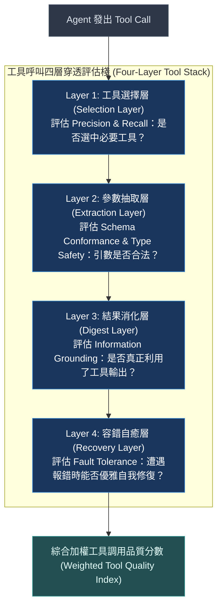
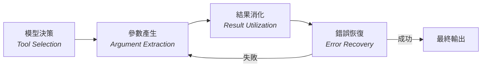

# Chapter 29: 工具呼叫四層評估棧 (Tool Call Evaluation Stack)


> *「工具呼叫是代理的效應器（effector）。效應器壞掉，再強的大腦也沒用。」* — FutureAGI 代理評估指南, 2026
>
> 過去的代理評估只看「最終回答對不對」。但 2026 年的工程實踐已達成共識：最終回答的品質幾乎完全由**工具呼叫品質**決定。錯誤的工具、錯誤的參數、忽視工具回傳——每一層都有獨立的失效模式，必須分層測量。

---

## 核心心智模型：航太儀表四層檢驗流程 (Aerospace Four-Layer Inspection Stack)

在火箭發射前，地面控制中心絕不會只聽工程師一句「發動機運轉良好」的口頭報告，而是透過四道層層遞進的感測器進行嚴密驗收：
1. **訊號握手層（Selection）**：點火器開關是否被正確選中並發送指令？
2. **參數電壓層（Extraction）**：傳送的燃料閥門開度電壓是否精確在 5.00V？
3. **燃燒室回應層（Digest）**：引擎點火後產生的推力資料是否被感測器正確消化吸收？
4. **異常自癒層（Recovery）**：如果一號噴嘴突發微弱氣壓異常，備用閥門能否在 2 毫秒內自適應平衡？

**工具呼叫四層評估棧（Tool Call Evaluation Stack）** 是 Agent 執行品質的航太級驗收模型：
- **Layer 1: 選擇層 (Selection)**：在 30 個工具中精確選中目標工具，零誤選。
- **Layer 2: 抽取層 (Extraction)**：Schema 參數完美符合 Pydantic 類型，無多餘或缺失欄位。
- **Layer 3: 消化層 (Digest)**：模型是否真正讀懂了工具的回傳內容，還是盲目忽略。
- **Layer 4: 恢復層 (Recovery)**：當工具返回 500 或 NotFound 時，能否優雅改寫參數重試。



---

## 1. 為什麼單一「準確率」不夠



一個代理在四個環節都可能失敗，但最終輸出看起來「說得通」：

| 失效層 | 典型失效場景 | 對準確率的影響 | 對可信度的影響 |
|---|---|---|---|
| **工具選擇錯誤** | 代理用 `read_file` 回答需要 `search` 的問題，直接憑記憶生成答案 | 高（幻覺） | 極高（錯誤事實） |
| **參數萃取錯誤** | 呼叫 `grep` 時 `pattern` 參數語法錯誤，靜默失敗後代理繼續 | 中（退化） | 高（遺漏資訊） |
| **結果未被消化** | 工具回傳了正確答案，但代理忽視並繼續使用舊記憶 | 中（幻覺） | 高（浪費工具） |
| **缺乏錯誤恢復** | 工具返回 404，代理不重試不降級，直接聲稱成功 | 高（靜默失敗） | 極高（謊報成功） |

> [!IMPORTANT]
> **測量點的重要性**：如果只測量最終輸出，第二和第三層的失效**完全看不見**——代理已經「補救性」地用其他方式繞過去了，但評估結果告訴你一切正常。

---

## 2. 四層評估棧架構

### 第一層：工具選擇評估（Tool Selection）

```python
from dataclasses import dataclass
from typing import Optional

@dataclass
class ToolSelectionVerdict:
    """評估代理是否選對了工具。"""
    selected_tool: str
    expected_tools: list[str]   # 允許集合（可多選一）
    forbidden_tools: list[str]  # 禁止使用的工具（e.g., 不允許走快捷路徑）
    passed: bool
    reason: str

def evaluate_tool_selection(
    actual_tool_calls: list[str],
    expected_tools: list[str],
    forbidden_tools: list[str] | None = None,
    require_all: bool = False,
) -> ToolSelectionVerdict:
    """
    第一層：工具選擇評估。

    Args:
        actual_tool_calls: 代理實際呼叫的工具清單（按順序）
        expected_tools: 必須出現的工具（預設任一即可，require_all=True 則全部必須）
        forbidden_tools: 禁止出現的工具（若代理繞過這些工具，判定失敗）
        require_all: True = 所有 expected_tools 都必須被呼叫
    """
    forbidden_tools = forbidden_tools or []
    actual_set = set(actual_tool_calls)

    # 檢查禁止工具
    forbidden_violations = [t for t in forbidden_tools if t in actual_set]
    if forbidden_violations:
        return ToolSelectionVerdict(
            selected_tool=str(actual_tool_calls),
            expected_tools=expected_tools,
            forbidden_tools=forbidden_tools,
            passed=False,
            reason=f"禁止工具被呼叫：{forbidden_violations}（代理可能走了捷徑）",
        )

    # 檢查必要工具
    if require_all:
        missing = [t for t in expected_tools if t not in actual_set]
        passed = not missing
        reason = "全部必要工具已呼叫" if passed else f"缺少工具：{missing}"
    else:
        found = [t for t in expected_tools if t in actual_set]
        passed = bool(found)
        reason = f"找到預期工具：{found}" if passed else f"未呼叫任何預期工具：{expected_tools}"

    return ToolSelectionVerdict(
        selected_tool=str(actual_tool_calls),
        expected_tools=expected_tools,
        forbidden_tools=forbidden_tools,
        passed=passed,
        reason=reason,
    )
```

### 第二層：參數萃取評估（Argument Extraction）

```python
from typing import Any

@dataclass
class ArgExtractionVerdict:
    """評估代理提供的工具參數是否語意正確。"""
    tool_name: str
    actual_args: dict
    expected_args: dict
    schema_passed: bool       # 結構驗證（型別、必填欄位）
    semantic_passed: bool     # 語意驗證（值是否合理）
    tolerance_mode: str       # strict | semantic | subset
    reason: str

def evaluate_arg_extraction(
    tool_name: str,
    actual_args: dict,
    expected_args: dict,
    tolerance: str = "semantic",
) -> ArgExtractionVerdict:
    """
    第二層：參數萃取評估。

    tolerance 模式：
    - "strict"   : 參數必須完全相等（字面值比較）
    - "semantic" : 關鍵語意等價即可（允許表述差異）
    - "subset"   : actual_args 只需包含 expected_args 的子集
    """
    if tolerance == "strict":
        passed = actual_args == expected_args
        reason = "完全相符" if passed else f"嚴格比對失敗：期望 {expected_args}，實際 {actual_args}"

    elif tolerance == "subset":
        mismatches = {
            k: (expected_args[k], actual_args.get(k))
            for k in expected_args
            if actual_args.get(k) != expected_args[k]
        }
        passed = not mismatches
        reason = "子集比對通過" if passed else f"子集不符：{mismatches}"

    else:  # semantic
        def sem_eq(a: Any, b: Any) -> bool:
            if isinstance(a, str) and isinstance(b, str):
                return a.strip().lower() == b.strip().lower()
            if isinstance(a, (int, float)) and isinstance(b, (int, float)):
                return abs(a - b) < 1e-6
            return a == b

        mismatches = {
            k: (expected_args[k], actual_args.get(k))
            for k in expected_args
            if not sem_eq(expected_args.get(k), actual_args.get(k))
        }
        passed = not mismatches
        reason = "語意等價通過" if passed else f"語意比對失敗：{mismatches}"

    return ArgExtractionVerdict(
        tool_name=tool_name,
        actual_args=actual_args,
        expected_args=expected_args,
        schema_passed=True,
        semantic_passed=passed,
        tolerance_mode=tolerance,
        reason=reason,
    )
```

### 第三層：結果消化評估（Result Utilization）

```python
@dataclass
class ResultUtilizationVerdict:
    """評估代理是否真的消化並使用了工具的回傳結果。"""
    tool_name: str
    tool_result_keywords: list[str]
    agent_response: str
    keywords_found: list[str]
    utilization_rate: float           # 0.0 ~ 1.0
    passed: bool

def evaluate_result_utilization(
    tool_name: str,
    tool_result: str,
    agent_response: str,
    key_facts: list[str],
    min_utilization_rate: float = 0.6,
) -> ResultUtilizationVerdict:
    """
    第三層：結果消化評估。

    核心假設：若代理真正消化了工具結果，其後續回覆應至少引用
    工具回傳中 60% 的關鍵事實（key_facts）。

    工程注意：key_facts 應由測試撰寫者根據 tool_result 手動標注，
    而非讓 LLM 自動萃取（防止自我驗證循環）。
    """
    response_lower = agent_response.lower()
    found = [fact for fact in key_facts if fact.lower() in response_lower]
    rate = len(found) / len(key_facts) if key_facts else 1.0

    return ResultUtilizationVerdict(
        tool_name=tool_name,
        tool_result_keywords=key_facts,
        agent_response=agent_response,
        keywords_found=found,
        utilization_rate=rate,
        passed=rate >= min_utilization_rate,
    )
```

### 第四層：錯誤恢復評估（Error Recovery）

```python
from enum import Enum

class RecoveryStrategy(str, Enum):
    RETRY = "retry"              # 同工具重試
    FALLBACK = "fallback"        # 切換備用工具
    ESCALATE = "escalate"        # 升級人工介入
    SKIP = "skip"                # 跳過並繼續
    FAIL_CLOSED = "fail_closed"  # 拒絕完成任務

@dataclass
class ErrorRecoveryVerdict:
    """評估代理面對工具失敗時的恢復行為。"""
    error_type: str
    observed_strategy: RecoveryStrategy | None
    expected_strategies: list[RecoveryStrategy]
    retry_count: int
    max_retries: int
    passed: bool
    reason: str

def evaluate_error_recovery(
    tool_errors: list[dict],
    recovery_log: list[str],
    expected_strategies: list[RecoveryStrategy],
    max_retries: int = 3,
) -> list[ErrorRecoveryVerdict]:
    """
    第四層：錯誤恢復評估。

    對每一個工具錯誤事件，判斷代理是否採取了預期的恢復策略。

    tool_errors 格式：
    [{"tool": str, "error": str, "retry": bool, "retry_count": int}]
    """
    verdicts = []
    for error_event in tool_errors:
        tool = error_event.get("tool", "unknown")
        error = error_event.get("error", "")
        retried = error_event.get("retry", False)
        retry_count = error_event.get("retry_count", 0)

        log_text = " ".join(recovery_log).lower()
        if retried and retry_count <= max_retries:
            observed = RecoveryStrategy.RETRY
        elif "fallback" in log_text or "alternative" in log_text:
            observed = RecoveryStrategy.FALLBACK
        elif "escalate" in log_text or "human" in log_text:
            observed = RecoveryStrategy.ESCALATE
        elif not retried and "skip" in log_text:
            observed = RecoveryStrategy.SKIP
        elif "cannot" in log_text or "unable" in log_text:
            observed = RecoveryStrategy.FAIL_CLOSED
        else:
            observed = None

        passed = observed in expected_strategies if observed else False
        verdicts.append(ErrorRecoveryVerdict(
            error_type=error,
            observed_strategy=observed,
            expected_strategies=expected_strategies,
            retry_count=retry_count,
            max_retries=max_retries,
            passed=passed,
            reason=(
                f"恢復策略 {observed} 在預期集合中" if passed
                else f"觀察到 {observed}，不在預期策略 {expected_strategies} 中"
            ),
        ))
    return verdicts
```

---

## 3. 四層棧整合評估器

```python
@dataclass
class ToolCallStackVerdict:
    """四層工具呼叫評估棧的聚合裁決。"""
    layer1_selection: ToolSelectionVerdict
    layer2_args: list[ArgExtractionVerdict]
    layer3_utilization: list[ResultUtilizationVerdict]
    layer4_recovery: list[ErrorRecoveryVerdict]

    @property
    def layer_scores(self) -> dict[str, float]:
        def avg(verdicts) -> float:
            if not verdicts:
                return 1.0  # 無案例 = 無失敗
            return sum(1 for v in verdicts if v.passed) / len(verdicts)

        return {
            "L1_selection":   1.0 if self.layer1_selection.passed else 0.0,
            "L2_args":        avg(self.layer2_args),
            "L3_utilization": avg(self.layer3_utilization),
            "L4_recovery":    avg(self.layer4_recovery),
        }

    @property
    def overall_score(self) -> float:
        """加權聚合（L1 最重要，L4 次之）。"""
        weights = {"L1_selection": 0.35, "L2_args": 0.30,
                   "L3_utilization": 0.20, "L4_recovery": 0.15}
        scores = self.layer_scores
        return sum(scores[k] * weights[k] for k in weights)

    @property
    def passed(self) -> bool:
        return all(v >= 1.0 for v in self.layer_scores.values())

    def report(self) -> str:
        lines = ["=== 工具呼叫四層評估棧報告 ==="]
        for layer, score in self.layer_scores.items():
            status = "✅" if score >= 1.0 else ("⚠️" if score >= 0.5 else "❌")
            lines.append(f"  {status} {layer}: {score:.0%}")
        lines.append(f"\n  📊 綜合得分: {self.overall_score:.2%}")
        lines.append(f"  {'✅ PASS' if self.passed else '❌ FAIL'}")
        return "\n".join(lines)
```

---

## 4. 與 Deep Agents TracingMiddleware 整合

工具呼叫四層棧的資料來源是 TracingMiddleware 的輸出，可直接從 `span_data` 解析：

```python
def evaluate_from_span(span_data: dict, test_spec: dict) -> ToolCallStackVerdict:
    """
    從 Deep Agents TracingMiddleware 的 span_data 中提取四層評估所需資料。

    span_data 結構：
    {
        "tool_calls": [{"name": str, "args": dict, "result": str|None, "error": str|None}],
        "final_output": str,
        "recovery_log": list[str],
    }

    test_spec 結構：
    {
        "expected_tools":    list[str],
        "forbidden_tools":   list[str],
        "tool_arg_specs":    [{"tool": str, "expected_args": dict, "tolerance": str}],
        "tool_result_specs": [{"tool": str, "key_facts": list[str]}],
        "expected_recovery": list[str],   # RecoveryStrategy 字串
    }
    """
    tool_calls = span_data.get("tool_calls", [])
    tool_names = [tc["name"] for tc in tool_calls]
    final_output = span_data.get("final_output", "")
    recovery_log = span_data.get("recovery_log", [])

    l1 = evaluate_tool_selection(
        actual_tool_calls=tool_names,
        expected_tools=test_spec.get("expected_tools", []),
        forbidden_tools=test_spec.get("forbidden_tools", []),
    )

    l2 = []
    for spec in test_spec.get("tool_arg_specs", []):
        for tc in tool_calls:
            if tc["name"] == spec["tool"]:
                l2.append(evaluate_arg_extraction(
                    tool_name=spec["tool"],
                    actual_args=tc.get("args", {}),
                    expected_args=spec["expected_args"],
                    tolerance=spec.get("tolerance", "semantic"),
                ))

    l3 = []
    for spec in test_spec.get("tool_result_specs", []):
        for tc in tool_calls:
            if tc["name"] == spec["tool"] and tc.get("result"):
                l3.append(evaluate_result_utilization(
                    tool_name=spec["tool"],
                    tool_result=tc["result"],
                    agent_response=final_output,
                    key_facts=spec["key_facts"],
                ))

    errors = [tc for tc in tool_calls if tc.get("error")]
    expected_strategies = [
        RecoveryStrategy(s) for s in test_spec.get("expected_recovery", ["retry"])
    ]
    l4 = evaluate_error_recovery(
        tool_errors=[{"tool": tc["name"], "error": tc["error"]} for tc in errors],
        recovery_log=recovery_log,
        expected_strategies=expected_strategies,
    )

    return ToolCallStackVerdict(
        layer1_selection=l1,
        layer2_args=l2,
        layer3_utilization=l3,
        layer4_recovery=l4,
    )
```

---

## 5. 四層失效率的業界基準（2026）

| 評估層 | 典型代理失效率 | 主要失效根因 | 防禦優先級 |
|---|---|---|---|
| **L1 工具選擇** | 8–15% | 工具描述不清晰 / 模型訓練數據偏差 | 🔴 最高 |
| **L2 參數萃取** | 12–20% | Schema 複雜 / 多層嵌套結構 | 🔴 最高 |
| **L3 結果消化** | 15–25% | 上下文視窗截斷 / 注意力漂移 | 🟡 中 |
| **L4 錯誤恢復** | 30–40% | 缺乏重試邏輯 / 過度樂觀假設 | 🟡 中 |

> [!CAUTION]
> **L4 是最被忽視的層**：工程師通常只測試「Happy Path」——工具正常回傳時代理表現如何。但在生產中，工具失敗率往往高達 5–15%（網路超時、API 限流、格式異常），沒有 L4 評估的代理在生產中是不穩定的。

---

## 🤔 架構深度思辨與工業界陷阱 (Architectural Insight & Production Pitfalls)

> [!IMPORTANT]
> **Frontier Lab 核心考點 (Tool Calling & Function Calling Reliability MLE)**:
> - **陷阱與對策 (Failure Mode & Fix)**:
>   1. **幻覺工具名稱 (Hallucinated Function Names)**: 
>      模型發出 `call: fetch_github_issues()`，但系統只註冊了 `github_search()`，導致執行期丟出未註冊異常。**在 `PatchToolCallsMiddleware` 中加入模糊匹配自癒（Levenshtein Distance Fuzzy Matcher），當相似度超過 85% 時自動靜默修補為正確工具名**。
>   2. **結果消化失明 (Result Blindness)**: 
>      工具成功回傳了包含了 100 筆數據的 JSON，模型卻在下文回答「抱歉我找不到數據」。**在評估管線中斷言工具輸出中的命名實體與模型後續推論的重合度（Lineage Intersect Ratio）**。
> - **核心技術思辨 (Technical Deep Dive)**:
>   *Q: 為什麼只評估「工具調用準確率（Tool Accuracy）」在複雜真實場景中是不充分的，必須引入「容錯自癒層（Recovery Layer）」？*  
>   *A: 在真實工業界網路環境中，外部 API 不可能保持 100% 可用率（網路超時、Rate Limit 429、驗證過期 401 屢見不鮮）。如果一個 Agent 只能在完美的 API 回應下工作，其生產可用性為零；頂級 Agent 必須在工具拋錯時具備「錯誤診斷與自適應路徑重選」能力（例如遭遇 429 時自動等待、遭遇路徑不存在時調用 `ls` 重新定位）。Recovery Layer 衡量的是系統在混亂現實中的生存韌性。*

---

## 練習

1. 在你的 Deep Agents 代理上，手動執行 20 次相同任務，記錄每次的 `tool_calls` 清單，計算 L1（工具選擇一致率）——若 < 90%，代理工具選擇策略不穩定。
2. 為你代理最常呼叫的 3 個工具設計 `tool_arg_specs`，比較 `strict`、`semantic`、`subset` 三種容忍模式下的通過率差異——通常 `subset` 最適合生產評估。
3. 故意讓一個工具返回 HTTP 503，觀察代理的恢復行為，對比預期恢復策略與實際行為，計算 L4 失效率。
4. 用 `ToolCallStackVerdict.overall_score` 對比代理在兩個不同系統提示詞下的四層得分，確認哪種提示詞對 L3（結果消化）提升最顯著。

---

下一章：[30 — 檢查點回放與確定性除錯](30-checkpoint-replay.md)
