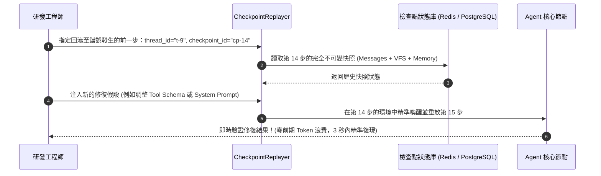

# Chapter 30: 檢查點回放與確定性除錯 (Checkpoint Replay)


> *「如果你不能重現代理的失敗，你就不能修復它。」* — LangGraph 檢查點設計文件, 2026
>
> 代理失敗的最大工程挑戰不是修復——而是**重現**。在長任務中，代理在第 15 個工具呼叫後失敗，但你沒有辦法在不重跑 14 個前置步驟的情況下調試第 15 步。Checkpoint Replay 解決了這個問題。

---

## 核心心智模型：平行時空遊戲存檔點 (Game Save States & Time-Travel Debugging)

想像你在玩一款難度極高的高難度動作遊戲（如《艾爾登法環》）：
- 如果每次陣亡都要從遊戲序章從頭開始玩 5 個小時，任何人都會崩潰。
- 遊戲存檔點（Save State / Checkpoint）允許你在進入 Boss 房的瞬間存檔；一旦死亡，立刻讀取該時間點的記憶體快照，重新嘗試不同的翻滾與攻擊時機。

在長任務 Agent 系統中，**檢查點重放（Checkpoint Replay）就是 Agent 的時光機除錯器**：
- **狀態快照持久化**：LangGraph 在每個節點執行完畢後，原子化保存圖狀態快照。
- **時光旅行偵錯（Time-Travel Debugging）**：當任務在第 15 步失敗時，無需從第 1 步重新消耗 5 萬 Token；直接回滾至第 14 步的檢查點，修改提示詞或中介軟體參數後單步執行重放！
- **外部副作用確定性 Mock**：重放時自動 Mock 外部網路 API，確保重現完全確定性。



---

## 30.1 檢查點重放資料結構設計

每個檢查點由不可變的四維元組構成：

$$	ext{Checkpoint} = \langle 	ext{thread\_id}, 	ext{checkpoint\_id}, 	ext{parent\_id}, 	ext{state\_snapshot} 
angle$$

透過維護 `parent_id` 指標鏈，LangGraph 構建出了一棵**分支版本樹（Branching Version Tree）**，支援隨時在任意歷史節點拉出新的分支嘗試不同策略。

---

## 1. 為什麼代理需要 Checkpoint Replay

傳統軟體 debug 靠的是：reproducible inputs → reproducible output。代理 debug 的核心障礙：

| 障礙 | 具體問題 | 傳統工具的侷限 |
|---|---|---|
| **非確定性** | 相同 prompt 在兩次呼叫中可能產生不同工具序列 | `print` log 無法重現上下文 |
| **狀態累積** | 代理在 VFS/store 中的中間狀態影響後續決策 | 重跑會重置狀態 |
| **成本高昂** | 長任務 15 個工具呼叫重跑成本高 | 無法只重跑第 10–15 步 |
| **工具副作用** | 工具呼叫可能修改外部系統（DB、檔案） | 重跑會產生重複副作用 |

> [!IMPORTANT]
> **Checkpoint Replay 的核心承諾**：把代理執行路徑的任意時間點「凍結」為可序列化的快照，之後可以從這個快照精確恢復，注入新的工具回傳、修改系統提示詞，然後繼續執行——而不需要重跑前置步驟。

---

## 2. 檢查點資料結構設計

```python
from dataclasses import dataclass, field
from datetime import datetime
from typing import Any
import json
import hashlib

@dataclass
class ToolCallRecord:
    """單次工具呼叫的完整快照。"""
    step_index: int
    tool_name: str
    args: dict
    result: str | None          # None = 尚未執行
    error: str | None           # None = 成功
    latency_ms: float | None
    timestamp: str = field(default_factory=lambda: datetime.utcnow().isoformat())

@dataclass
class AgentCheckpoint:
    """
    代理執行的完整快照，用於確定性回放。

    可序列化為 JSON，存入任意持久化後端（本地檔案、Redis、S3）。
    """
    checkpoint_id: str
    task_input: str
    system_prompt: str
    model: str

    # 已完成的工具呼叫序列（決定性歷史）
    completed_steps: list[ToolCallRecord] = field(default_factory=list)

    # 代理的 context 狀態（VFS 快照、store 狀態）
    vfs_state: dict = field(default_factory=dict)   # {path: content}
    store_state: dict = field(default_factory=dict)  # {key: value}

    # 對話歷史（完整的 messages 列表）
    message_history: list[dict] = field(default_factory=list)

    # 元資料
    created_at: str = field(default_factory=lambda: datetime.utcnow().isoformat())
    agent_version: str = "unknown"

    def checkpoint_hash(self) -> str:
        """計算快照的確定性雜湊值，用於驗證回放一致性。"""
        content = json.dumps({
            "task": self.task_input,
            "system": self.system_prompt,
            "steps": [(s.tool_name, s.args, s.result) for s in self.completed_steps],
        }, sort_keys=True)
        return hashlib.sha256(content.encode()).hexdigest()[:16]

    def to_json(self) -> str:
        """序列化為 JSON 字串，用於持久化。"""
        return json.dumps({
            "checkpoint_id": self.checkpoint_id,
            "task_input": self.task_input,
            "system_prompt": self.system_prompt,
            "model": self.model,
            "completed_steps": [
                {
                    "step_index": s.step_index,
                    "tool_name": s.tool_name,
                    "args": s.args,
                    "result": s.result,
                    "error": s.error,
                    "latency_ms": s.latency_ms,
                    "timestamp": s.timestamp,
                }
                for s in self.completed_steps
            ],
            "vfs_state": self.vfs_state,
            "store_state": self.store_state,
            "message_history": self.message_history,
            "created_at": self.created_at,
            "agent_version": self.agent_version,
        }, indent=2, ensure_ascii=False)

    @classmethod
    def from_json(cls, json_str: str) -> "AgentCheckpoint":
        """從 JSON 字串還原快照。"""
        data = json.loads(json_str)
        cp = cls(
            checkpoint_id=data["checkpoint_id"],
            task_input=data["task_input"],
            system_prompt=data["system_prompt"],
            model=data["model"],
            vfs_state=data.get("vfs_state", {}),
            store_state=data.get("store_state", {}),
            message_history=data.get("message_history", []),
            created_at=data.get("created_at", ""),
            agent_version=data.get("agent_version", "unknown"),
        )
        cp.completed_steps = [
            ToolCallRecord(**step)
            for step in data.get("completed_steps", [])
        ]
        return cp
```

---

## 3. 檢查點管理器

```python
import os
from pathlib import Path

class CheckpointManager:
    """
    管理代理執行的檢查點生命週期：儲存、載入、列舉、清理。

    預設使用本地檔案系統（.checkpoints/ 目錄）。
    生產中可替換為 Redis / S3 後端。
    """

    def __init__(self, storage_dir: str = ".checkpoints"):
        self.storage_dir = Path(storage_dir)
        self.storage_dir.mkdir(exist_ok=True)

    def save(self, checkpoint: AgentCheckpoint) -> str:
        """儲存檢查點，回傳儲存路徑。"""
        path = self.storage_dir / f"{checkpoint.checkpoint_id}.json"
        path.write_text(checkpoint.to_json(), encoding="utf-8")
        return str(path)

    def load(self, checkpoint_id: str) -> AgentCheckpoint:
        """載入指定 ID 的檢查點。"""
        path = self.storage_dir / f"{checkpoint_id}.json"
        if not path.exists():
            raise FileNotFoundError(f"找不到檢查點：{checkpoint_id}")
        return AgentCheckpoint.from_json(path.read_text(encoding="utf-8"))

    def list_checkpoints(self) -> list[str]:
        """列舉所有可用的檢查點 ID。"""
        return [p.stem for p in self.storage_dir.glob("*.json")]

    def delete(self, checkpoint_id: str) -> bool:
        path = self.storage_dir / f"{checkpoint_id}.json"
        if path.exists():
            path.unlink()
            return True
        return False

    def get_checkpoint_at_step(
        self,
        base_checkpoint_id: str,
        target_step: int,
    ) -> AgentCheckpoint:
        """
        從完整快照中截取到指定步驟的子快照。
        用於從「任意中間點」開始回放，而不是必須從頭開始。
        """
        full = self.load(base_checkpoint_id)
        truncated = AgentCheckpoint(
            checkpoint_id=f"{base_checkpoint_id}_step{target_step}",
            task_input=full.task_input,
            system_prompt=full.system_prompt,
            model=full.model,
            vfs_state=self._vfs_state_at_step(full, target_step),
            store_state=full.store_state.copy(),
            message_history=full.message_history[:target_step + 1],
            agent_version=full.agent_version,
        )
        truncated.completed_steps = full.completed_steps[:target_step]
        return truncated

    def _vfs_state_at_step(self, checkpoint: AgentCheckpoint, step: int) -> dict:
        """重建在第 N 步結束時的 VFS 狀態（簡化版：從完整狀態倒推）。"""
        # 生產中應記錄每步的 VFS diff，這裡返回完整狀態作為近似
        return checkpoint.vfs_state.copy()
```

---

## 4. Replay 引擎：確定性回放

```python
@dataclass
class ReplayConfig:
    """控制回放行為的設定。"""
    checkpoint_id: str
    start_step: int = 0      # 從第幾步開始回放（0 = 從頭）

    # 工具回傳注入（deterministic replay 的核心）
    # 格式：{step_index: {"tool": str, "result": str}}
    injected_tool_results: dict[int, dict] = field(default_factory=dict)

    # 修改系統提示詞（用於測試 prompt 改動的影響）
    override_system_prompt: str | None = None

    # 修改模型（用於測試模型切換的影響）
    override_model: str | None = None

    # 最多回放到第幾步（None = 回放到完成）
    max_steps: int | None = None


class ReplayEngine:
    """
    確定性回放引擎。

    核心功能：
    1. 從檢查點恢復代理狀態（VFS、store、message history）
    2. 對已完成步驟注入錄製的工具回傳（不真正呼叫外部系統）
    3. 從指定步驟繼續「真實」執行（呼叫真實工具）
    """

    def __init__(self, checkpoint_manager: CheckpointManager):
        self.manager = checkpoint_manager

    def replay(
        self,
        config: ReplayConfig,
        agent_factory,  # callable -> create_deep_agent instance
    ) -> dict:
        """
        執行回放並返回結果。

        Returns:
            {
                "checkpoint_id": str,
                "start_step": int,
                "replayed_steps": list[ToolCallRecord],
                "final_output": str,
                "diverged_at_step": int | None,  # 與原始軌跡首次分歧的步驟
            }
        """
        checkpoint = self.manager.get_checkpoint_at_step(
            config.checkpoint_id, config.start_step
        )

        # 構建含有已完成歷史的代理上下文
        replay_context = self._build_replay_context(checkpoint, config)

        # 注入工具回傳後繼續執行
        result = self._execute_with_injection(
            agent_factory=agent_factory,
            context=replay_context,
            injected=config.injected_tool_results,
            max_steps=config.max_steps,
        )

        diverged_at = self._find_divergence(
            original_steps=checkpoint.completed_steps,
            replayed_steps=result["replayed_steps"],
        )

        return {
            "checkpoint_id": config.checkpoint_id,
            "start_step": config.start_step,
            "replayed_steps": result["replayed_steps"],
            "final_output": result["final_output"],
            "diverged_at_step": diverged_at,
        }

    def _build_replay_context(
        self, checkpoint: AgentCheckpoint, config: ReplayConfig
    ) -> dict:
        """從快照構建代理的初始上下文。"""
        return {
            "task": checkpoint.task_input,
            "system_prompt": (
                config.override_system_prompt or checkpoint.system_prompt
            ),
            "model": config.override_model or checkpoint.model,
            "vfs_state": checkpoint.vfs_state,
            "store_state": checkpoint.store_state,
            "message_history": checkpoint.message_history,
        }

    def _execute_with_injection(
        self, agent_factory, context: dict, injected: dict, max_steps: int | None
    ) -> dict:
        """
        執行代理，對指定步驟注入預錄的工具回傳。

        注入的步驟不調用真實工具，直接返回錄製的結果——
        這保證了回放的確定性，同時允許你在特定步驟注入不同的回傳值來測試。
        """
        # 生產實現會在 Deep Agents 的 wrap_tool_call 中攔截並注入
        # 這裡是邏輯示意
        replayed = []
        current_step = len(context.get("message_history", [])) // 2

        # 模擬回放：若該步驟有注入值，使用注入值；否則調用真實工具
        for step_idx in range(current_step, current_step + (max_steps or 20)):
            if step_idx in injected:
                record = ToolCallRecord(
                    step_index=step_idx,
                    tool_name=injected[step_idx]["tool"],
                    args=injected[step_idx].get("args", {}),
                    result=injected[step_idx]["result"],
                    error=None,
                    latency_ms=0.0,   # 注入不計時
                )
            else:
                # 在真實實現中，這裡調用 agent_factory 繼續真實執行
                break
            replayed.append(record)

        return {
            "replayed_steps": replayed,
            "final_output": "[回放輸出 — 需接入真實代理執行]",
        }

    def _find_divergence(
        self,
        original_steps: list[ToolCallRecord],
        replayed_steps: list[ToolCallRecord],
    ) -> int | None:
        """找到回放軌跡與原始軌跡首次分歧的步驟索引。"""
        for i, (orig, replay) in enumerate(
            zip(original_steps, replayed_steps)
        ):
            if orig.tool_name != replay.tool_name or orig.args != replay.args:
                return i
        return None  # 未分歧
```

---

## 5. 確定性 Regression Test 模式

Checkpoint Replay 最重要的生產用途：把生產失敗案例轉化為可在 CI 中重現的回歸測試。

```python
class CheckpointRegressionTest:
    """
    把生產失敗的檢查點轉化為可自動重現的回歸測試。

    工作流程：
    1. 生產中代理失敗 → 自動儲存檢查點
    2. 工程師分析失敗原因，修復代理
    3. 在 CI 中，用 CheckpointRegressionTest 重現原始失敗
    4. 確認修復後的代理在同一檢查點上通過

    注意：這要求工具回傳被「錄製」並注入，而非再次呼叫外部工具。
    """

    def __init__(
        self,
        checkpoint_manager: CheckpointManager,
        replay_engine: ReplayEngine,
    ):
        self.manager = checkpoint_manager
        self.replay = replay_engine

    def record_failure(
        self,
        checkpoint: AgentCheckpoint,
        failure_description: str,
        expected_behavior: str,
    ) -> str:
        """
        記錄生產失敗案例，包含預期行為描述。
        返回記錄 ID（後續 CI 測試使用）。
        """
        checkpoint_id = f"regression_{checkpoint.checkpoint_id}"
        # 附加失敗描述元資料
        checkpoint.store_state["__regression_meta__"] = {
            "failure_description": failure_description,
            "expected_behavior": expected_behavior,
            "recorded_at": datetime.utcnow().isoformat(),
        }
        self.manager.save(checkpoint)
        return checkpoint_id

    def assert_fixed(
        self,
        regression_id: str,
        agent_factory,
        injected_tool_results: dict | None = None,
        expected_output_contains: list[str] | None = None,
    ) -> bool:
        """
        在 CI 中驗證修復後的代理能正確處理原始失敗案例。

        使用注入的工具回傳（而非真實呼叫），確保測試確定性。
        """
        result = self.replay.replay(
            ReplayConfig(
                checkpoint_id=regression_id,
                injected_tool_results=injected_tool_results or {},
            ),
            agent_factory=agent_factory,
        )

        if expected_output_contains:
            output = result["final_output"].lower()
            missing = [
                kw for kw in expected_output_contains
                if kw.lower() not in output
            ]
            if missing:
                print(f"❌ 回歸測試失敗：輸出缺少關鍵詞 {missing}")
                return False

        print(f"✅ 回歸測試通過：{regression_id}")
        return True
```

---

## 6. 自動檢查點注入中介軟體

在 Deep Agents 中，最優雅的做法是把檢查點儲存整合進 Middleware：

```python
from deepagents import AgentMiddleware

class CheckpointMiddleware(AgentMiddleware):
    """
    自動在每個工具呼叫前後儲存檢查點的 Deep Agents 中介軟體。

    工程實踐：
    - 使用「懶惰存檔」策略：只儲存每 N 步或發生錯誤時的快照
    - 錯誤時立即儲存（確保失敗可回放）
    - 正常完成後清理中間快照（節省儲存空間）
    """

    def __init__(
        self,
        manager: CheckpointManager,
        save_every_n_steps: int = 5,
        always_save_on_error: bool = True,
    ):
        self.manager = manager
        self.save_every = save_every_n_steps
        self.always_error = always_save_on_error
        self._current_steps: list[ToolCallRecord] = []
        self._checkpoint_id: str | None = None

    def wrap_tool_call(self, tool_name: str, tool_fn, args: dict) -> Any:
        step_idx = len(self._current_steps)

        try:
            import time
            start = time.time()
            result = tool_fn(**args)
            latency = (time.time() - start) * 1000

            record = ToolCallRecord(
                step_index=step_idx, tool_name=tool_name,
                args=args, result=str(result), error=None,
                latency_ms=latency,
            )
            self._current_steps.append(record)

            # 懶惰存檔：每 N 步存一次
            if step_idx % self.save_every == 0:
                self._save_current_checkpoint()

            return result

        except Exception as e:
            record = ToolCallRecord(
                step_index=step_idx, tool_name=tool_name,
                args=args, result=None, error=str(e), latency_ms=None,
            )
            self._current_steps.append(record)

            # 立即存檔：錯誤時保證可回放
            if self.always_error:
                cp_id = self._save_current_checkpoint(suffix="_error")
                print(f"⚠️  工具失敗，檢查點已儲存：{cp_id}")

            raise

    def _save_current_checkpoint(self, suffix: str = "") -> str:
        import uuid
        cp_id = self._checkpoint_id or str(uuid.uuid4())[:8]
        cp = AgentCheckpoint(
            checkpoint_id=f"{cp_id}{suffix}",
            task_input="[from middleware]",
            system_prompt="[from middleware]",
            model="unknown",
            completed_steps=self._current_steps.copy(),
        )
        return self.manager.save(cp)
```

---

## 7. 檢查點回放在評估工程中的五大應用場景

| 應用場景 | 實施方式 | 評估價值 |
|---|---|---|
| **生產失敗重現** | 自動在失敗時儲存完整快照；CI 中注入錄製的工具回傳 | 100% 可重現，不依賴外部 API |
| **工具回傳變體測試** | 從同一個檢查點出發，注入不同的工具回傳，觀察代理決策差異 | 隔離測試「工具品質 vs 代理邏輯」 |
| **Prompt 改動影響分析** | 相同檢查點 + 新舊 system prompt，比較軌跡分歧點 | 精確定位 prompt 改動的影響範圍 |
| **模型升級迴歸測試** | 相同檢查點集合 + 新模型，批次比較行為差異 | 在升級前量化模型差異 |
| **成本/延遲基準測試** | 錄製「慢路徑」執行，注入快取工具回傳，測量優化效果 | 隔離測試工具快取的成本影響 |

---

## 🤔 架構深度思辨與工業界陷阱 (Architectural Insight & Production Pitfalls)

> [!IMPORTANT]
> **Frontier Lab 核心考點 (Time-Travel Debugging & Deterministic Replay MLE)**:
> - **陷阱與對策 (Failure Mode & Fix)**:
>   1. **外部副作用洩漏摧毀確定性重放**: 
>      在第 15 步發送了一封真實電子郵件，重放第 15 步時又發送了一次。**在重放模式下，執行框架必須自動將所有寫入類工具切換為 Mock 虛擬設備（Dry-Run Mode），嚴禁產生外部非受控副作用**。
>   2. **隨機溫度導致的分支發散**: 
>      模型採樣溫度 $	au = 0.7$，回放時模型走出了完全不同的路徑，無法復現 Bug。**在記錄檢查點時，必須連帶保存隨機數種子（Seed），或在重放時強制覆寫 $	au = 0$**。
> - **核心技術思辨 (Technical Deep Dive)**:
>   *Q: 為什麼大型 Agent 平台必須支援「時空分支（State Forking）」而不能只做「線性回滾（Linear Rollback）」？*  
>   *A: 在複雜的多代理協作或探索式任務中，人類專家在介入時往往希望對比「如果當初採取策略 A 會怎樣，採取策略 B 又會怎樣」。線性回滾會覆蓋掉之後的歷史，導致原始錯誤軌跡丟失；時空分支（如同 Git Branching）為每次重放建立獨立的 child checkpoint，既完整保留了原始失敗軌跡作為錯誤分析樣本，又允許工程師在多個平行時空中並行測試多種修復假說。*

---

## 練習

1. 為你的 Deep Agents 代理部署 `CheckpointMiddleware`（`save_every_n_steps=3`），執行 10 次任務，觀察儲存的快照結構，確認 `checkpoint_hash` 在相同輸入下一致。
2. 從任意一個失敗的檢查點，用 `ReplayConfig.injected_tool_results` 注入修正後的工具回傳，確認代理在相同條件下是否能完成任務。
3. 選取一個三步任務的完整檢查點，從第 2 步開始回放（`start_step=2`），確認 VFS 和 message_history 狀態被正確恢復，而不需要重跑前兩步。
4. 用 `CheckpointRegressionTest` 把最近一次生產失敗轉化為 CI 回歸測試，確認修復後的代理在 CI 中通過，且注入工具回傳讓測試不依賴外部 API。

---

下一章：[31 — 自改進代理評估迴圈](31-self-improving-eval-loop.md)
