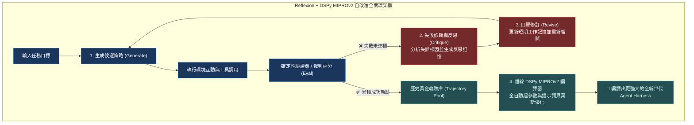
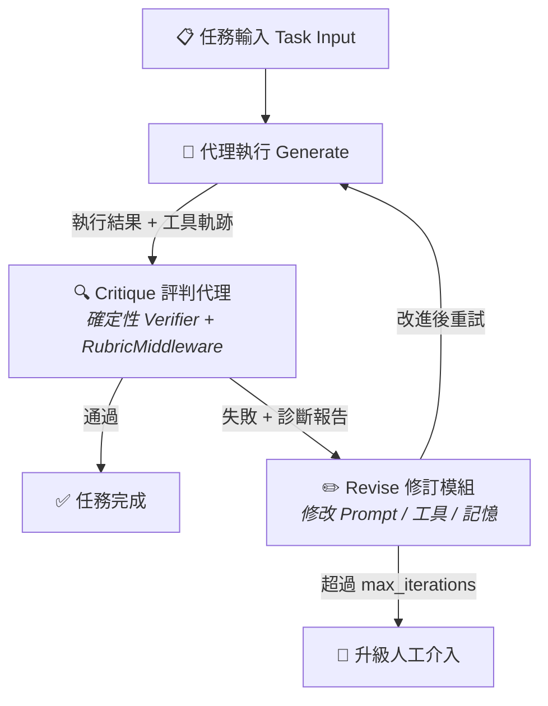

# Chapter 31: 自改進代理評估迴圈 (Self-Improving Eval Loop & DSPy)


> *「讓代理評估自己的失敗，然後改進自己——這不是科幻，而是 2026 年的生產工程。」* — Hamel Husain, 2026
>
> 傳統評估是**外部觀察**：人類或 LLM 裁判從外部評判代理輸出。自改進評估迴圈把評估**內化**：代理用評估結果驅動自身的提示詞、工具和記憶的迭代改進。這是評估工程的最高形態——評估既是測量，也是訓練信號。

---

## 核心心智模型：自我進化的自適應有機體 (Self-Adapting Organism & Reflexion Loop)

達爾文的生物演化論揭示：物種不是一次性設計完美的，而是在生存挑戰中透過「突變 → 篩選 → 適應」不斷自我進化。

現代最高階的 Agent 體系不再是靜態的提示詞工程，而是一個**自我進化的動態有機體**：
- **線上測試期反思修正（Reflexion / Test-Time RSI）**：當 Agent 任務執行失敗時，觸發 `Critique` 模組進行自我診斷，將失誤原因轉化為口頭記憶反思信號（Verbal Self-Reflection），在下一輪嘗試中自我修正。
- **離線跨任務技能編譯（DSPy MIPROv2 / Offline Compilation）**：收集數百個歷史成功與失敗軌跡，透過 DSPy 編譯器自動對 System Prompt 與 Few-Shot 示範進行貝葉斯搜尋與整數規劃優化，自動編譯出最佳提示詞參數。
- **Generate → Critique → Revise 全閉環**：推動系統從「依賴人類手動修 Bug」跨越到「自主持續進化」。



---

## 1. 自改進的核心架構：Generate → Critique → Revise



> [!CAUTION]
> **避免「一致性陷阱」（Coherence Trap）**：代理如果只用 LLM 自我評估，容易讓「批評代理」同意「執行代理」的結論——因為它們來自同一個模型家族。
>
> **防禦對策**：
> 1. Critique 必須包含至少一個**確定性驗證器**（VFS 狀態斷言、pytest 通過率等）
> 2. 批評代理使用不同廠商的模型（見 Chapter 18 反自我偏袒原則）
> 3. Revise 的修改必須有最小改動量約束（防止過度改動導致退化）

---

## 2. 診斷驅動的修訂：結構化失敗分析

```python
from dataclasses import dataclass, field
from typing import Literal
from enum import Enum

class FailureCategory(str, Enum):
    """自改進迴圈的失敗分類（驅動不同的修訂策略）。"""
    TOOL_SELECTION    = "tool_selection"   # 選錯工具
    ARG_EXTRACTION    = "arg_extraction"   # 參數錯誤
    RESULT_IGNORED    = "result_ignored"   # 忽視工具回傳
    HALLUCINATION     = "hallucination"    # 憑空生成
    CONTEXT_OVERFLOW  = "context_overflow" # 上下文截斷導致遺忘
    MISSING_SKILL     = "missing_skill"    # 代理不知道如何完成任務
    RUBRIC_FAIL       = "rubric_fail"      # LLM 裁判不通過

@dataclass
class FailureDiagnosis:
    """結構化的失敗診斷報告，驅動 Revise 模組的修訂策略。"""
    category: FailureCategory
    evidence: str           # 具體證據（工具日誌、輸出片段）
    affected_step: int      # 哪一步出問題
    suggested_fix: str      # 建議的修訂方向（給 Revise 模組）
    severity: Literal["low", "medium", "high", "critical"] = "medium"
    is_deterministic: bool = True  # True = 確定性判斷，False = LLM 裁判

def diagnose_failure(
    task_input: str,
    agent_output: str,
    tool_calls: list[dict],
    rubric_verdict: dict | None = None,
    vfs_assertions: list[dict] | None = None,
) -> list[FailureDiagnosis]:
    """
    多層診斷：先用確定性規則，再用 LLM 裁判，輸出結構化診斷。

    Args:
        tool_calls: [{"name": str, "args": dict, "result": str|None, "error": str|None}]
        rubric_verdict: RubricMiddleware 的裁決（可選）
        vfs_assertions: [{"path": str, "expected_content": str, "actual_content": str}]
    """
    diagnoses = []

    # 確定性規則診斷（優先）
    for i, tc in enumerate(tool_calls):
        if tc.get("error"):
            diagnoses.append(FailureDiagnosis(
                category=FailureCategory.TOOL_SELECTION,
                evidence=f"步驟 {i}：{tc['name']} 返回錯誤：{tc['error']}",
                affected_step=i,
                suggested_fix="在 system prompt 中加入工具錯誤處理指引，或增加工具重試邏輯",
                severity="high",
                is_deterministic=True,
            ))

    # VFS 副作用斷言（確定性）
    if vfs_assertions:
        for assertion in vfs_assertions:
            if assertion.get("actual_content") != assertion.get("expected_content"):
                diagnoses.append(FailureDiagnosis(
                    category=FailureCategory.ARG_EXTRACTION,
                    evidence=f"VFS 路徑 {assertion['path']} 內容不符預期",
                    affected_step=-1,
                    suggested_fix="強化 edit_file 工具的 system prompt 說明，加入範例",
                    severity="critical",
                    is_deterministic=True,
                ))

    # 幻覺偵測（確定性 heuristic）
    if tool_calls:
        tool_results = [tc.get("result", "") or "" for tc in tool_calls]
        all_tool_text = " ".join(tool_results).lower()
        output_lower = agent_output.lower()
        # 簡化版：如果輸出中有宣稱事實但在任何工具結果中都找不到
        # 生產中應使用更精確的宣告抽取方法
        suspicious_claims = [
            w for w in output_lower.split()
            if len(w) > 6 and w not in all_tool_text and w.isalpha()
        ]
        if len(suspicious_claims) > 20:
            diagnoses.append(FailureDiagnosis(
                category=FailureCategory.HALLUCINATION,
                evidence=f"輸出包含大量在工具結果中找不到的詞彙（{len(suspicious_claims)} 個）",
                affected_step=-1,
                suggested_fix="在 system prompt 中要求代理只陳述工具回傳中的事實",
                severity="high",
                is_deterministic=False,
            ))

    # LLM 裁判診斷（非確定性，最後手段）
    if rubric_verdict and rubric_verdict.get("result") != "satisfied":
        for criterion in rubric_verdict.get("criteria", []):
            if not criterion.get("passed"):
                diagnoses.append(FailureDiagnosis(
                    category=FailureCategory.RUBRIC_FAIL,
                    evidence=f"Rubric criterion 失敗：{criterion.get('name')}。缺失：{criterion.get('gap')}",
                    affected_step=-1,
                    suggested_fix=f"在輸出中明確覆蓋：{criterion.get('name')}",
                    severity="medium",
                    is_deterministic=False,
                ))

    return diagnoses
```

---

## 3. 自動修訂模組（Revise）

```python
@dataclass
class RevisionPlan:
    """一次修訂的完整計畫。"""
    iteration: int
    diagnoses: list[FailureDiagnosis]
    prompt_patches: list[str]   # 要附加到 system prompt 的片段
    new_skills: list[str]       # 要注入到 context 的技能說明
    tool_overrides: dict        # 工具參數預設值覆寫
    explanation: str            # 人可讀的修訂理由

class RevisionModule:
    """
    根據 FailureDiagnosis 自動生成 Prompt / 技能 / 工具修訂計畫。

    設計原則：
    - 最小改動：每次修訂只修改診斷到的問題，不動其他部分
    - 可審計：每次修訂的理由和改動內容都被記錄
    - 有界：連續失敗超過 max_iterations 時停止，不無限循環
    """

    # 基於失敗類別的修訂模板
    _PROMPT_PATCHES = {
        FailureCategory.TOOL_SELECTION: (
            "\n\n[工具選擇約束]\n"
            "- 需要搜尋最新資訊時，必須使用 search 或 web_search 工具\n"
            "- 不得憑訓練記憶回答實時性問題\n"
        ),
        FailureCategory.ARG_EXTRACTION: (
            "\n\n[工具參數精確性]\n"
            "- 呼叫工具時，必須嚴格遵守 Schema——尤其是必填欄位和型別\n"
            "- 路徑參數使用完整路徑，不要使用相對路徑或縮寫\n"
        ),
        FailureCategory.RESULT_IGNORED: (
            "\n\n[工具結果使用]\n"
            "- 在每個工具呼叫後，必須在回覆中明確引用工具回傳的具體資訊\n"
            "- 不得使用工具呼叫前已有的資訊作為回覆依據\n"
        ),
        FailureCategory.HALLUCINATION: (
            "\n\n[事實引用限制]\n"
            "- 所有宣稱事實必須來自工具回傳或用戶提供的資料\n"
            "- 若無足夠資訊，必須明確說明「根據可用資訊，無法確認……」\n"
        ),
        FailureCategory.CONTEXT_OVERFLOW: (
            "\n\n[上下文管理]\n"
            "- 優先使用 write_file 存儲中間結果，避免依賴對話記憶\n"
            "- 每完成一個子任務，立即總結要點並寫入暫存檔案\n"
        ),
    }

    def generate_revision(
        self,
        current_system_prompt: str,
        diagnoses: list[FailureDiagnosis],
        iteration: int,
        max_patch_length: int = 500,
    ) -> RevisionPlan:
        """
        根據診斷生成修訂計畫。

        修訂優先順序：
        1. 確定性診斷 > LLM 裁判診斷
        2. critical > high > medium > low
        3. 早期步驟 > 晚期步驟
        """
        # 排序：確定性優先，然後按嚴重程度
        severity_order = {"critical": 0, "high": 1, "medium": 2, "low": 3}
        sorted_diagnoses = sorted(
            diagnoses,
            key=lambda d: (0 if d.is_deterministic else 1, severity_order[d.severity])
        )

        prompt_patches = []
        applied_categories = set()

        for diag in sorted_diagnoses:
            if diag.category not in applied_categories:
                patch = self._PROMPT_PATCHES.get(diag.category, "")
                if patch:
                    prompt_patches.append(patch[:max_patch_length])
                    applied_categories.add(diag.category)

        explanation = f"迭代 {iteration}：修復 {len(sorted_diagnoses)} 個問題（"
        explanation += ", ".join(d.category.value for d in sorted_diagnoses[:3])
        if len(sorted_diagnoses) > 3:
            explanation += f" 等 {len(sorted_diagnoses)} 個"
        explanation += "）"

        return RevisionPlan(
            iteration=iteration,
            diagnoses=sorted_diagnoses,
            prompt_patches=prompt_patches,
            new_skills=[],
            tool_overrides={},
            explanation=explanation,
        )

    def apply(self, base_prompt: str, plan: RevisionPlan) -> str:
        """把修訂計畫套用到系統提示詞，返回新的提示詞。"""
        patched = base_prompt
        for patch in plan.prompt_patches:
            if patch not in patched:  # 避免重複添加相同 patch
                patched += patch
        return patched
```

---

## 4. 完整自改進迴圈編排

```python
@dataclass
class SelfImprovingLoopConfig:
    """自改進迴圈設定。"""
    max_iterations: int = 3          # 最多改進幾輪
    pass_threshold: float = 1.0      # 通過所有評估才算完成
    early_stop_on_critical: bool = True  # 發現 critical 失敗立即停止並升級

@dataclass
class IterationRecord:
    """每次迭代的完整記錄。"""
    iteration: int
    system_prompt_used: str
    output: str
    tool_calls: list[dict]
    diagnoses: list[FailureDiagnosis]
    revision_plan: RevisionPlan | None
    passed: bool

class SelfImprovingEvalLoop:
    """
    完整的自改進評估迴圈。

    每次迭代：
    1. 用當前 system_prompt 執行代理
    2. 用確定性 verifier + RubricMiddleware 評估
    3. 診斷失敗原因
    4. 生成修訂計畫
    5. 更新 system_prompt
    6. 重試（若達到 max_iterations，升級人工介入）
    """

    def __init__(
        self,
        agent_factory,
        verifier_fn,           # callable(output, tool_calls) -> bool
        rubric: str | None,    # LLM rubric（可選）
        revision_module: RevisionModule,
        config: SelfImprovingLoopConfig | None = None,
    ):
        self.agent_factory = agent_factory
        self.verifier = verifier_fn
        self.rubric = rubric
        self.reviser = revision_module
        self.config = config or SelfImprovingLoopConfig()

    def run(
        self,
        task_input: str,
        initial_system_prompt: str,
    ) -> dict:
        """
        執行自改進迴圈，返回最終結果和迭代歷史。

        Returns:
            {
                "success": bool,
                "final_output": str,
                "final_system_prompt": str,
                "iterations": list[IterationRecord],
                "total_iterations": int,
                "escalated": bool,   # 是否升級人工介入
            }
        """
        current_prompt = initial_system_prompt
        history: list[IterationRecord] = []

        for iteration in range(1, self.config.max_iterations + 1):
            print(f"\n{'='*50}")
            print(f"自改進迴圈 — 第 {iteration}/{self.config.max_iterations} 次迭代")
            print(f"{'='*50}")

            # Step 1: 執行代理
            agent = self.agent_factory(system_prompt=current_prompt)
            output, tool_calls = self._run_agent(agent, task_input)

            # Step 2: 評估
            deterministic_passed = self.verifier(output, tool_calls)
            rubric_verdict = None  # 在真實整合中呼叫 RubricMiddleware

            passed = deterministic_passed  # 簡化：只用確定性驗證

            # Step 3: 診斷
            diagnoses = diagnose_failure(
                task_input=task_input,
                agent_output=output,
                tool_calls=tool_calls,
                rubric_verdict=rubric_verdict,
            )

            # 記錄此次迭代
            record = IterationRecord(
                iteration=iteration,
                system_prompt_used=current_prompt,
                output=output,
                tool_calls=tool_calls,
                diagnoses=diagnoses,
                revision_plan=None,
                passed=passed,
            )

            if passed or not diagnoses:
                print(f"✅ 第 {iteration} 次迭代通過")
                history.append(record)
                return self._result(True, output, current_prompt, history, False)

            # 檢查 critical 失敗
            critical = [d for d in diagnoses if d.severity == "critical"]
            if critical and self.config.early_stop_on_critical:
                print(f"🚨 發現 {len(critical)} 個嚴重失敗，升級人工介入")
                history.append(record)
                return self._result(False, output, current_prompt, history, True)

            # Step 4: 生成修訂計畫
            plan = self.reviser.generate_revision(
                current_system_prompt=current_prompt,
                diagnoses=diagnoses,
                iteration=iteration,
            )
            print(f"📝 修訂計畫：{plan.explanation}")

            # Step 5: 更新 prompt
            current_prompt = self.reviser.apply(current_prompt, plan)
            record.revision_plan = plan
            history.append(record)

        print(f"⏱️  達到最大迭代次數（{self.config.max_iterations}），升級人工介入")
        return self._result(False, output, current_prompt, history, True)

    def _run_agent(self, agent, task_input: str) -> tuple[str, list[dict]]:
        """執行代理並回傳輸出和工具呼叫記錄。"""
        # 真實實現：調用 agent.invoke({"messages": [{"role": "user", "content": task_input}]})
        # 這裡返回模擬值
        return "[模擬代理輸出]", []

    @staticmethod
    def _result(
        success: bool, output: str, prompt: str,
        history: list[IterationRecord], escalated: bool,
    ) -> dict:
        return {
            "success": success,
            "final_output": output,
            "final_system_prompt": prompt,
            "iterations": history,
            "total_iterations": len(history),
            "escalated": escalated,
        }
```

---

## 5. 自改進學習：把修訂固化為持久技能

單次任務的自改進是一次性的。真正有價值的是把反覆奏效的修訂**持久化為 Skill**，讓未來的任務直接受益：

```python
@dataclass
class LearnedSkill:
    """從自改進迴圈中學到的持久化技能。"""
    skill_id: str
    trigger_pattern: str    # 何時應用這個技能（描述任務類型）
    prompt_injection: str   # 注入的提示詞片段
    learned_from: list[str] # 來源任務 ID
    success_count: int = 0  # 應用後成功次數
    total_applied: int = 0  # 總共應用次數

    @property
    def effectiveness(self) -> float:
        if self.total_applied == 0:
            return 0.0
        return self.success_count / self.total_applied

class SkillLibrary:
    """
    管理自改進迴圈學到的技能，供未來任務使用。

    實現「跨任務的自我改進」：
    - 從一個任務的失敗中學到的技能，自動應用於相似的未來任務
    - 根據實際效果持續更新技能的有效性評估
    - 低效技能自動淘汰（effectiveness < 0.3 的技能被廢棄）
    """

    def __init__(self):
        self._skills: dict[str, LearnedSkill] = {}

    def learn_from_revision(
        self,
        task_id: str,
        revision_plan: RevisionPlan,
        was_effective: bool,
    ) -> list[str]:
        """從一次有效的修訂中學習新技能。"""
        new_skill_ids = []
        for patch in revision_plan.prompt_patches:
            if not was_effective:
                continue
            import hashlib
            skill_id = hashlib.md5(patch.encode()).hexdigest()[:8]

            if skill_id not in self._skills:
                self._skills[skill_id] = LearnedSkill(
                    skill_id=skill_id,
                    trigger_pattern=str(revision_plan.diagnoses[0].category.value)
                                    if revision_plan.diagnoses else "general",
                    prompt_injection=patch,
                    learned_from=[task_id],
                )
            else:
                self._skills[skill_id].learned_from.append(task_id)

            if was_effective:
                self._skills[skill_id].success_count += 1
            self._skills[skill_id].total_applied += 1
            new_skill_ids.append(skill_id)
        return new_skill_ids

    def get_relevant_skills(
        self, task_description: str, top_k: int = 3
    ) -> list[LearnedSkill]:
        """
        為新任務檢索最相關的技能。
        簡化版：按 effectiveness 排序，返回前 K 個有效技能。
        生產版應使用語意相似度（embedding similarity）。
        """
        effective = [
            s for s in self._skills.values()
            if s.effectiveness >= 0.3 and s.total_applied >= 2
        ]
        return sorted(effective, key=lambda s: s.effectiveness, reverse=True)[:top_k]

    def prune_ineffective(self, min_effectiveness: float = 0.3) -> int:
        """清理低效技能，防止技能庫膨脹。"""
        before = len(self._skills)
        self._skills = {
            k: v for k, v in self._skills.items()
            if v.effectiveness >= min_effectiveness or v.total_applied < 2
        }
        return before - len(self._skills)

    def summary(self) -> dict:
        return {
            "total_skills": len(self._skills),
            "avg_effectiveness": (
                sum(s.effectiveness for s in self._skills.values()) / len(self._skills)
                if self._skills else 0.0
            ),
            "top_skills": [
                {"id": s.skill_id, "effectiveness": s.effectiveness, "applied": s.total_applied}
                for s in sorted(self._skills.values(),
                               key=lambda x: x.effectiveness, reverse=True)[:5]
            ],
        }
```

---

## 6. 自改進 vs. RL 訓練：定位與邊界

| 維度 | 自改進評估迴圈 | RLVR（強化學習） |
|---|---|---|
| **改進對象** | System Prompt + 技能注入（Scaffold） | 模型權重（Policy） |
| **改進速度** | 即時（分鐘級） | 緩慢（小時–天） |
| **改進持久性** | 運行期持久（保存 prompt / skill） | 模型持久（需重新訓練） |
| **可解釋性** | 高（每次修改可讀） | 低（黑盒權重更新） |
| **適用場景** | 部署後的快速調適、A/B 測試 | 系統性能力提升、新任務泛化 |
| **成本** | 低（只需推論 API） | 高（需要大量 GPU） |

> [!TIP]
> **工程建議**：先用自改進迴圈找出代理的系統性失敗模式（反覆觸發相同 Revision 的失效根因），再把這些模式作為 RLVR 的訓練信號——這比純靠人工分析失敗日誌效率高 3–5 倍。

---

## 7. 自改進迴圈的四大反模式

| 反模式 | 症狀 | 正確做法 |
|---|---|---|
| **無限 Prompt 膨脹** | 每次迭代都追加新規則，提示詞越來越長 | 設定 `max_prompt_length`，每次修訂替換而非追加 |
| **過擬合修訂** | 修訂只為通過當前案例，泛化能力下降 | 每次修訂後在 5 個不同案例上驗證，確保沒有回歸 |
| **自我驗證循環** | 執行代理和批評代理同族，相互認可 | 批評代理強制使用不同廠商模型，或只用確定性驗證器 |
| **無界重試** | 代理失敗時無限重試，成本失控 | 強制 `max_iterations`，超過後升級人工介入並停止 |

---

## 🤔 架構深度思辨與工業界陷阱 (Architectural Insight & Production Pitfalls)

> [!IMPORTANT]
> **Frontier Lab 核心考點 (Self-Correction & Autonomous Optimization MLE)**:
> - **陷阱與對策 (Failure Mode & Fix)**:
>   1. **反思迷信與模式坍縮 (Mode Collapse in Reflexion)**: 
>      在缺乏外部客觀 Verifier 的純對話任務中，模型自我反思時誤把正確的邏輯改成了錯誤的迎合，越改越糟。**必須嚴格遵循「Verifier's Law」——只有在具備確定性真值反饋（Ground-Truth Verifier）的任務中才啟用自動修訂閉環**。
>   2. **離線編譯對小樣本過擬合 (DSPy Overfitting)**: 
>      MIPROv2 在 20 道題目上刷到了 100% 準確率，但上線後遇到新題目汎化能力崩潰。**在 DSPy 編譯中嚴格劃分 Train/Val/Test 集合，並在目標函數中加入提示詞長度正則化懲罰項（Complexity Penalty）**。
> - **核心技術思辨 (Technical Deep Dive)**:
>   *Q: 為什麼說「線上測試期反思（Test-Time Search/Reflexion）」與「離線提示詞編譯（Offline DSPy Compilation）」是互補的雙輪驅動引擎？*  
>   *A: 這是現代 AI 系統的快慢思考雙系統（System 1 & System 2）：1. 線上反思（Reflexion）是 System 2——它在執行期消耗額外運算力（Test-Time Compute），針對當前特異性的棘手錯誤進行深度診斷與就地修正，提供即時韌性；2. 離線編譯（DSPy）是 System 1 的進化——它將無數次線上探索沉澱的高質量經驗萃取為直覺，透過參數化搜尋編譯進底層提示詞與 Few-Shot 中，使下一代模型在面對類似問題時無需反覆摸索即可第一時間命中正解，大幅降低常態運行的 Token 成本與延遲。兩者結合實現了「微觀自我修復」與「宏觀架構演化」的終極閉環。*

---

## 練習

1. 實作一個簡單的確定性 `verifier_fn`（例如：輸出中必須包含特定關鍵詞），把它接入 `SelfImprovingEvalLoop`，執行 3 次迭代，觀察 system prompt 如何逐步演化。
2. 故意在初始 system prompt 中省略一個工具使用指引（例如不提 `search` 工具的使用時機），讓自改進迴圈在 3 次迭代內自動補全這個指引。
3. 在 `SkillLibrary` 中儲存 5 次修訂，然後用 `prune_ineffective()` 清理 effectiveness < 0.3 的技能，觀察技能庫的演變。
4. 對比兩個配置：（a）`max_iterations=1`（一次性修訂）；（b）`max_iterations=5`（五輪迭代）——在 10 個任務上測量最終通過率，確認迭代次數與成功率的關係，尋找最佳 `max_iterations` 值。
5. 設計一個「跨任務學習」實驗：在任務 A 上訓練出的 `LearnedSkill`，在任務 B 上直接應用，測量是否提升了任務 B 的第一輪通過率。

---

本章是深度代理評估前沿章節的最後一篇。請回顧 [Part VI 總覽](index.md#part-vi) 或查閱 [附錄 — 22 個核心執行框架原始碼模組庫](28-runnable-examples.md) 取得完整模組導引。
